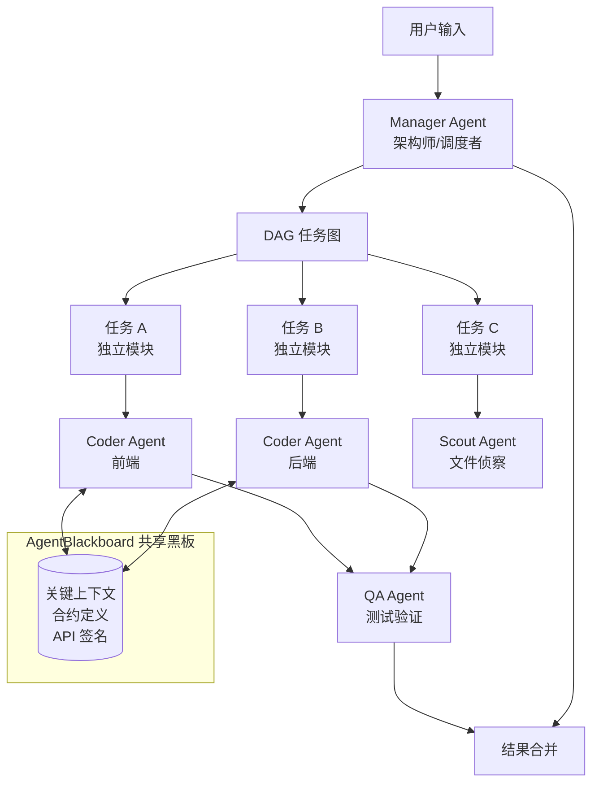
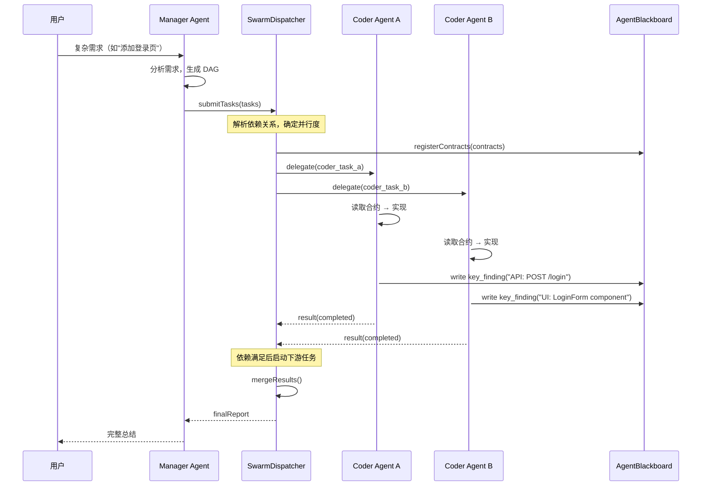
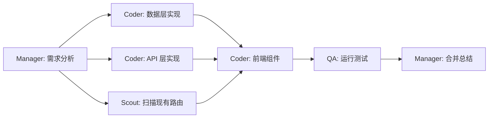
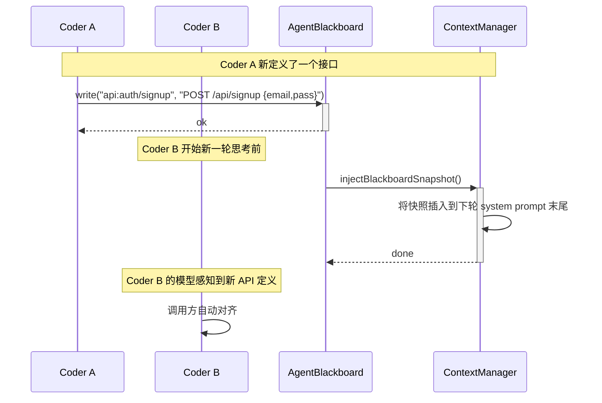
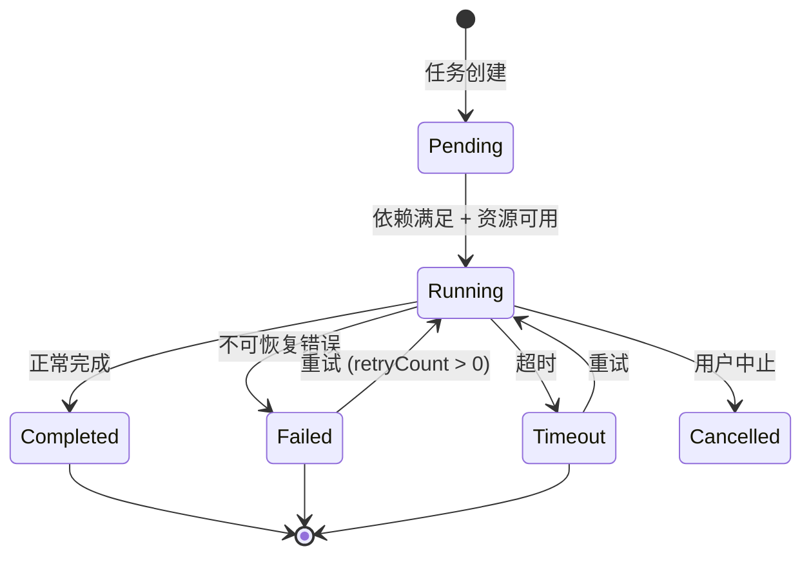

# MyAgent 架构进化蓝图：多并发智能体引擎 (Swarm Architecture)

> 版本: 2.0 | 状态: 设计阶段 | 最后更新: 2026-06-28
> 关联文档：[Context-Distiller Scout Plan](CONTEXT_DISTILLER_SCOUT_PLAN.md) | [Agent Evolution Roadmap](docs/ai-coding-agent-evolution.md)

---

## 目录

- [1. 核心愿景](#1-核心愿景)
- [2. 架构概览](#2-架构概览)
- [3. 角色系统 (Roles)](#3-角色系统-roles)
- [4. SwarmDispatcher 调度核心](#4-swarmdispatcher-调度核心)
- [5. 任务模型与 DAG](#5-任务模型与-dag)
- [6. AgentBlackboard 共享黑板](#6-agentblackboard-共享黑板)
- [7. Agent 生命周期与资源管理](#7-agent-生命周期与资源管理)
- [8. 多轨道 UI 呈现](#8-多轨道-ui-呈现)
- [9. 迁移路线图](#9-迁移路线图)
- [10. 关键设计决策记录](#10-关键设计决策记录)
- [附录A: 文件清单与入口](#附录a-文件清单与入口)
- [附录B: 与现有系统的集成点](#附录b-与现有系统的集成点)
- [附录C: Scout Agent 集成说明](#附录c-scout-agent-集成说明)

---

## 1. 核心愿景

当前业界（包括当前版本的 MyAgent）大多采用"单体顺序循环 (Monolithic Sequential Loop)"架构：

```
接受任务 -> 思考 -> 调用工具 -> 结果 -> 继续循环
```

当前 AgentRunner 正是这种模式 — 一个 `while (loopCount < 30)` 的串行阻塞循环，所有 12 个工具全量暴露给模型。

为了在执行效率和项目开发速度上超越现有的 AI 开发工具集合（Cursor、Claude Code、Devin 等），MyAgent 将进化为**多并发任务调度中心**，支持同时运行 5～10 个基于细分角色的 Agent，实现：

- **并行文件探索**：Scout Agent 集群同时扫描 10 个文件
- **并发编码**：Manager 拆解 DAG 后，多个 Coder Agent 并行实现独立模块
- **流水线验证**：QA Agent 在 Coder 完成后自动接棒运行测试

最终目标：**将"需求输入 → 代码验证完成"的端到端延迟缩短 3～5 倍**。



---

## 2. 架构概览

### 2.1 分层架构

```
+-------------------------------------------------------------------+
|                    UI 层 (多轨道视图)                                |
|  树状视图 · 进度轨道 · 微干预按钮 · 暂停/恢复                       |
+----------------------------------+--------------------------------+
                                   |
+----------------------------------v--------------------------------+
|                SwarmDispatcher (调度核心)                           |
|   · 任务解析 & DAG 生成                                            |
|   · 角色分配 & 并发控制                                            |
|   · 结果聚合 & 冲突检测                                            |
+--------+-----------+----------+-----------------------------------+
         |           |          |
+--------v--+   +----v------+  +-v-----------+
| Manager   |   | Coder(s)  |  | Scout(s)    |  ← 运行时按需
| Agent     |   | Agent(s)  |  | Agent(s)    |    实例化的独立
+--------+--+   +----+------+  +-+-----------+    AgentRunner
         |           |          |
         +-----------+----------+
                     |
+--------------------v----------------------------------------------+
|              AgentBlackboard (进程内内存黑板)                      |
|   write_telepathic_memory / read_telepathic_memory                |
+-------------------------------------------------------------------+
```

### 2.2 与当前代码库的关系

| 已有组件 | 在 Swarm 中的角色 | 变更程度 |
|---|---|---|
| `AgentRunner` | 每个子 Agent 的运行时载体 | 中等 — 需支持 RoleConfig 注入 |
| `ToolManager` | 按角色过滤可用工具 | 低 — 只需新增 filter 逻辑 |
| `ContextManager` | 消息裁剪保留 | 低 — 黑板上下文可绕过裁剪 |
| `ChatService` | LLM 通信层 | 不变 |
| `ProviderStore` | 支持主模型+侦察模型两组凭证 | 中等 — 增加双 Provider 配置 |

---

## 3. 角色系统 (Roles)

### 3.1 RoleConfig 定义

```typescript
// src/main/agent/swarm/types.ts

export type AgentRole = 'manager' | 'coder' | 'scout' | 'qa'

export interface RoleConfig {
  role: AgentRole
  label: string                        // 用户可见的名称
  systemPrompt: string                 // 角色专用 System Prompt
  allowedTools: string[]               // 允许的工具白名单（空=全部）
  fileScope: FileScopeRule[]           // 文件写入范围限制
  maxParallelism: number               // 该角色最多并行实例数
  priority: number                     // 调度优先级（高者优先分配资源）
}

export interface FileScopeRule {
  type: 'allow' | 'deny'
  pattern: string                      // glob pattern, 如 src/views/**/*
}
```

### 3.2 默认角色定义

| 角色 | 标签 | 核心职责 | 可用工具 | 并行上限 |
|---|---|---|---|---|
| manager | 架构师 | 任务拆解、DAG 生成、结果合并 | 搜索/分析/读取 | 1 |
| coder | 编码员 | 实现具体模块 | 读写/搜索/命令 | 5 |
| scout | 侦察兵 | 快速文件扫描、上下文提取 | 读取/搜索 | 10 |
| qa | 测试员 | 运行测试、验证修改 | 命令/读取 | 3 |

### 3.3 角色 System Prompt 示例（片段）

```typescript
const MANAGER_PROMPT = `你是一个项目架构师。你的职责是：
1. 理解用户需求
2. 将其拆解为独立的子任务，生成 DAG 依赖图
3. 将子任务分配给合适的角色 Agent
4. 在每个子任务产出后审查并合并结果
你不能直接修改文件——所有文件修改必须由 Coder Agent 完成。`

const SCOUT_PROMPT = `你是一个快速侦察兵。你的职责是：
1. 读取指定的文件并提取摘要
2. 识别关键函数签名、类型定义、TODO 注释
3. 返回简洁、结构化的报告（而非完整文件内容）
你只能读取文件，不能写入或执行命令。`
```

---

## 4. SwarmDispatcher 调度核心

### 4.1 核心接口

```typescript
// src/main/agent/swarm/SwarmDispatcher.ts

export interface SwarmConfig {
  /** 最大同时运行的 Agent 数 */
  maxConcurrency: number       // 默认 5
  /** 单 Agent 最大循环步数 */
  maxAgentSteps: number        // 默认 20
  /** 单 Agent 超时 (ms) */
  agentTimeoutMs: number       // 默认 300_000 (5min)
  /** 失败重试次数 */
  maxRetries: number           // 默认 2
  /** 角色配置表 */
  roles: Map<AgentRole, RoleConfig>
  /** 双 Provider 配置 */
  primaryProvider: ProviderConfig    // 主模型（用于 manager/coder）
  scoutProvider?: ProviderConfig     // 侦察模型（用于 scout，更便宜）
}

export interface SwarmTask {
  id: string
  role: AgentRole
  prompt: string
  context: TaskContext
  fileScope?: FileScopeRule[]
  /** 依赖的其他任务 ID 列表（此任务在这些任务完成后才能启动） */
  dependsOn: string[]
  /** 超时时间 */
  timeoutMs: number
  /** 重试次数 */
  retryCount: number
}

export interface TaskContext {
  /** 原始用户需求的完整内容 */
  userRequest: string
  /** 关联文件列表 */
  relevantFiles: string[]
  /** 从黑板拉取的关键上下文（只读快照） */
  blackboardSnapshot: BlackboardEntry[]
}

export interface TaskResult {
  taskId: string
  role: AgentRole
  status: 'completed' | 'failed' | 'timeout' | 'cancelled'
  output: string
  changedFiles: string[]
  error?: string
  tokenUsage?: { prompt: number; completion: number }
}
```

### 4.2 调度流程



### 4.3 核心算法

```typescript
class SwarmDispatcher {
  private activeAgents: Map<string, AgentRunner> = new Map()
  private pendingQueue: SwarmTask[] = []
  private completed: Map<string, TaskResult> = new Map()

  async submitTasks(tasks: SwarmTask[]): Promise<TaskResult[]> {
    this.pendingQueue = this.topologicalSort(tasks)
    return this.executeLoop()
  }

  private async executeLoop(): Promise<TaskResult[]> {
    while (this.pendingQueue.length > 0 || this.activeAgents.size > 0) {
      // 1. 找出依赖已满足且未越限的任务
      const ready = this.pendingQueue.filter(t =>
        t.dependsOn.every(d => this.completed.get(d)?.status === 'completed')
      )

      // 2. 按角色优先级 + 并行上限填充
      for (const task of ready) {
        if (this.activeAgents.size >= this.config.maxConcurrency) break
        const roleConfig = this.config.roles.get(task.role)
        if (!roleConfig) continue

        const activeOfRole = [...this.activeAgents.values()]
          .filter(a => a.role === task.role).length
        if (activeOfRole >= roleConfig.maxParallelism) continue

        // 3. 移出队列，启动 Agent
        this.pendingQueue = this.pendingQueue.filter(t => t.id !== task.id)
        this.startAgent(task)
      }

      // 4. 等待任意一个完成（事件驱动）
      await this.waitForAnyCompletion()
    }

    return [...this.completed.values()]
  }

  private async startAgent(task: SwarmTask): Promise<void> {
    const runner = new AgentRunner()
    const roleConfig = this.config.roles.get(task.role)!

    // 构造角色专属的工具列表
    const tools = this.buildRoleTools(roleConfig)

    // 异步执行并在完成时触发回调
    const promise = runner.run({
      baseUrl: task.role === 'scout'
        ? this.config.scoutProvider?.baseUrl ?? this.config.primaryProvider.baseUrl
        : this.config.primaryProvider.baseUrl,
      apiKey: ...,
      apiFormat: ...,
      model: ...,
      messages: [
        { role: 'system', content: roleConfig.systemPrompt },
        { role: 'user', content: this.buildTaskPrompt(task) }
      ],
      tools,
      workspaceRoot: this.workspaceRoot
    }, {
      onChunk: (delta, reasoningDelta) => { },
      onToolStart: (id, name, args) => { },
      onToolEnd: (id, result) => { },
      onDone: (content) => this.onAgentDone(task.id, content),
      onError: (err) => this.onAgentFailed(task.id, err)
    })

    this.activeAgents.set(task.id, runner)

    // 超时保护
    const timeout = setTimeout(() => {
      runner.abort()
      this.onAgentTimeout(task.id)
    }, task.timeoutMs)

    await promise
    clearTimeout(timeout)
  }
}
```

### 4.4 错误处理策略

| 失败场景 | 处理方式 |
|---|---|
| Agent 超时 | 中止 → 记录 timeout → 重试 (若 retryCount > 0) → 否则标记 failed |
| 工具调用异常 | 返回 Error 信息给模型，由模型自行纠正后重试 |
| DAG 死锁 | 拓扑排序检测环 → 如果检测到环，回退到 Manager 人工拆解 |
| 文件冲突 | Coder B 写入 Coder A 已修改的文件 → 检测到 scope 违规，拒绝并通知 Manager |
| 子 Agent 连续失败 | Manager 介入：重新分析子任务并调整方案 |

---

## 5. 任务模型与 DAG

### 5.1 DAG 接口

```typescript
export interface TaskDAG {
  tasks: SwarmTask[]
  /** 隐式拓扑序 */
  topologicalOrder: string[]
  /** 关键路径长度（用于估算完成时间） */
  criticalPathLength: number
}

// DAG 校验器
export function validateDAG(tasks: SwarmTask[]): { valid: boolean; cycles?: string[][] } {
  // 使用 DFS 检测环
  // 返回无效路径供 Manager 修正
}
```

### 5.2 典型 DAG 示例



此图的关键路径为 `T0 → T3 → T4 → T5 → T6`，共 5 步串行。通过并行化 T1/T2/T3，将理论 7 步压缩到 5 步时间窗口。

---

## 6. AgentBlackboard 共享黑板

### 6.1 接口设计

```typescript
// src/main/agent/swarm/AgentBlackboard.ts

export interface BlackboardEntry {
  key: string
  value: string
  sourceAgentId: string
  timestamp: number
  /** 过期时间（TTL），自动清理过时条目 */
  ttlMs?: number
}

export class AgentBlackboard {
  private store: Map<string, BlackboardEntry> = new Map()

  /** 写入一条信息 */
  write(key: string, value: string, sourceAgentId: string, ttlMs?: number): void

  /** 按 key 精确读取 */
  read(key: string): BlackboardEntry | undefined

  /** 前缀搜索 */
  find(prefix: string): BlackboardEntry[]

  /** 删除过期的条目 */
  evictExpired(): number

  /** 获取当前完整快照（注入子 Agent 上下文时使用） */
  getSnapshot(): BlackboardEntry[]

  /** 获取自某个时间戳之后的增量 */
  getDelta(sinceTimestamp: number): BlackboardEntry[]
}
```

### 6.2 黑板数据流



### 6.3 与现有 ContextManager 的集成

在 `AgentRunner.run()` 的每轮循环开始时，新增一步：

```typescript
// 在 AgentRunner.run() 的 while 循环开头
allMessages = ContextManager.trimMessages(allMessages)

// [新增] 如果配置了 Blackboard，注入最新上下文
if (this.blackboard) {
  const snapshot = this.blackboard.getSnapshot()
  if (snapshot.length > 0) {
    const blackboardSection = this.formatBlackboardForPrompt(snapshot)
    // 找到最新一条 user 消息，在其末尾追加黑板上下文
    this.injectIntoLatestUserMessage(allMessages, blackboardSection)
  }
}
```

---

## 7. Agent 生命周期与资源管理

### 7.1 生命周期状态机



### 7.2 资源约束策略

| 维度 | 策略 |
|---|---|
| Token 预算 | 每个子 Agent 有独立的 token 上限（由 RoleConfig 指定），超限后强制中止 |
| 并发上限 | 全局 maxConcurrency + 每角色 maxParallelism 双层控制 |
| 文件隔离 | Coder/QA 的 fileScope 严格限制可写入路径，Manager 违规写入将被拒绝 |
| 超时熔断 | 单 Agent 超时后自动清理进程资源，不影响其他 Agent |

### 7.3 异常降级

当系统资源紧张时（如 token 即将耗尽），SwarmDispatcher 执行降级策略：

1. 暂停新任务下发
2. 等待活跃 Agent 逐个完成
3. 将剩余 pending 任务转为串行执行（退化为单 Agent 模式）

---

## 8. 多轨道 UI 呈现

### 8.1 与当前渲染进程的集成

当前 chat.handlers.ts 通过 IPC 将流式数据发送到渲染进程。Swarm UI 需要新增 IPC 通道：

| 通道 | 方向 | 用途 |
|---|---|---|
| swarm:task-created | main → renderer | 新子任务出现在轨道 |
| swarm:task-status | main → renderer | 状态变更 (pending/running/completed/failed) |
| swarm:tool-call | main → renderer | 当前 Agent 调用工具 |
| swarm:agent-thinking | main → renderer | Agent 当前的思考内容 |
| swarm:intervene | renderer → main | 用户点击"暂停"或"纠正"子 Agent |

### 8.2 UI 布局示意

```
+-----------------------------------------------------------------+
| [Manager 正在思考...]                                            |
|   +-- 拆解任务 -------------------------------------------------+
|   | DAG: [Coder A -> QA] ---- [Coder B]                         |
|   +-------------------------------------------------------------+
+-----------------------------------------------------------------+
| [Coder A]  ████████░░ 实现登录 API                               |
|   +-- ReadFile: auth.ts  ✓                                      |
|   +-- WriteToFile: login.ts ████████░░░░                         |
|   +-- 思考: "需要在 User 模型里加 role 字段..."                   |
|                                                                  |
| [Coder B]  已完成                                                |
|   +-- ReadFile: types.ts  ✓                                     |
|   +-- WriteToFile: LoginForm.tsx  ✓                             |
|   +-- 等待合并 ---- [审查]                                       |
|                                                                  |
| [Scout]  已完成                                                  |
|   +-- Scan routes.ts → 发现 3 条路由                              |
|   +-- 报告已提交至黑板                                           |
+-----------------------------------------------------------------+
```

---

## 9. 迁移路线图

### 阶段 0：准备（MVP 基础设施）

目标：可演示的最小原型，证明多 Agent 并行能工作

| 步骤 | 文件 | 工作量 |
|---|---|---|
| 1. 创建 src/main/agent/swarm/types.ts | 类型定义 | ~1h |
| 2. 创建 AgentBlackboard.ts | 内存键值存储+TTL | ~2h |
| 3. 改造 AgentRunner 接受 RoleConfig | 注入 systemPrompt + allowedTools | ~2h |
| 4. ToolManager.filterByRole() | 按角色过滤工具定义 | ~1h |
| 5. 创建 SwarmDispatcher 最小版本 | 顺序 delegate（不并行） | ~3h |

验收标准：
- AgentRunner 能通过 allowedTools 限制可用工具
- Blackboard 支持写入/读取/过期
- SwarmDispatcher 能依次执行多个 sub-task 并收集结果

### 阶段 1：角色系统 + 工具隔离

| 步骤 | 文件 | 工作量 |
|---|---|---|
| 1. 注册 4 个默认角色 | 硬编码 RoleConfig | ~1h |
| 2. 角色专属 System Prompt | 编写 manager/coder/scout/qa prompt | ~2h |
| 3. ToolManager.filterByRole() 集成到 AgentRunner | 传参过滤 | ~1h |
| 4. 验证：Manager 不能写文件，Coder 不能运行测试 | 自动化测试 | ~2h |

### 阶段 2：并行调度 + DAG

| 步骤 | 文件 | 工作量 |
|---|---|---|
| 1. SwarmDispatcher 并行执行 + Promise.all | 事件循环 | ~4h |
| 2. DAG 拓扑排序 + 依赖解析 | 数据结构 | ~3h |
| 3. 超时 + 重试机制 | 错误处理 | ~2h |
| 4. 并发上限控制 | 信号量 | ~1h |
| 5. 集成测试：拆解→并行编码→合并 | E2E | ~4h |

### 阶段 3：Scout Agent 集成

详情见 [CONTEXT_DISTILLER_SCOUT_PLAN.md](CONTEXT_DISTILLER_SCOUT_PLAN.md)。核心新增：

| 组件 | 说明 |
|---|---|
| AskScoutAgentTool | 单文件侦察工具，供 Manager 调用 |
| BatchScoutAgentTool | 批量并发侦察工具，同时扫描 N 个文件 |
| Provider 双模型配置 | 主模型 + 便宜侦察模型 |

### 阶段 4：黑板集成 + 上下文注入

| 步骤 | 工作量 |
|---|---|
| 1. AgentBlackboard.getSnapshot() → ContextManager 注入循环 | ~2h |
| 2. AgentRunner 每轮循环前拉取黑板增量 | ~1h |
| 3. 实现 write_telepathic_memory / read_telepathic_memory 工具 | ~2h |
| 4. 过期清理后台任务 | ~1h |

### 阶段 5：多轨道 UI

| 步骤 | 工作量 |
|---|---|
| 1. 新增 IPC 通道 swarm:* 系列 | ~2h |
| 2. 渲染进程树状视图组件 | ~4h |
| 3. 进度条 + 实时流式内容 | ~3h |
| 4. 微干预（暂停/恢复/纠正） | ~4h |

---

## 10. 关键设计决策记录

### TDR-001：为什么不用现成框架（LangGraph / CrewAI）

| 方案 | 优点 | 缺点 |
|---|---|---|
| 自研 | 完全可控、体积小、深度集成已有 ToolManager | 开发成本 |
| LangGraph | Graph 调度成熟 | 大包 (~500KB)、Python 优先、状态管理耦合重 |
| CrewAI | 角色系统开箱即用 | Python 生态、与 Electron 集成复杂 |

结论：自研。MyAgent 的核心是 coding agent，调度层需要深度集成 file scope、blackboard 和现有 ToolManager，框架无法满足。

### TDR-002：进程 vs 线程 vs 事件循环

| 方案 | 隔离性 | 通信成本 | 实现复杂度 |
|---|---|---|---|
| child_process 隔离 | 强 | 高 (JSON serialization) | 高 |
| worker_threads | 中 | 中 (postMessage) | 中 |
| 事件循环 + 独立 AgentRunner 实例 | 弱 | 极低 (内存共享) | 低 |

结论：阶段 0~3 使用事件循环 + 独立 AgentRunner 实例。阶段 5 后如出现隔离需求，再迁移到 worker_threads。所有接口按 message-passing 设计，保留迁移能力。

### TDR-003：Blackboard 是否需要持久化

结论：阶段 0~3 纯内存，不持久化。后续如果引入"断点续训/恢复"，可以通过序列化 + 文件存储实现持久化（作为独立阶段）。

### TDR-004：DAG 由 Manager 模型生成 vs 代码硬编码

结论：由 Manager Agent 的 LLM 动态生成。硬编码 DAG 无法适应多样化需求。可行性基于：当前主流模型（GPT-4o、Claude Sonnet）生成 JSON 格式 DAG 的可靠度已足够高。如果后续出现格式错误，可加入 DAG 校验 + 自动回退修复机制。

---

## 附录A：文件清单与入口

### 新增文件

```
src/main/agent/swarm/
+-- types.ts                  # 类型定义（SwarmTask, RoleConfig, TaskResult 等）
+-- SwarmDispatcher.ts        # 调度核心
+-- AgentBlackboard.ts        # 共享黑板
+-- TaskDAG.ts                # DAG 拓扑排序 + 校验
+-- RoleRegistry.ts           # 角色注册表
+-- AgentFactory.ts           # 按角色构造 AgentRunner 实例
+-- tools/
    +-- AskScoutAgentTool.ts      # [阶段 3] 单文件侦察工具
    +-- BatchScoutAgentTool.ts    # [阶段 3] 批量侦察工具
```

### 修改文件

| 文件 | 修改内容 |
|---|---|
| src/main/agent/AgentRunner.ts | 接受 RoleConfig 注入，支持工具过滤，支持 Blackboard 上下文注入 |
| src/main/tools/ToolManager.ts | 新增 filterByRole(allowedTools: string[]) 方法 |
| src/main/ipc/chat.handlers.ts | 注册 swarm:* IPC 通道 |
| src/main/index.ts | 初始化 SwarmDispatcher（传入主窗口引用用于 UI 推送） |

---

## 附录B：与现有系统的集成点

### B.1 AgentRunner 改动点（当前代码）

当前 AgentRunner.run() 中的 while (loopCount < 30) 循环，代码行72附近：

改动点：
1. 构造函数新增 roleConfig?: RoleConfig 参数 → 用于覆写 systemPrompt 和过滤 availableTools
2. 循环开始时，新增 Blackboard 注入步骤
3. loopCount 上限改为由 SwarmConfig.maxAgentSteps 控制

### B.2 ToolManager 改动点

新增方法：
```typescript
filterByRole(allowedTools: string[]): ToolDefinition[] {
  return this.getToolDefinitions()
    .filter(td => !allowedTools.length || allowedTools.includes(td.function.name))
}
```

### B.3 ProviderStore 改动点

新增双 Provider 配置结构，在当前 SessionConfig 基础上扩展：
```typescript
export interface SwarmProviderConfig {
  primary: SessionConfig       // 主模型
  scout?: SessionConfig        // 可选侦察模型（便宜）
}
```

---

## 附录C：Scout Agent 集成说明

### C.1 启用方式

Scout Agent 不是独立运行的，而是作为 SwarmDispatcher 的内置角色或 Manager 的工具调用触发：

**模式 A（推荐）**：Manager 通过 DAG 分配 scout 子任务 → SwarmDispatcher 实例化 Scout Agent

```yaml
tasks:
  - id: "scan_routes"
    role: scout
    prompt: "扫描 src/router 目录下的所有路由文件，提取接口路径列表"
    dependsOn: []
```

**模式 B（兼容）**：Manager 直接调用 AskScoutAgentTool（作为一个普通工具）

```json
{
  "tool": "ask_scout_agent",
  "args": {
    "files": ["OrderService.ts"],
    "query": "提取公有方法签名"
  }
}
```

### C.2 Scout 模型配置

在 Provider 配置中新增可选字段：

```json
{
  "primary": { "model": "gpt-4o", "baseUrl": "..." },
  "scout": { "model": "gemini-2.0-flash", "baseUrl": "...", "apiKey": "..." }
}
```

如果未配置 scout provider，则 Scout Agent 自动降级使用 primary 配置。

---

> 本蓝图是活的文档。每个阶段完成后，更新对应状态。遇到需要修正的设计假设，更新 TDR 并注明原因。
