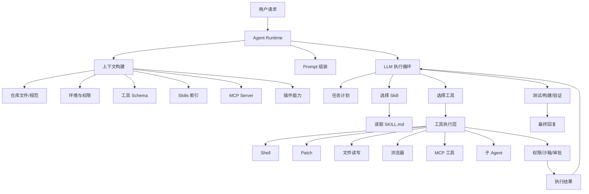
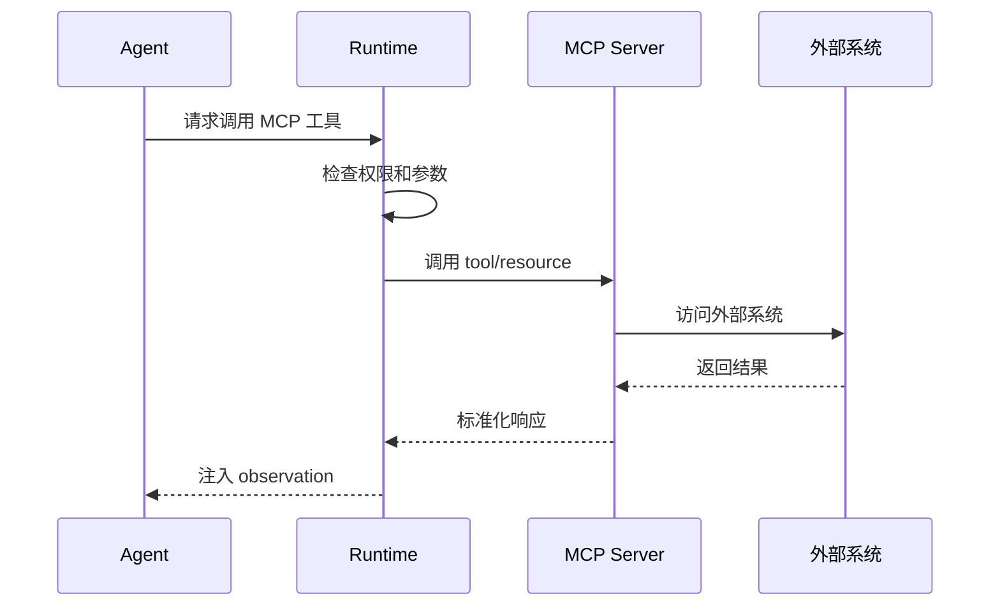

# AI Coding Agent 完整流程与渐进式完善路线

本文档用于指导当前项目从“基础 AI Coding 功能”逐步演进为接近 Codex / Claude Code / Cursor Agent 这类完整 Coding Agent 的系统。重点不是一次性做完，而是把能力拆成可验证、可迭代的阶段。

## 1. 目标

构建一个能够在本地项目中完成编码任务的 AI Agent：

- 理解用户需求和项目上下文。
- 自动规划任务步骤。
- 读取、搜索、修改项目文件。
- 调用 Shell、Patch、MCP、Skills、插件等工具。
- 在权限边界内执行命令。
- 运行测试、构建、Lint 做验证。
- 输出清晰的最终交付说明。

最终形态应具备以下能力：



## 2. 核心概念

### 2.1 Agent Runtime

Agent Runtime 是整个系统的调度核心，负责：

- 接收用户输入。
- 维护对话状态。
- 构建 Prompt。
- 提供工具列表。
- 执行模型返回的 tool call。
- 管理权限、超时、错误和重试。
- 将工具结果继续喂给模型。
- 判断任务是否完成。

可以理解为：模型负责“决策”，Runtime 负责“执行”。

### 2.2 Prompt 分层

完整 Coding Agent 通常不是只有一个用户 Prompt，而是多层指令组合：

1. `System Prompt`
   - 定义 Agent 身份、边界、安全原则。
   - 例如：你是一个本地编码 Agent，必须真实检查文件，不要编造结果。

2. `Developer Prompt`
   - 定义产品级工作流和风格。
   - 例如：何时制定计划、何时跑测试、如何输出最终结果。

3. `User Prompt`
   - 用户当前任务。

4. `Environment Context`
   - 当前目录、系统平台、日期、可写路径、网络权限、Shell 类型等。

5. `Repository Instructions`
   - 仓库内约定，例如 `AGENTS.md`、`.clinerules`、`README.md`。

6. `Tool Schemas`
   - 当前可调用工具的名称、说明、参数结构和限制。

7. `Skills Index`
   - 当前可用 Skill 的名称、描述、触发条件、入口文件。

8. `MCP / Plugins Context`
   - 当前连接了哪些 MCP Server、插件提供了哪些工具或 Skill。

推荐组装顺序：

```text
System Instructions
Developer Instructions
Repository Instructions
Environment Context
Available Tools
Available Skills
Available MCP Servers
Conversation History / Summary
User Request
```

### 2.3 Rules 系统

Rules 是 Agent Coding 中非常重要的一层，用于描述项目约定、全局偏好、目录级规范和工具安全边界。它和 Prompt、Skills、MCP 不冲突，而是作为上下文构建的一部分被扫描、合并、裁剪后注入模型。

建议将 Rules 分为两类：

| 类型 | 推荐位置 | 作用 |
| --- | --- | --- |
| 全局 Rules | `C:\Users\user\.codez\rules\` | 用户级长期规则，适用于所有项目。 |
| 项目 Rules | `<workspace>\.codez\rules\` | 当前项目专属规则，只作用于该仓库。 |

兼容常见生态规则文件：

| 文件 | 来源生态 | 建议处理方式 |
| --- | --- | --- |
| `.clinerules` | Cline | 作为项目根级规则读取。 |
| `.cursorrules` | Cursor | 作为项目根级规则读取。 |
| `AGENTS.md` | Codex / 多 Agent 生态 | 支持目录级作用域，越靠近目标文件优先级越高。 |
| `README.md` / `CONTRIBUTING.md` | 通用项目文档 | 作为辅助项目上下文，不应高于显式 Rules。 |

推荐目录结构：

```text
C:\Users\user\.codez\rules\
  global.md
  coding-style.md
  safety.md
  frontend.md
  backend.md

<workspace>\.codez\rules\
  project.md
  architecture.md
  testing.md
  style.md
```

目录级规则可以放在任意子目录：

```text
src/features/payment/AGENTS.md
src/features/payment/.codez/rules/payment.md
```

目录级规则作用域建议：

- `AGENTS.md` 的作用域是它所在目录及其所有子目录。
- `<dir>\.codez\rules\*.md` 的作用域是 `<dir>` 及其所有子目录。
- 根目录 `.clinerules`、`.cursorrules` 默认作用于整个 workspace。
- 全局 Rules 默认作用于所有 workspace，但优先级低于项目 Rules。

推荐优先级：

```text
System Rules
> Developer Rules
> User Explicit Instructions
> Tool / Permission Rules
> Directory Scoped Project Rules
> Workspace Project Rules
> Legacy Project Rules (.clinerules / .cursorrules / AGENTS.md)
> Global Rules (C:\Users\user\.codez\rules)
> Skill Rules
> Memory / Preferences
```

其中安全类规则不能只靠 Prompt 约束，必须由 Runtime 强制执行。例如：

- 禁止写入 workspace 之外路径。
- 删除、重置、联网安装依赖必须审批。
- MCP 和插件不能绕过权限系统。
- Shell 命令必须有超时和输出截断。

推荐 Rule 数据模型：

```ts
type RuleSource =
  | "system"
  | "developer"
  | "user"
  | "tool"
  | "workspace"
  | "directory"
  | "legacy"
  | "global"
  | "skill"
  | "memory";

type AgentRule = {
  id: string;
  source: RuleSource;
  priority: number;
  path?: string;
  scope?: string;
  content: string;
  appliesTo?: string[];
};
```

推荐扫描顺序：

1. 读取全局目录 `C:\Users\user\.codez\rules\*.md`。
2. 读取项目目录 `<workspace>\.codez\rules\*.md`。
3. 读取兼容文件：`.clinerules`、`.cursorrules`、根级 `AGENTS.md`。
4. 当任务涉及某个文件时，从 workspace 根目录到目标文件目录逐级查找 `AGENTS.md` 和 `.codez/rules/*.md`。
5. 根据优先级、作用域和用户当前任务过滤规则。
6. 将最终适用规则摘要注入 Prompt，必要时附带原文。

冲突处理建议：

- 越高优先级规则覆盖越低优先级规则。
- 越靠近目标文件的目录级规则覆盖上层目录规则。
- 用户本轮明确要求覆盖项目偏好，但不能覆盖安全规则。
- Skill 规则只在该 Skill 被选中时生效，不能覆盖项目和用户显式规则。

Prompt 注入示例：

```text
Applicable Rules:
- Global: Use TypeScript strict style. Avoid one-letter variables.
- Workspace: Do not introduce new state management libraries.
- Directory: Files under src/features/payment must keep API calls in services/payment.ts.
- Legacy .clinerules: Run tests before final response when changing source files.
```

最小实现建议：

1. 先支持 `C:\Users\user\.codez\rules\*.md` 全局规则。
2. 再支持 `<workspace>\.codez\rules\*.md` 项目规则。
3. 然后兼容 `.clinerules`、`.cursorrules`、`AGENTS.md`。
4. 最后实现目录级作用域和规则冲突合并。


### 2.4 Tools

工具是模型能调用的外部能力。典型工具包括：

| 工具 | 作用 |
| --- | --- |
| `shell` | 执行命令、搜索文件、运行测试、构建项目。 |
| `read_file` | 读取文件内容。 |
| `write_file` | 写入完整文件，适合新文件或小文件。 |
| `apply_patch` | 以 diff 方式修改文件，适合代码编辑。 |
| `update_plan` | 更新用户可见的任务计划。 |
| `browser` | 打开页面、点击、截图、做 UI 验证。 |
| `mcp_tool` | 调用 MCP Server 暴露的工具。 |
| `sub_agent` | 将独立任务分配给子 Agent 并行处理。 |

推荐优先级：

1. 搜索类任务优先用 `rg` 或文件索引。
2. 修改代码优先用 `apply_patch`。
3. 需要运行项目、测试、构建时用 `shell`。
4. 需要外部系统或专业能力时用 MCP / 插件。
5. 大型任务才考虑子 Agent。

### 2.5 Skills

Skill 是一组专项能力说明，通常由一个 `SKILL.md` 描述。Skill 不一定直接执行代码，而是告诉 Agent：

- 什么时候应该使用该 Skill。
- 该遵循什么流程。
- 需要读取哪些参考文件。
- 是否有脚本、模板、约束或最佳实践。
- 应调用哪些 MCP 或工具。

建议 Skill 目录结构：

```text
skills/
  react-performance/
    SKILL.md
    references/
      rendering.md
      data-fetching.md
  compose-review/
    SKILL.md
  plugin-creator/
    SKILL.md
    templates/
      plugin.json
```

Skill 索引示例：

```json
{
  "name": "react-performance",
  "description": "用于 React / Next.js 性能优化、组件重构、渲染问题排查。",
  "source": "skills/react-performance/SKILL.md",
  "triggers": ["React", "Next.js", "性能", "渲染", "bundle"]
}
```

Skill 使用规则：

1. 用户明确点名 Skill 时必须使用。
2. 任务明显匹配 Skill 描述时自动使用。
3. 使用前必须读取完整 `SKILL.md`。
4. 如果 `SKILL.md` 引用额外文件，只读取与任务相关的文件。
5. 多个 Skill 同时适用时，选择最小必要集合。

### 2.6 MCP

MCP 是 Model Context Protocol，用于把外部系统接入 Agent。MCP Server 可以提供：

- `tools`：可调用动作，例如查数据库、打开浏览器、读 GitHub issue。
- `resources`：可读取上下文，例如文档、schema、文件、API 描述。
- `prompts`：可复用提示模板。

常见 MCP 类型：

| MCP 类型 | 能力 |
| --- | --- |
| Browser MCP | 控制浏览器、截图、检查 DOM。 |
| GitHub MCP | 读取 issue、PR、文件、CI 状态。 |
| Database MCP | 查询数据库 schema 和数据。 |
| Docs MCP | 检索官方文档。 |
| Figma/Stitch MCP | 读取设计稿、生成页面、上传设计资产。 |
| Node/Python REPL MCP | 执行受控脚本、处理文件、生成图表。 |
| Linear/Jira MCP | 读取需求、同步任务状态。 |

MCP 调用流程：



### 2.7 Plugins

插件是比 Skill 更大的能力包。一个插件可以包含：

- 一个或多个 Skill。
- 一个或多个 MCP Server。
- 本地脚本。
- UI 扩展。
- 模板、资源、配置。

建议插件结构：

```text
plugins/
  browser/
    plugin.json
    skills/
      control-browser/SKILL.md
    mcp/
      server.js
  github/
    plugin.json
    skills/
      pr-review/SKILL.md
    mcp/
      github-server.js
```

插件清单示例：

```json
{
  "name": "browser",
  "version": "1.0.0",
  "skills": ["skills/control-browser/SKILL.md"],
  "mcpServers": [
    {
      "name": "browser",
      "command": "node",
      "args": ["mcp/server.js"]
    }
  ]
}
```

## 3. 一次完整 Coding 任务流程

### 3.1 接收任务

用户输入：

```text
修复登录页点击提交后无响应的问题，并补充测试。
```

Runtime 记录：

- 用户原始请求。
- 当前项目路径。
- 当前会话历史。
- 当前模型、工具、权限配置。

### 3.2 构建上下文

Runtime 自动收集：

- `package.json`、`README.md`、配置文件摘要。
- 当前 Git 状态。
- 仓库规范文件。
- 可用工具、Skills、MCP、插件列表。
- 文件系统权限，例如只允许写入 workspace。

上下文不要无限塞入模型，应优先使用摘要和索引，按需读取具体文件。

### 3.3 任务分类

模型先判断任务类型：

- Bug 修复。
- 新功能开发。
- 重构。
- 测试补充。
- UI 实现。
- 代码审查。
- 文档生成。
- 外部服务接入。

不同任务类型决定后续策略：

| 任务类型 | 推荐策略 |
| --- | --- |
| Bug 修复 | 先复现，再定位，再最小修复，再验证。 |
| 新功能 | 先理解架构，再设计接口，再实现，再补测试。 |
| 重构 | 先锁定行为，再小步改动，再跑测试。 |
| UI | 先确认视觉和交互，再实现，再浏览器验证。 |
| 文档 | 先读取真实代码，再生成文档，不凭空写。 |

### 3.4 Skill 选择

Runtime 给模型提供 Skill 索引，模型根据用户请求决定是否使用。

示例规则：

```text
如果任务涉及 React / Next.js 性能优化，使用 react-performance Skill。
如果任务涉及 Jetpack Compose 审查，使用 compose-review Skill。
如果任务涉及 OpenAI API 官方文档，使用 openai-docs Skill。
如果任务涉及图片生成，使用 imagegen Skill。
```

如果命中 Skill：

1. 读取 `SKILL.md`。
2. 遵循 Skill 中的流程。
3. 只加载必要参考文件。
4. Skill 指令优先级低于 system/developer/user 指令。

### 3.5 制定计划

复杂任务需要生成用户可见计划，例如：

```text
1. 定位登录提交流程
2. 复现无响应原因
3. 修复提交状态处理
4. 补充相关测试
5. 运行验证命令
```

计划状态应随着执行更新：

- `pending`
- `in_progress`
- `completed`

简单任务可以不展示计划，避免形式主义。

### 3.6 代码探索

推荐探索顺序：

1. 用 `rg` 搜索关键字。
2. 读取入口文件。
3. 沿调用链读取相关模块。
4. 查看测试和配置。
5. 必要时查看 Git 历史。

原则：

- 不要一次性读取无关大文件。
- 不要凭文件名猜实现。
- 优先找现有模式，保持风格一致。

### 3.7 修改代码

推荐使用 `apply_patch` 修改代码：

```diff
*** Begin Patch
*** Update File: src/login.ts
@@
- submit()
+ await submit()
*** End Patch
```

修改原则：

- 小步提交给文件系统。
- 只改与任务相关的文件。
- 优先修根因，不做表层 workaround。
- 不随手格式化整仓库。
- 不删除用户文件，除非用户明确要求。

### 3.8 权限与审批

工具执行前必须经过权限层。

需要审批的情况：

- 写入 workspace 之外的路径。
- 执行危险命令，例如删除、重置、强制覆盖。
- 联网安装依赖。
- 访问外部服务。
- 打开 GUI 应用。
- 读取敏感文件。

建议权限模型：

| 权限级别 | 行为 |
| --- | --- |
| `read-only` | 只能读取文件和运行安全查询。 |
| `workspace-write` | 可修改 workspace 内文件。 |
| `network-restricted` | 默认禁止网络。 |
| `approval-required` | 高风险命令需要用户批准。 |
| `full-access` | 仅用于可信环境，不建议默认开启。 |

### 3.9 验证

验证顺序应从小到大：

1. 运行最相关单元测试。
2. 运行相关模块测试。
3. 运行类型检查。
4. 运行 Lint。
5. 运行构建。
6. 必要时做浏览器或端到端验证。

如果验证失败：

- 判断是否由本次修改引起。
- 是本次修改引起则继续修复。
- 是既有问题则在最终回复中说明，不扩大修复范围。

### 3.10 最终回复

最终回复应包含：

- 完成了什么。
- 修改了哪些文件。
- 运行了哪些验证。
- 是否存在未解决问题。
- 用户下一步可以做什么。

示例：

```text
已修复登录提交无响应问题。

- 修改 `src/pages/Login.tsx`：补上 async submit 状态处理。
- 修改 `src/api/auth.ts`：统一错误返回。
- 新增 `src/pages/Login.test.tsx`：覆盖提交成功和失败场景。
- 已运行 `npm test -- Login.test.tsx`，通过。
```

## 4. 推荐的工具 Schema

### 4.1 Shell Tool

```ts
type ShellTool = {
  name: "shell";
  description: "Run a shell command in the workspace.";
  input: {
    command: string;
    cwd?: string;
    timeoutMs?: number;
    requireApproval?: boolean;
    justification?: string;
  };
};
```

### 4.2 Patch Tool

```ts
type PatchTool = {
  name: "apply_patch";
  description: "Apply a unified diff patch to workspace files.";
  input: {
    patch: string;
  };
};
```

### 4.3 Plan Tool

```ts
type PlanTool = {
  name: "update_plan";
  description: "Update the visible task plan.";
  input: {
    steps: Array<{
      text: string;
      status: "pending" | "in_progress" | "completed";
    }>;
  };
};
```

### 4.4 MCP Tool Proxy

```ts
type McpToolProxy = {
  name: "mcp_call";
  description: "Call a tool exposed by an MCP server.";
  input: {
    server: string;
    tool: string;
    arguments: Record<string, unknown>;
  };
};
```

## 5. 渐进式完善路线

### 阶段 0：基础对话能力

目标：让用户能向 Agent 提问，模型能基于上下文回答。

必备能力：

- 用户输入框。
- 模型调用。
- 对话历史。
- 基础 Markdown 渲染。
- 错误提示。

验收标准：

- 能连续对话。
- 能解释用户粘贴的代码。
- 能基于历史消息回答。

### 阶段 1：只读代码理解

目标：Agent 能读取项目并回答代码问题。

新增能力：

- 工作区文件树。
- 文件读取工具。
- 搜索工具。
- 仓库摘要。
- `README.md` / 配置文件识别。

验收标准：

- 用户问“这个项目怎么启动”，Agent 能基于真实文件回答。
- 用户问“登录逻辑在哪”，Agent 能搜索并定位文件。
- Agent 不再凭空猜测项目结构。

### 阶段 2：可控文件修改

目标：Agent 能修改 workspace 内文件。

新增能力：

- `apply_patch`。
- 文件写入权限控制。
- 修改前后 diff 展示。
- 用户确认机制。
- Git dirty 状态提示。

验收标准：

- Agent 能完成小型 bug 修复。
- 每次修改能展示 diff。
- 不能写 workspace 外文件。

### 阶段 3：Shell 与验证

目标：Agent 能运行命令验证修改。

新增能力：

- Shell 工具。
- 命令白名单/黑名单。
- 超时控制。
- 输出截断。
- 测试/构建命令识别。
- 失败重试策略。

验收标准：

- Agent 能运行 `npm test`、`npm run build` 等命令。
- 命令失败时能读取错误并修复。
- 危险命令需要用户审批。

### 阶段 4：计划与任务状态

目标：复杂任务可视化、可追踪。

新增能力：

- `update_plan` 工具。
- 步骤状态管理。
- 任务进行中状态。
- 中断与恢复。
- 最终完成总结。

验收标准：

- 多步骤任务能展示计划。
- 每完成一步能更新状态。
- 简单任务不会强行生成计划。

### 阶段 5：Skills 系统

目标：为不同任务提供专项工作流。

新增能力：

- Skill 目录扫描。
- Skill 元信息索引。
- `SKILL.md` 读取。
- Skill 触发规则。
- Skill 引用资源加载。

验收标准：

- 用户说“用 React 性能 Skill 优化”，Agent 会读取对应 Skill。
- 任务明显匹配 Skill 时可自动使用。
- Skill 能约束 Agent 的工具选择和工作流。

### 阶段 6：MCP 接入

目标：Agent 能连接外部系统。

新增能力：

- MCP Server 配置。
- MCP tools 列表发现。
- MCP resources 列表发现。
- MCP 调用代理。
- MCP 权限控制。
- MCP 错误处理。

验收标准：

- Agent 能调用 Browser MCP 做 UI 验证。
- Agent 能调用 Docs MCP 查询官方文档。
- Agent 能读取 MCP resource 并纳入上下文。

### 阶段 7：插件系统

目标：把 Skill、MCP、脚本、模板打包为可安装能力。

新增能力：

- `plugin.json` manifest。
- 插件安装/卸载。
- 插件启用/禁用。
- 插件贡献 Skills。
- 插件贡献 MCP Server。
- 插件贡献命令和模板。

验收标准：

- 安装插件后，Agent 能发现其 Skill 和 MCP。
- 禁用插件后，相关能力从上下文中移除。
- 插件不会绕过权限系统。

### 阶段 8：子 Agent 与并行任务

目标：复杂任务可以拆分并行处理。

新增能力：

- 子 Agent 创建。
- 子 Agent 工作区隔离。
- 子 Agent 结果汇总。
- 冲突检测。
- 明确文件所有权。

验收标准：

- 主 Agent 可让一个子 Agent 调研 API，另一个子 Agent 写测试。
- 子 Agent 不互相覆盖修改。
- 主 Agent 能整合结果。

### 阶段 9：长期记忆与项目知识库

目标：Agent 能长期理解项目。

新增能力：

- 项目摘要。
- 架构文档索引。
- 历史任务记录。
- 向量检索或关键词检索。
- 上下文压缩。
- 代码变更后的知识库更新。

验收标准：

- Agent 能记住项目约定。
- 长对话不会无限膨胀上下文。
- 新任务能复用历史结论。

## 6. 推荐 Prompt 模板

### 6.1 System Prompt

```text
You are an autonomous coding agent running inside a local repository.
You must inspect real files before making claims about the codebase.
You should complete the user's task end-to-end when possible.
Do not invent APIs, files, test results, or command outputs.
Prefer small, focused, root-cause fixes.
Do not modify unrelated files.
Do not commit, push, delete, or install dependencies unless explicitly allowed.
```

### 6.2 Developer Prompt

```text
Workflow:
1. Understand the request.
2. Inspect relevant files.
3. Create a concise plan for multi-step tasks.
4. Use Skills when the task matches a Skill description.
5. Use tools through structured calls only.
6. Apply minimal patches.
7. Validate with relevant tests or builds.
8. Summarize changes and validation results.

Tool rules:
- Use search before broad reading.
- Use patch-based edits for code changes.
- Ask approval for network, destructive commands, or writes outside workspace.
- If a command fails, analyze the output before retrying.
```

### 6.3 Environment Context 模板

```text
Current working directory: <cwd>
Shell: <shell>
OS: <os>
Date: <date>
Writable roots: <paths>
Network: restricted | enabled
Approval mode: never | on-request | on-failure
Available tools: <tool list>
Available skills: <skill index>
Available MCP servers: <mcp list>
```

## 7. 最小可行实现建议

如果当前只有基础功能，建议按以下顺序做：

1. 文件搜索和读取。
2. 工具调用协议。
3. `apply_patch` 修改文件。
4. Shell 执行和权限控制。
5. 任务计划工具。
6. Skills 扫描和读取。
7. MCP Client。
8. 插件 manifest。
9. 子 Agent。
10. 长期项目记忆。

优先级最高的是：读文件、搜文件、改文件、跑验证。这四个能力成型后，Agent 才真正具备 Coding 能力。

## 8. 实现注意事项

- 工具结果必须真实返回给模型，不要让模型自己假设命令输出。
- 所有文件修改都应能被 diff 追踪。
- Shell 输出要截断，避免把超大日志塞进上下文。
- Prompt 中不要塞完整仓库，应该按需检索。
- 权限系统必须在 Runtime 层实现，不能只靠 Prompt 约束。
- MCP 和插件不能绕过同一套权限系统。
- Skill 是指导，不是最高优先级；用户明确要求和安全策略更高。
- 最终回复必须区分“已验证”和“未验证”。

## 9. 当前阶段建议

如果项目目前只开发了基础功能，建议先落地到阶段 3：

- 阶段 1：只读代码理解。
- 阶段 2：可控文件修改。
- 阶段 3：Shell 与验证。

这三个阶段完成后，再接入 Skills。否则 Skill、MCP、插件即使做出来，Agent 也缺少基础执行能力，实际编码体验不会好。

