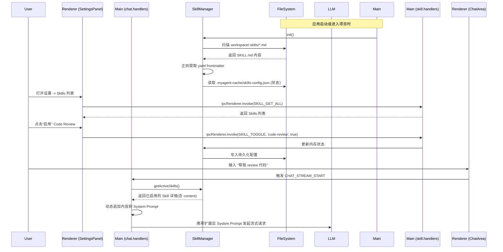

# Skills 技能流系统 - 技术架构设计

> 文档编号：ARCH-01
> 模块：Skills 系统 (对应需求阶段 9A)
> 更新日期：2026-06-27

## 1. 架构目标与原则

随着项目 Agent 核心链路（`AgentRunner`、工具调用等）的稳定，我们需要引入 Skills 扩展机制，让不同的垂直领域知识（如 Code Review、前端切图）独立挂载。

**核心设计原则**：
1. **零侵入**：尽量不改动极其复杂的 `AgentRunner` 状态机与执行循环。
2. **安全隔离**：用户在项目内配置的 `.skills` 不应直接破坏全局配置，且只影响当前项目的对话上下文。
3. **轻量级**：避免引入重型的 Yaml 解析库，主进程采用正则提取，保证启动加载极快。

## 2. 系统交互时序



## 3. 核心接入点设计

### 3.1 主进程：SkillManager (`src/main/services/SkillManager.ts`)
负责与文件系统直接打交道，承担扫描和状态持久化功能。

- **双层扫描 (`scanWorkspace`)**:
  - 全局层：读取 `app.getPath('userData') + '/global-skills'`。如果目录为空，自动生成预置的内置 Skill。
  - 项目层：递归读取 `workspaceRoot/.skills` 目录。
- **解析逻辑**:
  核心正则：`/^---\n([\s\S]*?)\n---\n([\s\S]*)$/`。
- **状态维护**:
  持久化存储分离：全局状态存在全局配置文件中，项目特有状态存在 `${rootPath}/.myagent-cache/skills-config.json`。合并返回前端。

### 3.2 IPC 通信桥梁 (`src/main/ipc/skill.handlers.ts`)
- **暴露频道**：
  - `SKILL_GET_ALL`: 返回 `SkillDefinition[]` 给渲染层。
  - `SKILL_TOGGLE`: 接收 `(id: string, enabled: boolean)`，同步到 `SkillManager`。
- **Preload 注册**：
  在 `window.api.skill` 下提供类型安全的方法供 React 调用。

### 3.3 Agent 融合层 (`src/main/ipc/chat.handlers.ts`)
目前 `AgentRunner` 实例化时由 `chat.handlers.ts` 传入基础配置。为了实现“零侵入”，修改 `chat.handlers.ts` 的系统提示词装配逻辑：

```typescript
const skillManager = getSkillManager();
const activeSkills = skillManager.getActiveSkills(currentWorkspace);

// 原始系统提示词
let systemPrompt = [
  'You are a helpful AI programming assistant.',
  'You have access to various tools. Choose the most efficient tool for each task based on its description.'
].join('\n');

// 注入激活的 Skills
if (activeSkills.length > 0) {
  systemPrompt += '\n\n【已挂载专属技能工作流】\n';
  for (const skill of activeSkills) {
    systemPrompt += `\n=== Skill: ${skill.name} ===\n${skill.content}\n`;
  }
}
```
*注：该注入发生在 `messages` 数组首个元素的 `content` 构建中，彻底与后续多轮对话解耦。*

### 3.4 前端 UI 表现层 (`src/renderer/src/components/SettingsPanel.tsx`)
- 新增独立的 Tab："插件技能"。
- `useEffect` 初次渲染时发起 API 请求拉取全部 Skills。
- 使用 `Zustand` 或本地 `useState` 管理开关变更。
- UI 形态：采用卡片式列表，每个卡片包含 Title、Description 和一个右置的 Toggle 按钮。

## 4. 关键数据结构 (`src/shared/types/skill.ts`)

```typescript
export interface SkillDefinition {
  id: string;          // 唯一标识符，通常为文件夹名或除去后缀的文件名
  name: string;        // 解析自 yaml
  description: string; // 解析自 yaml
  triggers: string[];  // 预留给前端匹配或后续意图识别使用
  content: string;     // 要注入到 Agent 的纯文本 (markdown 正文)
  enabled: boolean;    // 是否处于启用状态
}
```

## 5. 预期风险与限制
- **上下文爆炸**：如果用户同时开启了过多的 Skills，System Prompt 可能会过长，占用 LLM 上下文 Token 额度。需要在使用说明中提醒用户“按需启用”。
- **文件监听**：初版实现暂不接入 `fs.watch`。用户如果动态修改了 `SKILL.md`，可能需要切换一下开关或重新启动应用以触发重载。
