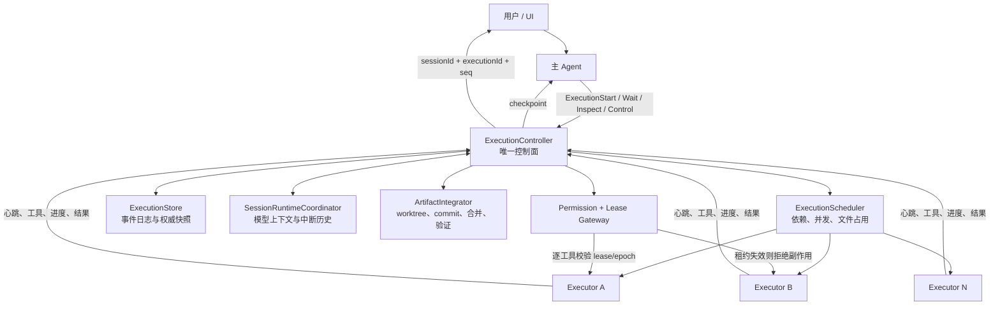
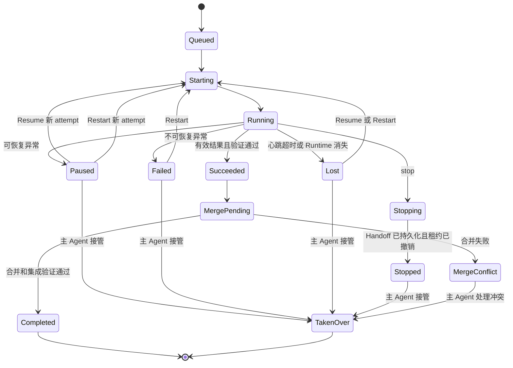
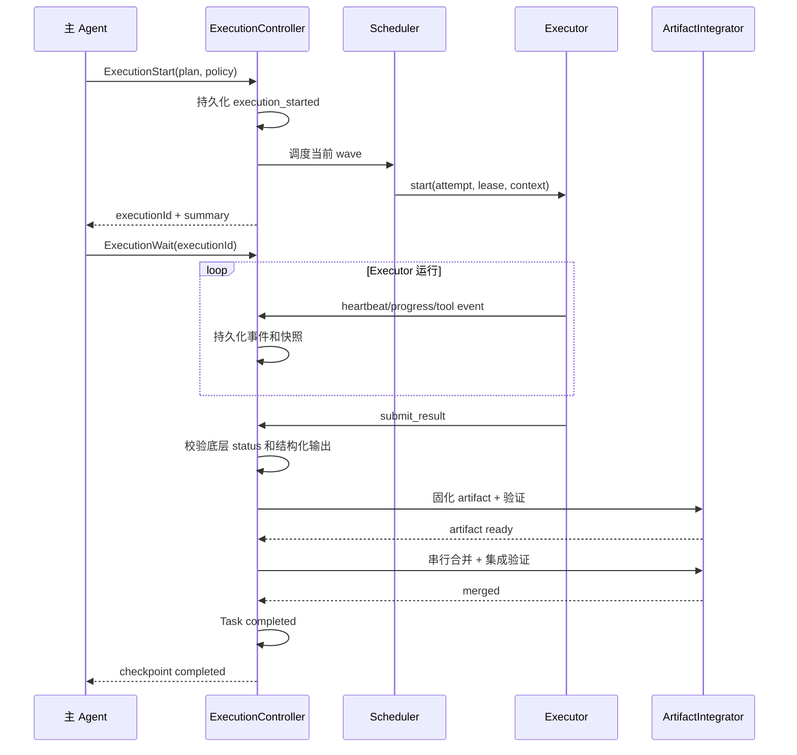
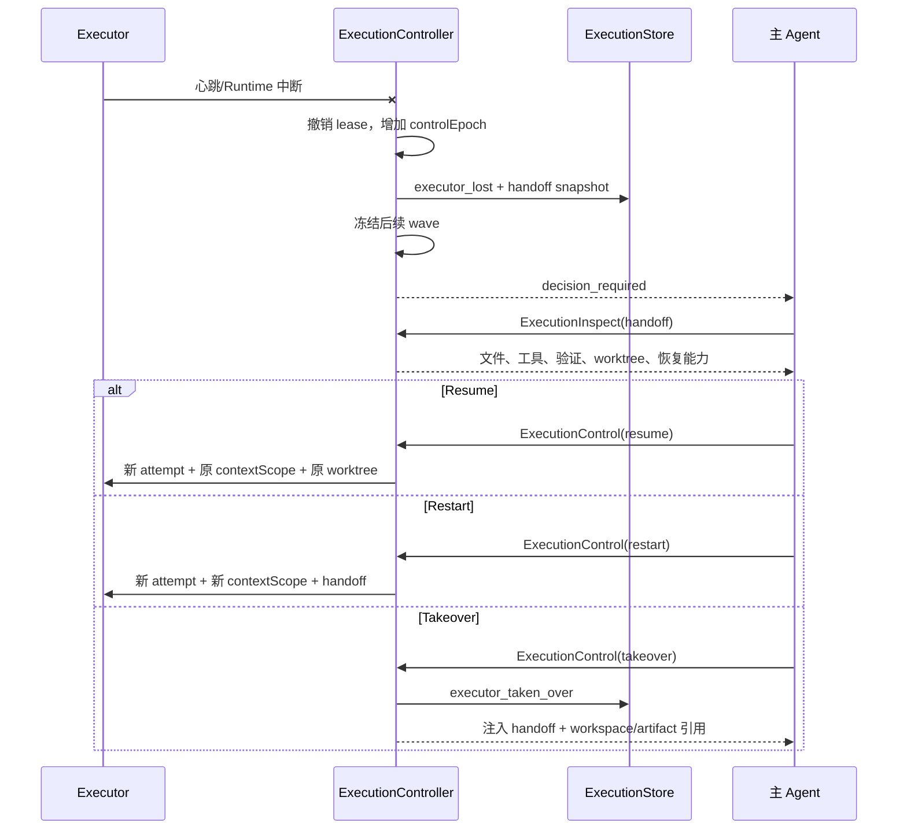

# 主 Agent 权威控制 Executor 设计

**日期:** 2026-07-12
**状态:** 设计（待批准）
**范围:** 在现有 `AgentRunner`、`SubAgentManager`、`parallelOrchestrator`、`SessionRuntimeCoordinator`、`TaskStore` 和 worktree 能力上，建立由主 Agent 掌握最终决策权、由主进程 Runtime 强制执行的 Executor 控制面。

---

## 1. 摘要

本设计将并行 Executor 从“`DelegateTasks` 内部阻塞运行的一组子 Agent”提升为“可查询、可撤销、可恢复、可接管的持久化执行单元”。

核心决策：

1. **主 Agent 是决策权威，ExecutionController 是执行权威。** 主 Agent 决定启动、继续、停止、重启、接管、跳过和是否接受部分成果；ExecutionController 负责实时状态、租约、持久化、并发和故障检测。
2. **停止不能只依赖 `AbortSignal`。** 每个 Executor 必须持有可撤销租约和单调递增的 `controlEpoch`。旧 Executor 即使收到迟到的模型响应，也不能继续调用工具或写文件。
3. **Executor 运行与逻辑任务分离。** 一个逻辑 `executorId` 可以有多个 `attemptId`；恢复、重启和进程丢失不会制造重复逻辑任务。
4. **写入型并行 Executor 默认强制 worktree 隔离。** `shared` 只保留为兼容路径，不作为完全可控并行写入的默认方案。
5. **运行中信息通过事件进入控制面，主 Agent 在检查点获取有界摘要。** UI 实时展示不等于主 Agent 已知；只有写入主 Agent 上下文的结构化快照才算完成交接。
6. **Executor 自报成功不等于任务完成。** 只有 Executor 输出有效、验证通过、成果合并成功后，逻辑任务才进入 `completed`。

最高优先级验收条件：

> ExecutionController 确认停止后，任何旧 Executor 都不能再产生文件或工具副作用；任何异常都必须留下足够主 Agent 恢复、重启或接管的结构化快照。

---

## 2. 当前代码基线

### 2.1 已有能力

当前仓库已经具备本设计需要的部分基础：

- `src/main/agent/AgentRunner/parallelOrchestrator.ts`
  - 支持 wave 内并发、wave 间屏障和并发上限。
  - 支持 shared/worktree 两种隔离方式。
  - 支持成功 worktree 的串行合并和失败 worktree 保留。
- `src/main/agent/SubAgentManager.ts`
  - 已为 SubAgent 建立独立上下文 scope。
  - 已支持父 `AbortSignal`、内部 `AbortController` 和 active handle。
  - 已生成 `SubAgentHandoff`，包含最近工具、已检查文件、已修改文件和可能修改文件。
  - 已通过统一权限入口执行 Executor 工具。
- `src/main/services/context/SessionRuntimeCoordinator.ts`
  - 已持久化模型消息、工具调用、完成和中断事件。
  - 已支持 interrupted turn 和 resume state。
- `src/main/services/ChatRuntimeRegistry.ts`
  - 已能按 session 查询主 Runner 和 SubAgent 是否仍活跃。
- `src/main/services/WorktreeService.ts`
  - 已封装 worktree 创建、删除和枚举。
- `src/renderer/src/stores/chatStore`
  - 已持久化 SubAgent UI 记录和中断恢复信息。

### 2.2 当前关键缺口

| 缺口 | 当前代码表现 | 后果 |
|---|---|---|
| 主 Agent 不能中途决策 | `handleDelegateTasks` 阻塞等待完整 `ParallelExecutionReport` | 主 Agent 只能在整波结束后看到结果 |
| 并行 Executor 未收到父取消信号 | `AgentRunner` 调用 `handleDelegateTasks` 时没有传递 `abortController.signal` | 用户停止主任务后 Executor 可能继续运行 |
| 缺少硬撤销 | 工具调用只检查普通权限范围，没有检查 execution lease | 迟到响应可能在逻辑停止后继续写入 |
| 失败语义被压缩 | `normalizeWorkerResult` 未优先尊重底层 `result.status` | failed/interrupted 可能被非空文本误判为 completed |
| Handoff 没有进入聚合报告 | `spawnWorker` 只保留 summary、filesModified、qualitySummary | 主 Agent 缺少接管所需的最近工具和可能副作用信息 |
| 状态没有 execution 作用域 | `PARALLEL_*` 广播缺少稳定 `executionId/sessionId/seq` | 多会话或多执行相互覆盖 |
| UI 状态是单例 | `parallelExecStore` 只保存一份运行状态 | 不能恢复或同时展示多个执行 |
| 无独立 attempt | worktree 名和 subAgentId 主要由 stepId/时间组成 | 重启、恢复、去重和审计语义不明确 |
| Task 状态不足 | `TaskStatus` 没有 failed/blocked/paused | 失败被重新写成 pending，原因只能存在临时报告中 |
| 部分成果边界不清 | shared 模式失败后半成品留在主工作区 | 主 Agent 无法可靠判断确认修改和可能修改 |

### 2.3 必须保留的现有约束

- 所有工具继续经过统一权限入口，不能为 Executor 增加绕过路径。
- SubAgent 独立上下文继续由 `SessionRuntimeCoordinator` 和 `ModelLedgerStore` 管理。
- 用户主动停止不得自动创建用户消息，也不得未经决策自动继续。
- 已完成且已验证的成果不能因兄弟 Executor 失败而丢失。
- wave 依赖顺序必须由显式计划决定，运行时不能仅凭文件不重叠重写依赖关系。

### 2.4 与现有设计的关系

- 保留 `2026-07-05-parallel-plan-execution-design.md` 的 wave、并发闸、失败停波和 worktree 隔离思想，但替换其阻塞式生命周期、无作用域事件和不完整恢复语义。
- 扩展 `2026-07-11-subagent-interruption-authority-design.md`：该设计解决主 Runner 对普通 SubAgent 的中断权威，本设计进一步覆盖多个 Executor、attempt、租约、部分成果和应用恢复。
- 服从 `2026-07-10-cross-platform-permission-policy-design.md`：lease 是权限系统的附加必要条件，不替代命令解析、风险判断、工作区范围或用户批准。
- 复用 `2026-07-11-shared-agent-tool-policy-design.md` 的共享工具策略，但控制权由 Runtime 强制执行，不能只依赖 Executor 提示词自律。

---

## 3. 目标与非目标

### 3.1 目标

- 主 Agent 可以启动一个或多个 Executor。
- 主 Agent 可以停止单个 Executor 或整次 execution。
- 主 Agent 可以查询每个 Executor 的核心状态和关键上下文。
- Executor 异常、停止、丢失或合并失败时，主 Agent 可以选择 resume、restart 或 takeover。
- 应用重启后能够从持久化记录恢复 execution 和 Executor 状态。
- 同一任务的多个 attempt 不会重复合并或重复标记完成。
- 成功、失败、验证、合并和逻辑完成具有不同且清晰的状态。
- UI 能准确展示 queued/running/paused/stopped/failed/merge-conflict 等状态，并将控制请求路由给权威控制面。

### 3.2 非目标

- 不让主 Agent逐 token 监听所有 Executor 输出。
- 不让 Executor 直接修改其他 Executor 的状态或控制兄弟 Executor。
- 不依靠 UI store 判断 Runtime 是否仍在运行。
- 第一阶段不实现操作系统级进程沙箱；租约、权限网关和 worktree 是应用层控制边界。
- 不保证任意 shell 子进程能够瞬间终止；但租约撤销后必须阻止其后续工具调用和受控写入。

---

## 4. 核心原则

### 4.1 决策权与执行权分离

主 Agent 是 LLM 决策者，但不能被视为持续运行的后台进程。它可能正在等待工具、上下文压缩、用户输入或已经结束当前模型回合。因此：

- **主 Agent 决定策略。** 例如失败后是恢复、重启、接管还是放弃。
- **ExecutionController 执行策略。** 例如立即撤销租约、发送 abort、记录心跳超时、冻结后续 wave。
- **PolicySnapshot 保存主 Agent 已授权的自动策略。** 例如“网络错误自动重试 3 次”“全波成功后自动合并”。
- **检查点唤醒主 Agent。** 出现完成、不可自动恢复异常、用户停止或需要接管时，等待工具返回结构化检查点。

### 4.2 状态必须持久化后才对外可见

所有状态变化遵循：

1. Controller 校验当前 epoch 和合法状态迁移。
2. 先追加 durable event。
3. reducer 生成新快照。
4. 再向主 Agent等待者和 UI 发布事件。

这样可以避免 UI 已显示“停止”但磁盘中仍是 running，或应用崩溃后无法判断最后状态。

### 4.3 控制操作必须幂等

每个控制命令携带 `commandId`。重复发送 stop、resume 或 restart 时，Controller 返回第一次命令的结果，不重复启动 attempt 或重复合并。

---

## 5. 总体架构



### 5.1 新增组件

#### ExecutionController

职责：

- 创建和恢复 execution。
- 接受控制命令。
- 维护 execution、executor 和 attempt 状态机。
- 持有当前 `controlEpoch` 和租约。
- 处理心跳、超时、结果和异常。
- 在需要主 Agent决策时生成 checkpoint。
- 决定是否启动下一 wave。

#### ExecutionScheduler

职责：

- 尊重显式 wave/DAG，不重新推断逻辑依赖。
- 实施全局并发上限，而不是每个 execution 各自拥有独立上限。
- 管理每个 provider/model 的并发和速率预算。
- 分配文件范围和 worktree。
- 对重复 stepId、重复 wave index、未知依赖和空 wave 做前置校验。

#### ExecutionStore

职责：

- 按 session 持久化 execution event。
- 通过 reducer 生成权威快照。
- 支持按 `executionId` 恢复、订阅和幂等命令查询。
- 为 UI 和主 Agent提供不同详细度的投影。

建议复用 `ModelLedgerStore` 的 append-only 思路，但 execution event 与模型消息生命周期不同，应使用独立 namespace 或独立 store，避免控制状态依赖上下文裁剪。

#### ArtifactIntegrator

职责：

- 为 attempt 创建或复用 worktree。
- 将成功结果固化为 `artifactCommit`。
- 串行执行合并，避免 git index 竞争。
- 区分 Executor 成功、artifact 就绪、合并成功和集成验证成功。
- 保留失败 worktree，并提供 inspect/discard/takeover 操作。

---

## 6. 身份模型

必须区分以下身份：

| 字段 | 生命周期 | 用途 |
|---|---|---|
| `sessionId` | 会话 | 防止跨会话污染 |
| `executionId` | 一次并行执行 | 聚合 wave、策略、控制命令和 UI |
| `executorId` | 一个逻辑执行任务 | 多次 attempt 之间保持稳定 |
| `attemptId` | 一次 Runtime 启动 | 区分 resume/restart 和旧进程 |
| `contextScopeId` | Executor 模型上下文 | 决定是否复用历史 |
| `leaseId` | 一次有效执行租约 | 每次工具调用做硬校验 |
| `controlEpoch` | execution 控制版本 | 撤销旧 attempt 的权限 |

建议 ID：

```text
executionId = exec_<session>_<ulid>
executorId  = executor_<execution>_<stepId>
attemptId   = attempt_<executor>_<number>_<ulid>
leaseId     = lease_<attempt>_<ulid>
```

不能继续依赖 `Date.now()` 作为唯一性来源。

---

## 7. 状态模型

### 7.1 Execution 状态

```ts
type ExecutionStatus =
  | 'planned'
  | 'starting'
  | 'running'
  | 'decision_required'
  | 'stopping'
  | 'stopped'
  | 'completed'
  | 'failed'
  | 'cancelled'
```

### 7.2 Executor 状态

```ts
type ExecutorStatus =
  | 'queued'
  | 'starting'
  | 'running'
  | 'pausing'
  | 'paused'
  | 'stopping'
  | 'stopped'
  | 'succeeded'
  | 'failed'
  | 'lost'
  | 'taken_over'
```

### 7.3 Artifact 状态

```ts
type ArtifactStatus =
  | 'none'
  | 'dirty'
  | 'ready'
  | 'merge_pending'
  | 'merging'
  | 'merged'
  | 'merge_conflict'
  | 'integration_failed'
  | 'discarded'
```

### 7.4 状态机



关键语义：

- `succeeded` 是 Executor Runtime 终态，不是 Task 终态。
- `completed` 必须包含验证和 artifact 集成成功。
- `paused/stopped/lost/failed` 必须伴随结构化 handoff。
- `taken_over` 表示 Executor 已失去写权限，剩余工作归主 Agent所有。

---

## 8. 权威数据结构

### 8.1 ExecutionRecord

```ts
interface ExecutionRecord {
  executionId: string
  sessionId: string
  source: string
  parentTurnId: string
  parentToolCallId: string
  status: ExecutionStatus
  controlEpoch: number
  currentWaveIndex: number | null
  waves: ExecutionWaveRecord[]
  policy: ExecutionPolicySnapshot
  lastEventSequence: number
  createdAt: number
  updatedAt: number
  terminalAt?: number
}
```

### 8.2 ExecutorRecord

```ts
interface ExecutorRecord {
  executorId: string
  executionId: string
  stepId: string
  waveIndex: number
  status: ExecutorStatus
  currentAttemptId?: string
  attemptCount: number
  assignedFiles: string[]
  acceptanceCriteria: string[]
  verificationCommand?: string
  artifactStatus: ArtifactStatus
  artifactCommit?: string
  worktreePath?: string
  lastSnapshot?: ExecutorSnapshot
  createdAt: number
  updatedAt: number
}
```

### 8.3 AttemptRecord

```ts
interface AttemptRecord {
  attemptId: string
  executorId: string
  mode: 'initial' | 'resume' | 'restart'
  contextScopeId: string
  leaseId: string
  controlEpoch: number
  status: 'starting' | 'running' | 'terminal'
  startedAt: number
  lastHeartbeatAt: number
  terminalAt?: number
  result?: ExecutorAttemptResult
}
```

### 8.4 EventEnvelope

```ts
interface ExecutionEventEnvelope<T> {
  eventId: string
  sequence: number
  sessionId: string
  executionId: string
  executorId?: string
  attemptId?: string
  controlEpoch: number
  timestamp: number
  type: ExecutionEventType
  payload: T
}
```

`sequence` 在同一 execution 内严格单调递增。Renderer 只接受比本地 `lastSequence` 更大的事件；发现跳号时重新拉取 snapshot，而不是继续猜测状态。

---

## 9. 主 Agent 控制协议

### 9.1 工具接口

#### ExecutionStart

创建 execution、验证分组、持久化计划并启动第一个可运行 wave。工具在 Controller 接管后立即返回，不阻塞等待全部 Executor。

```ts
interface ExecutionStartResult {
  executionId: string
  status: 'starting' | 'running'
  executorIds: string[]
  snapshot: ExecutionSummary
}
```

#### ExecutionWait

等待下一个主 Agent检查点。它可以长轮询，但必须响应用户停止和 Controller checkpoint。

```ts
type ExecutionCheckpointReason =
  | 'completed'
  | 'decision_required'
  | 'stopped'
  | 'cancelled'
  | 'timeout'
```

返回内容只包含主 Agent决策所需的有界摘要；完整日志通过 Inspect 按需读取。

#### ExecutionInspect

```ts
interface ExecutionInspectArgs {
  executionId: string
  executorId?: string
  detail: 'summary' | 'handoff' | 'timeline' | 'artifact'
}
```

#### ExecutionControl

```ts
type ExecutionControlAction =
  | 'stop_executor'
  | 'stop_all'
  | 'resume'
  | 'restart'
  | 'takeover'
  | 'skip'
  | 'accept_completed'
  | 'retry_merge'
  | 'discard_artifact'
  | 'cancel_execution'

interface ExecutionControlArgs {
  commandId: string
  executionId: string
  executorId?: string
  action: ExecutionControlAction
  options?: {
    reuseContext?: boolean
    reuseWorktree?: boolean
    resetWorktree?: boolean
    reason?: string
  }
}
```

### 9.2 为什么 Start 与 Wait 分离

当前 `DelegateTasks` 一直占用主 Agent工具调用，直到整波结束。拆分后：

- Controller 可以在后台持续执行。
- 用户停止可以直接进入 Controller，不必等待主 Agent模型响应。
- Executor 失败时 `ExecutionWait` 立即以 `decision_required` 返回主 Agent。
- 主 Agent 可以 Inspect 后再 Control，不需要重新创建整个委派。
- 应用恢复时主 Agent可以重新 Wait 已存在的 execution。

兼容期可保留 `DelegateTasks`，但其内部应改成：`ExecutionStart` 后调用一次 `ExecutionWait`，而不是直接拥有 Executor 生命周期。

---

## 10. Executor 与主 Agent 信息交换

### 10.1 下发给 Executor 的信息

在现有 `spawnWorker` 任务和 `contextBundle` 基础上增加：

- `executionId/executorId/attemptId`。
- 当前 `controlEpoch/leaseId`。
- 明确的文件范围和 worktree 根目录。
- 验收条件和验证命令。
- 前序依赖产出的 artifact/commit 引用。
- 恢复时的 `SubAgentHandoff`。
- 明确禁止自行 commit、merge、启动兄弟 Executor 或改变 wave。

### 10.2 ExecutorSnapshot

```ts
interface ExecutorSnapshot {
  executionId: string
  executorId: string
  attemptId: string
  stepId: string
  status: ExecutorStatus
  reasonCode?: ExecutorFailureReason
  reason?: string
  summary: string
  lastAction?: string
  blockers: string[]
  filesExamined: string[]
  filesModified: string[]
  filesPossiblyModified: string[]
  recentTools: SubAgentHandoffTool[]
  verification?: {
    command: string
    exitCode?: number
    timedOut?: boolean
    summary: string
  }
  artifactStatus: ArtifactStatus
  artifactCommit?: string
  worktreePath?: string
  workspaceMayHaveUntrackedChanges: boolean
  retryable: boolean
  canResume: boolean
  lastHeartbeatAt: number
}
```

### 10.3 信息分层

| 层级 | 消费者 | 内容 |
|---|---|---|
| 实时事件 | Controller、UI | chunk、当前工具、心跳、短进度 |
| 有界 Snapshot | 主 Agent、UI | 状态、原因、文件、验证、最近工具、恢复能力 |
| 完整 Timeline | Inspect、排障 UI | 全部工具调用和结果 |
| 模型历史 | Resume | Executor 自己的 durable context scope |

实时 UI 日志不能替代 Snapshot；Snapshot 也不能替代恢复所需的 durable 模型历史。

---

## 11. 正常执行时序



---

## 12. 停止、租约与僵尸 Executor 防护

### 12.1 两阶段停止

#### 第一阶段：协作停止

1. execution 或 executor 进入 `stopping`。
2. Controller 增加 `controlEpoch` 并撤销旧 lease。
3. 向对应 attempt 的 `AbortController` 发送 abort。
4. 等待当前受控工具退出并要求生成 handoff。

#### 第二阶段：强制隔离

即使模型请求或 shell 子进程没有及时退出：

- Permission/Lease Gateway 拒绝旧 `leaseId` 或旧 `controlEpoch` 的工具调用。
- Controller 忽略旧 attempt 的迟到 success/result 事件。
- 旧 attempt 不能获取新的工具授权。
- worktree artifact 不会被集成。

### 12.2 工具调用校验

现有 `authorizeSubAgentToolCall` 增加控制凭据：

```ts
interface ExecutorControlToken {
  executionId: string
  executorId: string
  attemptId: string
  leaseId: string
  controlEpoch: number
}
```

每次工具调用执行前校验：

1. execution 仍允许执行。
2. executor 当前 attempt 与 token 一致。
3. lease 未撤销且未过期。
4. token epoch 等于 execution 当前 epoch。
5. 工具仍在该 Executor 的 permissionScope 内。

校验必须位于工具执行体之前，且覆盖 Read、Edit、Write、NotebookEdit、Bash、PowerShell、MCP 和插件工具。只保护写工具不够，因为停止后的网络、进程和外部服务调用同样是副作用。

### 12.3 停止确认定义

只有同时满足以下条件才对 UI 和主 Agent报告 `stopped`：

- lease 已撤销并持久化。
- attempt 已从 active runtime registry 移除，或被标记为不可再授权。
- pending tool calls 已记录 interrupted 结果。
- handoff 已持久化。
- artifact 状态已确定为 ready、dirty、none 或 discarded。

---

## 13. 异常分类与策略

```ts
type ExecutorFailureReason =
  | 'provider_transient'
  | 'provider_terminal'
  | 'permission_denied'
  | 'scope_violation'
  | 'tool_error'
  | 'verification_failed'
  | 'protocol_failure'
  | 'runtime_error'
  | 'heartbeat_timeout'
  | 'runtime_missing'
  | 'parent_stopped'
  | 'user_stopped'
  | 'merge_conflict'
  | 'integration_failed'
```

| 原因 | Controller 默认动作 | 是否自动重试 | 主 Agent选项 |
|---|---|---:|---|
| `provider_transient` | attempt 内退避重试 | 最多 N 次 | resume/restart/takeover |
| `provider_terminal` | paused + checkpoint | 否 | restart/takeover/cancel |
| `permission_denied` | paused，不扩大权限 | 否 | 调整 scope 后 restart/takeover |
| `scope_violation` | failed，保留现场 | 否 | 重新规划/restart/takeover |
| `tool_error` | 交给 Executor 一次自恢复机会 | 有界 | resume/restart/takeover |
| `verification_failed` | artifact dirty，停止集成 | 否 | resume/takeover |
| `protocol_failure` | 生成 handoff | 否 | restart/takeover |
| `heartbeat_timeout` | 撤销 lease，标记 lost | 否 | resume/restart/takeover |
| `runtime_missing` | 从 ledger 重建 handoff | 否 | resume/restart/takeover |
| `merge_conflict` | 不重跑 Executor | 否 | retry_merge/takeover |
| `user_stopped` | 停止且不自动续跑 | 否 | 用户或主 Agent显式 resume |

自动重试策略必须是 execution 创建时的 `ExecutionPolicySnapshot`，不能由失败中的 Executor 自行修改。

---

## 14. 异常接管与恢复时序



---

## 15. Resume、Restart 与 Takeover

### 15.1 Resume

适用：网络中断、应用重启、用户暂停、Runtime 丢失但 durable context 完整。

- `executorId` 不变。
- 新建 `attemptId` 和 lease。
- 复用原 `contextScopeId`。
- 复用原 worktree。
- turn 输入明确要求从最后 durable 状态继续，禁止重复已完成工作。
- attempt 数量增加，旧 attempt 永久失效。

### 15.2 Restart

适用：协议失败、上下文污染、模型不适合、需要重新分配提示或权限范围。

- `executorId` 不变。
- 新建 `attemptId`。
- 默认新建 `contextScopeId`，只注入有界 handoff。
- 可选择复用 worktree，或在审计后重置到最后确认 artifact。
- 重置 worktree 属于潜在破坏操作，必须由主 Agent明确选择 `resetWorktree`。

### 15.3 Takeover

适用：需要跨文件修改、合并冲突、重复失败或主 Agent判断自己处理更高效。

接管顺序：

1. 撤销 Executor lease。
2. 等待或隔离当前工具调用。
3. 持久化最终 handoff。
4. 将 Executor 标记 `taken_over`。
5. 向主 Agent上下文注入有界 takeover payload。
6. 主 Agent在指定 worktree 或主工作区继续处理。

takeover payload 必须包含：原任务、已完成工作、剩余工作、已确认修改、可能修改、最近失败、验证状态、worktree 路径和 artifact commit。

---

## 16. Handoff 设计

现有 `SubAgentHandoff` 作为基础，扩展为：

```ts
interface ExecutorHandoff extends SubAgentHandoff {
  executionId: string
  executorId: string
  attemptId: string
  stepId: string
  waveIndex: number
  reasonCode: ExecutorFailureReason
  blockers: string[]
  completedActions: string[]
  remainingWork: string[]
  verification?: ExecutorSnapshot['verification']
  artifactStatus: ArtifactStatus
  artifactCommit?: string
  worktreePath?: string
  contextScopeId: string
  retryable: boolean
  recommendedAction: 'resume' | 'restart' | 'takeover' | 'retry_merge' | 'cancel'
}
```

Handoff 来源按可靠性排序：

1. Executor 显式提交的结构化结果。
2. Runtime 记录的成功工具结果和文件写入事实。
3. `SessionRuntimeCoordinator` 的 durable model/tool history。
4. worktree 的 `git status`、`git diff` 和 artifact commit。
5. UI 流式 content 只能作为补充，不能作为权威完成证据。

主 Agent不能只根据自然语言 summary 判断完成或失败。

---

## 17. 已完成部分与 Artifact 策略

### 17.1 完成层级

```text
Executor submit_result completed
  -> Runtime result valid
  -> Executor verification passed
  -> artifact commit ready
  -> merge succeeded
  -> integration verification passed
  -> logical Task completed
```

任一层失败都不能跳过后续证据直接标记 Task completed。

### 17.2 同波部分成功

当一波中 A、B 成功，C 失败：

- A、B 的 worktree 固化为不可变 `artifactCommit`，状态 `ready`。
- C 的 worktree 保持 `dirty` 或 `none`，生成 handoff。
- 后续 wave 冻结。
- Controller 返回 `decision_required`，列出成功 artifact 和失败 Executor。
- 默认不自动把 A、B 合并到主工作区，主 Agent可执行 `accept_completed`。
- 若 policy 明确授权“同波独立成功自动合并”，Controller 可自动集成 A、B，但该策略必须在 ExecutionStart 时固定。
- 已在前序 wave 完成并集成的 Task 不回滚。

默认选择“保留 artifact、失败时由主 Agent确认集成”，以满足主 Agent完全控制的目标。

### 17.3 重试范围

- 只重试 failed/paused/lost/stopped 的逻辑 Executor。
- `ready/merged/completed` 的 Executor 不重新运行。
- restart 产生新 attempt，不产生新 Task。
- artifact merge 必须按 commit ID 幂等，重复命令不能重复合并。

### 17.4 shared 模式

完全控制目标下，多个可写 Executor 不应并发使用 shared：

- partial write 无法可靠归属单个 Executor。
- failed Executor 的半成品已经进入主工作区。
- 主 Agent接管前无法区分 confirmed/possible changes。
- rollback 可能覆盖兄弟 Executor 的成功修改。

兼容 shared 模式时必须至少增加：

- 文件级写租约。
- 每个 attempt 的 edit journal。
- 写前内容指纹和写后内容指纹。
- 可检测冲突的条件回滚。
- shell 产生未跟踪副作用时强制 workspace audit。

第一阶段建议直接禁止 `wave.stepIds.length > 1` 的 writable shared execution。

---

## 18. Worktree 生命周期

worktree 名称必须 attempt-aware：

```text
.codez/worktrees/<executionId>/<executorId>/<attemptId>
branch: codez/exec/<executionId>/<executorId>/<attemptId>
```

生命周期：

1. initial attempt 创建 worktree。
2. resume 默认复用同一 worktree，但使用新 lease 和 attemptId；worktree 归属记录更新到新 attempt。
3. restart 默认创建新 worktree，或经显式选择复用旧 worktree。
4. Executor 成功后生成 artifact commit，但不自行 merge。
5. ArtifactIntegrator 串行合并。
6. merged 且集成验证成功后才允许清理。
7. failed/lost/stopped/merge-conflict 默认保留。
8. discard 必须是显式控制命令，并记录审计事件。

现有 `WorktreeService.create` 遇到已存在 worktree 时不能直接再次 `git worktree add`。新接口需要区分：

```ts
createAttempt(...)
attachExisting(...)
snapshot(...)
commitArtifact(...)
discard(...)
```

---

## 19. 心跳、丢失检测与应用恢复

### 19.1 心跳

Executor 在以下时机刷新 `lastHeartbeatAt`：

- 模型流收到 chunk。
- 工具开始或结束。
- 自动重试开始。
- 等待用户/Provider 维护状态发生变化。
- 最长静默周期内由 Runtime 主动发送轻量 heartbeat。

建议阈值不是单一固定超时：

- 模型请求和已知长工具使用各自 deadline。
- deadline 内没有事件不能立即判 failed，只标记 `suspected` 并检查 Runtime registry。
- Runtime registry 不存在且 durable turn 未完成时，撤销 lease并标记 `lost`。

### 19.2 应用启动恢复

启动时 ExecutionController：

1. 加载所有非终态 execution。
2. 对照 `ChatRuntimeRegistry` 和 `SubAgentManager.listActiveForSession`。
3. 对不存在的 attempt 撤销 lease。
4. 使用 `SessionRuntimeCoordinator` 修复未关闭 turn。
5. 从 ledger、tool facts 和 worktree 重建 handoff。
6. 标记 execution 为 `decision_required`。
7. UI 拉取 snapshot；主 Agent下一次进入该会话时收到内部 checkpoint，而不是伪造用户消息。

---

## 20. UI 设计

### 20.1 信息架构

每个 execution 必须绑定原始 `parentToolCallId/messageId`，不能挂到“当前最新 Agent 消息”。

折叠摘要：

```text
并行执行 · 2 运行 · 1 等待 · 3 完成 · 1 需处理
```

展开层级：

```text
Execution
  Wave 0
    Executor t1  completed
    Executor t2  completed
  Wave 1
    Executor t3  running
    Executor t4  paused: provider error
  Wave 2
    Executor t5  queued
```

Executor 行展示：

- 状态和 attempt 次数。
- 任务标题。
- 当前动作和最后心跳时间。
- 已确认修改文件数量。
- 验证状态。
- worktree/artifact 状态。
- 推荐动作。

完整工具日志继续复用 `SubAgentCard`，但必须按 `executorId` 渲染全部匹配记录，不能对共同 `parentToolCallId` 使用 `.find()` 只显示一个。

### 20.2 控制操作

UI 操作仍进入 ExecutionController，不能只改前端 store：

- 停止单个。
- 停止全部。
- 恢复。
- 重启。
- 主 Agent接管。
- 接受已完成成果。
- 打开失败 worktree。
- 重试合并。
- 丢弃 artifact。

危险操作必须确认：丢弃 worktree、重置 worktree、取消整次 execution。

### 20.3 可访问性

- 动态聚合状态使用 `aria-live="polite"`，不逐 token 播报。
- 错误和停止状态使用文字与图标，不能只依赖颜色。
- 折叠按钮提供唯一 `aria-controls`，不能复用固定 DOM id。
- 小屏保留紧凑状态，不直接隐藏唯一进度信息。
- running 动画遵守 `prefers-reduced-motion`。

---

## 21. IPC 与 Renderer 状态

废弃无法关联 execution 的裸事件语义：

```text
PARALLEL_EXEC_STARTED
PARALLEL_WAVE_UPDATE
PARALLEL_EXEC_DONE
```

改为统一事件和快照接口：

```ts
EXECUTION_EVENT
EXECUTION_SNAPSHOT_GET
EXECUTION_CONTROL
EXECUTION_LIST_ACTIVE
```

Renderer store：

```ts
interface ExecutionViewStore {
  byExecutionId: Record<string, ExecutionViewState>
  executionIdsBySession: Record<string, string[]>
  lastSequenceByExecution: Record<string, number>
}
```

订阅规则：

- event 的 sessionId 必须与目标会话匹配。
- event 的 sequence 必须连续。
- 缺失事件时重新读取 snapshot。
- terminal execution 保留在所属消息中，不因新 execution 开始而被覆盖。
- UI 重载后先查询权威 snapshot，再决定如何修复持久化展示状态。

---

## 22. 代码改造映射

| 文件/模块 | 改造方向 |
|---|---|
| `src/main/agent/AgentRunner/parallelOrchestrator.ts` | 拆分纯分组校验与 ExecutionController；不再直接拥有完整生命周期 |
| `src/main/agent/AgentRunner/delegateTasksHelper.ts` | 改为 Start + Wait 兼容适配器；移除会破坏逻辑依赖的 singleton wave 自动压缩 |
| `src/main/agent/AgentRunner/index.ts` | 注册 Execution 工具；把父 abort 路由到 Controller |
| `src/main/agent/SubAgentManager.ts` | 接收 control token；逐工具校验 lease；完整返回 interrupted/failed/handoff |
| `src/main/services/context/SessionRuntimeCoordinator.ts` | 暴露 attempt scope 恢复和权威 interrupted turn 查询 |
| `src/main/services/ChatRuntimeRegistry.ts` | 从 activeSubAgentIds 扩展为 attempt-aware runtime projection |
| `src/main/services/WorktreeService.ts` | 增加 attempt-aware create/attach/artifact/discard 接口 |
| `src/main/services/TaskStore.ts` | 增加 paused/blocked/failed，或独立保存 execution status，避免失败伪装 pending |
| `src/shared/types/subagent.ts` | 扩展 ExecutorHandoff、control token 和 runtime snapshot |
| `src/shared/types/parallel.ts` | 增加 execution/executor/attempt/artifact/event/checkpoint 类型 |
| `src/shared/ipc/channels.ts` | 增加 execution event/snapshot/control 通道 |
| `src/preload/index.ts` | 暴露 session-scoped execution API |
| `src/renderer/src/stores/parallelExecStore.ts` | 从单例改为 `byExecutionId` 权威投影 |
| `ParallelWaveGroup.tsx` | 按 execution 渲染，展示真实 queued/running/paused 状态 |
| `ExecutionLog/index.tsx` | 按 parentToolCallId 渲染全部 Executor，而非 `.find()` 单个 |

建议新增：

```text
src/main/services/execution/ExecutionController.ts
src/main/services/execution/ExecutionStore.ts
src/main/services/execution/ExecutionReducer.ts
src/main/services/execution/ExecutionScheduler.ts
src/main/services/execution/ArtifactIntegrator.ts
src/main/tools/builtin/ExecutionStartTool.ts
src/main/tools/builtin/ExecutionWaitTool.ts
src/main/tools/builtin/ExecutionInspectTool.ts
src/main/tools/builtin/ExecutionControlTool.ts
```

---

## 23. 实施阶段

### Phase 1：权威状态与协议

- 新增 shared types、ExecutionStore 和 reducer。
- 所有事件增加 sessionId、executionId、attemptId、sequence。
- Renderer 改为多 execution store。
- 保留旧 DelegateTasks，但内部使用新 execution record。

### Phase 2：停止与硬撤销

- 将父 abort 传给 ExecutionController 和所有 Executor。
- 引入 lease/controlEpoch。
- 所有工具调用进入 Permission + Lease Gateway。
- 实现 stop_executor、stop_all 和 cancel_execution。

### Phase 3：Handoff、恢复和接管

- 完整传播 SubAgentHandoff 到 ExecutorSnapshot 和 checkpoint。
- 实现 heartbeat/lost 检测。
- 实现 resume、restart 和 takeover。
- 实现应用重启后的 execution reconciliation。

### Phase 4：Artifact 与部分成果

- worktree attempt-aware。
- 成功生成 artifact commit。
- 实现 accept_completed、retry_merge 和 discard_artifact。
- Task completed 改为验证和集成后的最终状态。

### Phase 5：UI 与兼容清理

- 多 Executor 真实进度和控制入口。
- 移除单例 parallel store 和无作用域广播。
- 修复只显示一个 Executor 卡片的问题。
- 评估废弃 writable shared parallel 模式。

---

## 24. 测试策略

### 24.1 状态机测试

- 非法状态迁移被拒绝。
- commandId 幂等。
- sequence 单调递增。
- 旧 epoch 事件不改变当前快照。
- succeeded 不会直接把 Task 标记 completed。

### 24.2 停止测试

- 同波 3 个 Executor 运行时 stop_all，全部收到中断。
- Controller 报 stopped 后，旧 attempt 的 Edit/Write/Bash 调用被拒绝。
- 迟到的 submit_result 不会覆盖 stopped 状态。
- 用户停止不会自动 resume。

### 24.3 异常恢复测试

- Provider 短暂错误按 policy 自动重试。
- 超过重试上限后产生 decision_required。
- Runtime 被模拟杀死后进入 lost 并生成 handoff。
- resume 复用 durable context，不重复已经成功的工具调用。
- restart 创建新 attempt，不创建新逻辑 Task。
- takeover 后旧 Executor 无法继续写入。

### 24.4 部分成果测试

- 同波 A/B 成功、C 失败时 A/B artifact 保留，C 不合并。
- accept_completed 只合并 A/B，且重复调用幂等。
- 后续 wave 不启动。
- retry 只启动 C 的新 attempt。
- 前序已合并 wave 不回滚。

### 24.5 worktree 与合并测试

- failed attempt 的 worktree 可 attach/resume。
- 同名旧 worktree 不导致 restart 创建失败。
- merge conflict 不重跑 Executor。
- 集成验证失败时 artifact 状态正确。
- discard 有审计事件且不能误删其他 execution worktree。

### 24.6 恢复与 UI 测试

- 应用重启后恢复 active/paused/lost execution。
- 两个 session 同时 execution 不互相覆盖。
- 两次 execution 的相同 wave index 不串状态。
- 同一 DelegateTasks 下全部 Executor 卡片可见。
- queued Executor 不显示为 running。
- 错误、停止和动态状态可被屏幕阅读器识别。

---

## 25. 验收标准

实现完成必须同时满足：

1. 主 Agent能启动、停止、恢复、重启、接管单个 Executor 或整次 execution。
2. 用户停止后，Controller 能在有界时间内撤销所有 lease。
3. `stopped` 确认之后，旧 attempt 无法执行任何新工具副作用。
4. 主 Agent能获得每个异常 Executor 的结构化核心信息，而不是仅得到一段错误字符串。
5. failed/interrupted/lost 绝不会因为存在自然语言 output 被归类为 completed。
6. Executor 自报成功、验证成功、artifact ready、merged 和 Task completed 是不同状态。
7. 同波部分成功时成果可保留、可审查、可选择合并，失败任务可单独恢复或重启。
8. 应用崩溃或重启后能够恢复权威状态，不依靠 UI streaming 标志猜测。
9. execution 事件严格按 session/execution 隔离。
10. 全部控制命令和 artifact 操作幂等且可审计。

---

## 26. 开放决策与建议默认值

| 决策 | 建议默认值 |
|---|---|
| writable parallel isolation | 强制 worktree |
| Provider 自动重试 | 3 次，指数退避 |
| 心跳检测 | 结合请求/tool deadline，不使用单一静默超时直接判失败 |
| 部分成功自动合并 | 默认否，主 Agent执行 accept_completed |
| resume context | 复用原 contextScope |
| restart context | 新 contextScope + 有界 handoff |
| failed worktree 清理 | 默认保留，显式 discard |
| 旧 attempt 迟到结果 | 记录审计但不改变状态 |
| 主 Agent等待方式 | Start 后 Wait，异常检查点立即返回 |
| shared 并行写 | 第一阶段禁止 |

这些默认值优先保证可控性、可恢复性和成果不丢失；后续可在不削弱 Runtime 强制边界的前提下开放性能优化。
