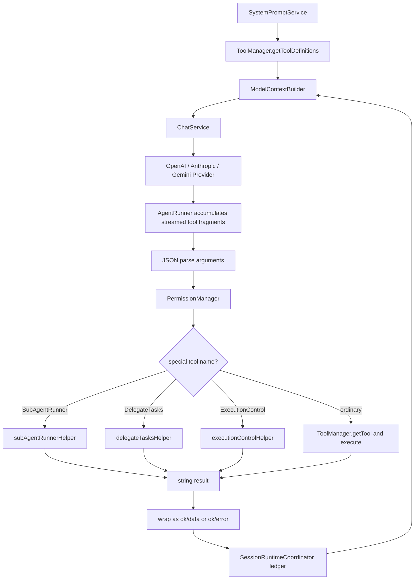
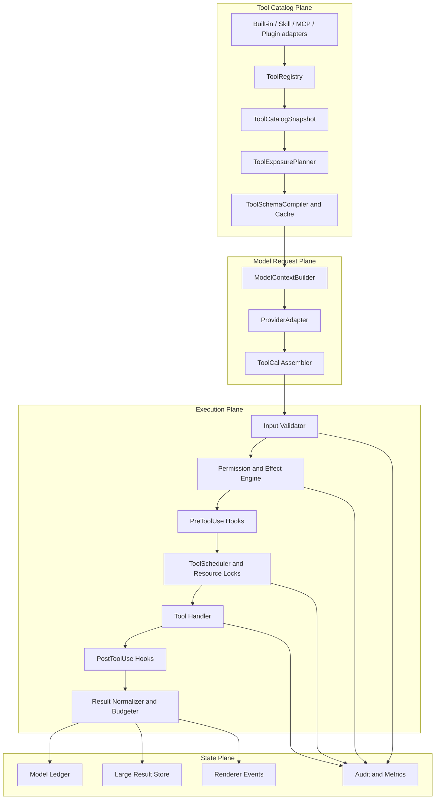
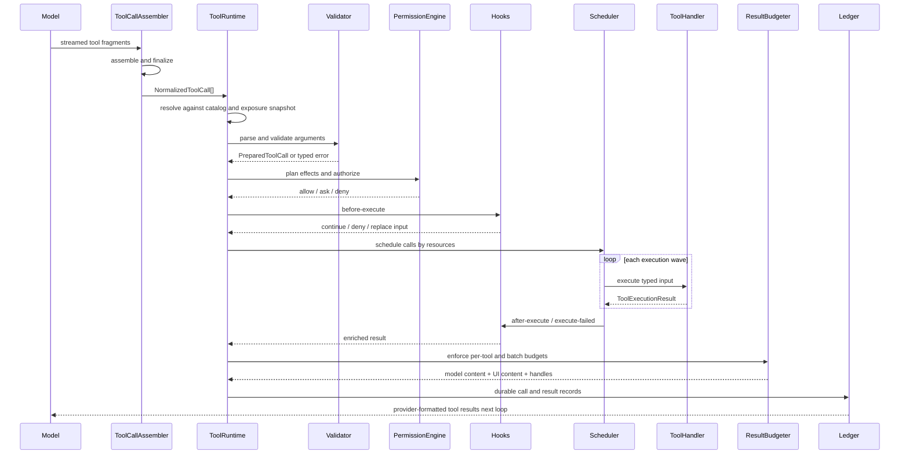

# 基于 Claude Code 的 CodeZ 工具调用平台 V2 设计

- 日期：2026-07-13
- 状态：Draft
- 目标项目：CodeZ
- 参考实现：`F:\MyProjectF\Claude-Code`，提交 `b78dd22`
- 参考性质：该仓库由 Claude Code npm source map 还原，并非官方原始源码；本设计只借鉴当前快照中可验证的架构思想
- 文档范围：工具目录、工具暴露、Provider 协议归一化、参数校验、权限、Hooks、并发执行、结果管理、上下文预算、MCP、可观测性和渐进迁移
- 术语说明：本文使用标准名称 MCP（Model Context Protocol）；对应需求中提到的“mmcp”
- 本次交付：仅设计文档，不修改生产代码、测试、依赖或配置

---

## 1. 摘要

CodeZ 已经完成核心工具名称和单工具能力对齐，但当前工具调用仍然是“固定工具列表 + AgentRunner 中央分发 + 字符串结果”的第一代架构。随着任务管理、子代理、并行 Executor、上下文压缩和多 Provider 支持加入，工具系统已经承担了远超最初契约的职责：

- 24 个内建工具始终全部发送给模型；
- system prompt 又重复注入一次工具摘要；
- 工具参数只在每个工具内部手工 `JSON.parse` 和校验；
- 所有同轮工具调用默认通过 `Promise.all` 并行，缺少统一的并发安全声明；
- `SubAgentRunner`、`DelegateTasks`、`ExecutionControl` 等特殊工具在 `AgentRunner` 里硬编码分支；
- 权限系统通过工具名集合判断能力，工具新增或改名容易造成策略漂移；
- 工具成功或失败依赖字符串特征识别，再被二次 JSON 包装；
- 大结果进入 ledger 后才由上下文裁剪处理，无法阻止单轮结果批次瞬间撑大上下文；
- 三家 Provider 分别解析工具调用流，但没有统一、可测试的 ToolCall assembler 契约；
- 暂无 MCP/插件工具的稳定接入点。

本设计将工具系统重构为一个独立的 Tool Runtime。核心变化如下：

1. 用 `ToolRegistry` 代替固定 `ToolManager` 列表，工具声明能力、风险、并发、可见性和中断语义。
2. 每一轮生成不可变 `ToolCatalogSnapshot`，确保 schema、执行对象和权限判断来自同一版本。
3. 引入 `ToolExposurePlanner`，按核心工具、角色、权限、Provider 能力和上下文预算选择本轮工具。
4. 引入跨 Provider 的 `ToolCallAssembler`，将 OpenAI、Anthropic 和 Gemini 的流式差异归一为 `NormalizedToolCall`。
5. 使用统一 JSON Schema validator 在执行前校验参数，工具实现接收已解析、已校验对象。
6. 引入 `ToolExecutionPipeline`：解析、查找、暴露校验、权限、Hooks、调度、执行、结果规范化、持久化、ledger 记录。
7. 用声明式 effect plan 取代权限系统中的工具名白名单。
8. 用资源锁和 `isConcurrencySafe` 控制并发，禁止冲突写入在同一 `Promise.all` 中无序执行。
9. 统一 `ToolExecutionResult`，分离模型内容、UI 内容、结构化数据、错误、文件引用和副作用。
10. 对大工具结果在进入 ledger 前做批次预算和持久化，以虚拟句柄而不是放宽工作区文件权限来支持后续读取。
11. 正式实现 MCP Client，覆盖配置、连接、tools/resources/prompts、OAuth、权限、动态刷新、UI 和可观测性。
12. 为插件和动态 Skills 预留 `ToolSourceAdapter`，但插件市场不作为本期 MCP 的前置条件。

这不是重写现有 24 个工具。第一阶段会通过 `LegacyToolAdapter` 包装现有 `Tool` 类，先建立新运行时边界，再逐步迁移实现。

---

## 2. 背景与已有设计关系

### 2.1 已完成的工作

`docs/superpowers/specs/2026-06-30-claude-tool-alignment-design.md` 已解决以下问题：

- 对齐 `Read / Edit / Write / NotebookEdit / Glob / Grep / Bash / PowerShell` 等核心工具名；
- 实现 AskUserQuestion、Skill、PushNotification；
- 保留 CodeZ 的事务编辑、回滚和恢复状态能力；
- 为多 Provider 提供基础 tool schema 映射；
- 对 Shell、Read、Edit 等工具描述进行 Claude Code 语义对齐。

`2026-07-11-shared-agent-tool-policy-design.md` 与并行执行相关设计又补充了：

- 主 Agent、Research、ExecutionPlanner、Executor 共享工具策略；
- `Read.files` 批量读取；
- `DelegateTasks`、Execution controller、worktree 隔离和执行 handoff；
- 工具批次在 renderer 中的展示语义。

因此，本设计不再讨论“是否需要某个核心工具”或逐项重写工具实现，而是解决工具调用平台本身的结构问题。

### 2.2 与 Claude Code 的关键架构差异

Claude Code 当前快照中的工具系统具有以下值得借鉴的机制：

- `Tool` 同时声明 input schema、output schema、只读性、破坏性、并发安全、中断行为、是否启用、是否延迟加载等元数据；
- 工具池按权限 deny 规则、运行模式、平台、feature gate、Agent 角色和 MCP 连接动态组合；
- ToolSearch 可以延迟加载 schema，避免所有 MCP/低频工具污染每轮上下文；
- schema 有会话级稳定缓存，减少工具描述轻微变化造成的 prompt cache 失效；
- 工具执行经过参数校验、权限、PreToolUse hook、执行、PostToolUse hook、结果映射和遥测；
- 大结果在回传模型前持久化，只发送预览和路径；
- 单工具和单批次结果都有独立预算；
- 权限支持 allow/deny/ask 多来源规则、沙箱、Hooks 和 headless agent 行为；
- 工具调用执行逻辑与 UI、Provider wire format 分离。

CodeZ 不能直接复制这些实现，原因是：

1. CodeZ 同时支持 OpenAI、Anthropic 和 Gemini，不应把 Anthropic `tool_reference` 或 `cache_control` 当作统一协议。
2. CodeZ 的 `Read` 严格限制在 workspace 内，不能照搬 Claude Code 将大结果保存到外部文件后要求模型直接 Read 的方式。
3. CodeZ 已有 ledger、事务编辑、文件指纹和 Executor lease，需要成为新运行时的一等数据，而不是绕过它们。
4. CodeZ 当前部署在 Electron/Windows 场景，Bash 与 PowerShell 的 sandbox 能力并不对称。
5. CodeZ 的工具定义仍是 JSON Schema，现阶段引入完整 Zod 工具体系会增加一次不必要的 schema 迁移。

---

## 3. 当前架构基线

### 3.1 当前调用链



### 3.2 现有核心契约

当前 `src/main/tools/Tool.ts` 的抽象契约为：

```ts
abstract class Tool {
  abstract get name(): string
  abstract get summary(): string
  abstract get description(): string
  abstract get parameters_schema(): Record<string, any>
  abstract execute(args: string, context: ToolContext): Promise<string>
}
```

这个契约简单，但存在四个扩展瓶颈：

- 输入仍是 JSON 字符串，解析和错误格式由每个工具重复实现；
- 输出仍以字符串为中心，框架通过字符串判断错误；
- 权限、并发、破坏性、结果预算等行为不在工具声明中；
- 工具执行和 Provider schema 没有版本化快照。

### 3.3 当前主要问题

| 问题 | 当前表现 | 风险 |
|---|---|---|
| 固定工具池 | 24 个工具每轮全部发送 | schema token 持续增长，后续 MCP 无法扩展 |
| 重复声明 | tool schema 和 `<available_tools>` 同时包含描述 | 重复 token，两个来源可能漂移 |
| 参数校验分散 | 每个工具手写 JSON.parse 和字段判断 | 错误文案不一致，漏校验 additional properties |
| 特殊工具硬编码 | AgentRunner 按名字 if/else | 每加一个编排工具都修改主循环 |
| 权限按名称分类 | PermissionManager 维护多个名称 Set | 改名或 alias 容易绕过/误触权限 |
| 无统一并发模型 | 同轮调用全部 Promise.all | 同文件写、交互工具和上下文修改可能竞态 |
| 字符串错误检测 | `Error:`、hash mismatch 等启发式 | 成功文本可能误判，结构化错误可能漏判 |
| 双重结果包装 | 工具可能自己返回 `{ok}`，Runner 再包一层 | 模型收到嵌套 JSON 字符串，UI 还需反解 |
| 大结果处理偏晚 | ToolOutputPruner 在后续 context build 才工作 | 单轮批量结果可能先进入 ledger 并触发溢出 |
| Provider 解析耦合 | 各 Provider 直接输出 tool chunk | 边界 fragment、重复 call id 和坏 JSON 难统一测试 |
| 动态扩展缺口 | 无 MCP/plugin adapter | 工具越多，ToolManager 和 AgentRunner 越难维护 |

---

## 4. 目标与非目标

### 4.1 目标

1. 工具注册、选择、授权、执行、结果和观察形成明确分层。
2. 内建工具不需要因为加入运行时 V2 而重写业务逻辑。
3. 工具 schema 与实际可执行工具来自同一个不可变快照。
4. 不允许模型调用本轮没有暴露的工具，即使注册表中存在。
5. 所有工具参数在进入业务实现前完成统一解析和 JSON Schema 校验。
6. 权限依据“将产生什么 effect”判断，而不是依据工具名字猜测。
7. 并行执行只发生在明确安全的调用之间；冲突调用按确定顺序串行。
8. 任何工具结果在进入 ledger 前都满足单工具和单批次预算。
9. Provider 只负责 wire format，不承载工具业务策略。
10. 为未来 MCP、插件、动态 Skills 和远程工具保留稳定接口。
11. MCP 作为 V2 必交付能力接入统一 Tool Runtime，不允许存在绕过 registry、权限、调度或结果预算的旁路。
11. 支持灰度启用、逐阶段回滚和 V1/V2 行为对照。

### 4.2 非目标

- 本设计不要求立即增加新的用户可见工具。
- 不实现插件市场；MCP server 管理和 OAuth 属于正式范围，插件生态在 MCP 稳定后单独立项。
- 首期不移除现有 `Tool` 抽象和 24 个工具实现。
- 首期不改变 Edit/Write 的事务语义和用户 diff 审批流程。
- 首期不放宽 Read 的 workspace 边界。
- 首期不承诺 Bash/PowerShell 都具有完整 OS sandbox。
- 不将 Claude Code 的内部 feature gate、遥测字段或 Anthropic 专有协议直接复制进 CodeZ。
- 不在工具运行时中重新实现 Agent 规划策略；运行时只执行已产生的工具调用。

---

## 5. 设计原则

### 5.1 单一事实源

同一个 `ToolDescriptor` 必须同时驱动：

- 模型可见 schema；
- AvailableTools/ToolSearch 摘要；
- 权限能力分类；
- 并发和资源锁；
- UI 展示；
- 结果预算；
- 遥测中的工具身份。

禁止在 Prompt、PermissionManager、AgentRunner 和 renderer 分别维护工具名列表。

### 5.2 每轮快照稳定

一次模型请求开始后，工具目录不能在流式响应中途改变。MCP 连接、设置变化或 feature flag 更新只能影响下一轮 `ToolCatalogSnapshot`。

### 5.3 Provider 中立

内部 canonical contract 不出现 Anthropic `tool_use`、OpenAI `tool_calls` 或 Gemini `functionCall` 类型。Provider adapter 只在边界转换。

### 5.4 安全由 Runtime 保证

Prompt 可以指导模型，但不能授予权限。工具是否可见、是否允许、是否能写某路径、是否必须串行，都必须由运行时机械执行。

### 5.5 失败可恢复

错误必须提供稳定 code、是否可恢复和建议动作。模型不应依赖英文字符串猜测是否需要重新 Read、缩小 Grep 或请求用户批准。

### 5.6 渐进迁移

新架构首先包装旧实现并保持行为，再迁移契约。任何阶段都应可通过 feature flag 回到 V1。

---

## 6. 目标架构



### 6.1 分层职责

| 层 | 组件 | 职责 |
|---|---|---|
| Catalog | ToolRegistry | 注册、alias、来源、版本、冲突检测 |
| Catalog | ToolExposurePlanner | 决定本轮模型可以看到哪些工具 |
| Catalog | ToolSchemaCompiler | 生成稳定 Provider schema 和 fingerprint |
| Protocol | ToolCallAssembler | 拼接流式 fragment，输出 canonical calls |
| Validation | ToolInputValidator | JSON 解析、schema 校验、错误格式化 |
| Policy | ToolEffectPlanner | 根据参数解析预期副作用和资源范围 |
| Policy | PermissionEngine | allow/ask/deny、规则、hardline、重校验 |
| Hooks | ToolHookRunner | 执行前后策略扩展，不侵入工具实现 |
| Scheduling | ToolScheduler | 并行分组、资源锁、取消和超时 |
| Execution | ToolHandler | 执行业务逻辑，返回 typed result |
| Result | ToolResultProcessor | 预算、持久化、UI/模型分流、ledger 记录 |
| Observability | ToolExecutionJournal | 生命周期事件、耗时、错误和审计 |

---

## 7. 核心领域模型

### 7.1 ToolDescriptor

```ts
export interface ToolDescriptor {
  name: string
  aliases?: readonly string[]
  version: string
  source: 'builtin' | 'skill' | 'mcp' | 'plugin'

  summary: string
  description: string | ((ctx: ToolDescriptionContext) => string | Promise<string>)
  searchHint?: string

  inputSchema: JsonSchemaObject
  outputSchema?: JsonSchemaObject

  availability: {
    enabled(ctx: ToolAvailabilityContext): boolean | Promise<boolean>
    roles: readonly AgentRole[] | '*'
    platforms?: readonly NodeJS.Platform[]
    exposure: 'always' | 'core' | 'deferred' | 'internal'
  }

  behavior: {
    readOnly(input: unknown): boolean
    destructive(input: unknown): boolean
    concurrency: 'safe' | 'resource-locked' | 'exclusive'
    interrupt: 'cancel' | 'block' | 'detach'
    maxResultChars: number
    timeoutMs?: number
  }

  planEffects(input: unknown, ctx: ToolPlanningContext): Promise<ToolEffectPlan>
  resourceKeys(input: unknown, ctx: ToolPlanningContext): Promise<readonly string[]>
}
```

关键约束：

- `name` 是 canonical wire name，必须匹配 `[A-Za-z0-9_-]+`。
- alias 只用于兼容历史消息和旧配置，不主动暴露给模型。
- `description` 可以依赖角色和 Provider 能力，但同一会话快照内必须稳定。
- `internal` 工具只允许框架调用，不出现在模型 schema。
- `exposure` 不等于权限。工具可见不代表执行一定被允许。
- `resourceKeys` 必须返回规范化资源，例如 `file:F:/repo/src/a.ts`、`session:s1:tasks`、`ui:ask-user`。

### 7.2 ToolHandler

```ts
export interface ToolHandler<TInput = unknown, TOutput = unknown> {
  readonly descriptor: ToolDescriptor

  execute(
    input: TInput,
    context: ToolExecutionContext
  ): Promise<ToolExecutionResult<TOutput>>
}
```

V2 handler 不再接收 JSON 字符串。JSON parse 和 schema validation 已在执行管线前完成。

### 7.3 ToolExecutionContext

```ts
export interface ToolExecutionContext {
  workspaceRoot: string
  sessionId: string
  turnId: string
  contextScopeId: string
  callId: string
  agentId?: string
  agentRole: AgentRole

  transaction?: {
    id: string
    service: EditTransactionService
  }

  runtimeCoordinator: SessionRuntimeCoordinator
  abortSignal: AbortSignal
  emitProgress(event: ToolProgressEvent): void
}
```

上下文中不应放置 Provider client、API key 或 renderer 对象。工具需要外部能力时通过显式 service dependency 注入。

### 7.4 ToolExecutionResult

```ts
export type ToolExecutionResult<T = unknown> =
  | {
      status: 'success'
      data?: T
      modelContent: ToolModelContent
      uiContent?: ToolUiContent
      fileReferences?: FileContextReference[]
      effects?: ToolEffectRecord[]
      cache?: { kind: 'stable' | 'volatile'; key?: string }
    }
  | {
      status: 'error' | 'denied' | 'cancelled'
      error: ToolExecutionError
      modelContent?: ToolModelContent
      uiContent?: ToolUiContent
      effects?: ToolEffectRecord[]
    }

export interface ToolExecutionError {
  code: string
  message: string
  recoverable: boolean
  suggestion?: string
  retryAfterMs?: number
  details?: Record<string, unknown>
}
```

`modelContent` 和 `uiContent` 必须分离：

- `modelContent` 进入 ledger 和下一轮模型上下文；
- `uiContent` 仅给 renderer，可包含完整 diff、执行器状态或富结构；
- `data` 供框架后处理，不应先 stringify 再被外层 stringify；
- `effects` 是实际发生的副作用，用于审计和事务收尾；
- 错误 code 是逻辑判断依据，禁止继续依赖 `Error:` 前缀。

### 7.5 LegacyToolAdapter

迁移期使用 adapter 包装现有工具：

```ts
class LegacyToolAdapter implements ToolHandler {
  constructor(private readonly legacy: Tool) {}

  async execute(input: unknown, ctx: ToolExecutionContext): Promise<ToolExecutionResult> {
    const output = await this.legacy.executeWithMetadata(
      JSON.stringify(input),
      toLegacyToolContext(ctx)
    )
    return normalizeLegacyOutput(output)
  }
}
```

`normalizeLegacyOutput` 仅作为迁移兼容层保留旧字符串错误识别。所有原生 V2 handler 禁止返回字符串错误。

---

## 8. ToolRegistry 与 Catalog Snapshot

### 8.1 Registry API

```ts
export interface ToolRegistry {
  register(handler: ToolHandler): void
  unregister(source: ToolSourceId): void
  resolve(nameOrAlias: string): ToolHandler | undefined
  createSnapshot(ctx: ToolAvailabilityContext): Promise<ToolCatalogSnapshot>
}

export interface ToolCatalogSnapshot {
  id: string
  createdAt: string
  handlersByCanonicalName: ReadonlyMap<string, ToolHandler>
  aliases: ReadonlyMap<string, string>
  descriptors: readonly ToolDescriptor[]
  fingerprint: string
}
```

### 8.2 注册冲突规则

1. 内建 canonical name 不能被 MCP/plugin 覆盖。
2. 同名外部工具必须规范化为 `mcp__<server>__<tool>` 或 `plugin__<plugin>__<tool>`。
3. alias 不得与任何 canonical name 冲突。
4. alias 冲突时注册失败并记录 source，不采用“后注册覆盖”。
5. snapshot 创建后不可变；外部工具连接变化只产生新 snapshot。

### 8.3 版本与 fingerprint

fingerprint 至少包含：

- canonical name；
- descriptor version；
- description 的最终文本；
- input/output schema 的 canonical JSON；
- exposure metadata；
- Provider schema compiler version。

JSON canonicalization 必须稳定排序 object keys，避免构造顺序不同造成无意义缓存失效。

---

## 9. 工具暴露与延迟 Schema

### 9.1 为什么需要暴露规划

当前 24 个工具的 schema 已经占用固定上下文。正式实现 MCP 后，一个 server 可能带来几十到几百个工具。如果全部加载：

- 每轮输入 token 成本线性增加；
- 模型更容易选择相似但错误的工具；
- Provider 可能超过工具数量或 schema 大小限制；
- 任意外部工具 schema 变化都会影响请求 fingerprint。

### 9.2 暴露等级

建议默认分层：

| 等级 | 默认工具 | 说明 |
|---|---|---|
| always | `ToolSearch`、`AskUserQuestion` | 运行时基础设施，始终可见 |
| core | `Read`、`Edit`、`Write`、`Glob`、`Grep`、平台主 Shell | 主编码路径 |
| role | Task、Agent、Delegate、Execution 工具 | 仅对适用 Agent 角色可见 |
| deferred | Web、PushNotification、NotebookEdit、低频外部工具 | 按需激活 |
| internal | rollback 协调、结果存储读取、框架控制工具 | 不直接暴露或条件暴露 |

最终分类需通过真实会话日志验证，不能只根据主观判断永久固定。

### 9.3 ToolExposurePlanner

输入：

```ts
interface ToolExposureRequest {
  catalog: ToolCatalogSnapshot
  agentRole: AgentRole
  permissionContext: PermissionContext
  providerCapabilities: ProviderToolCapabilities
  contextBudget: ContextBudgetSnapshot
  activatedDeferredTools: ReadonlySet<string>
  taskSignals?: readonly string[]
}
```

输出：

```ts
interface ToolExposurePlan {
  eagerTools: readonly ToolDescriptor[]
  deferredTools: readonly DeferredToolSummary[]
  hiddenTools: readonly { name: string; reason: string }[]
  schemaFingerprint: string
  estimatedSchemaTokens: number
}
```

规划顺序：

1. 移除当前平台/角色不可用工具。
2. 移除 blanket deny 工具，避免模型看见必然失败的能力。
3. 加入 always 工具。
4. 加入适用于角色的 core 工具。
5. 加入本会话已激活 deferred 工具。
6. 根据 Provider 工具数量和 schema 字节上限裁剪。
7. 若剩余 schema token 超过输入预算的指定比例，按优先级继续延迟。
8. 生成 deferred name/summary 列表供 ToolSearch 使用。

### 9.4 跨 Provider ToolSearch

CodeZ 不依赖 Anthropic 专有 `tool_reference`。统一流程如下：

1. 初始请求只暴露 eager tools 和 `ToolSearch`。
2. 模型调用 `ToolSearch({ query })`。
3. ToolSearch 在当前 catalog snapshot 中搜索 deferred tools。
4. 结果返回匹配名称、摘要和“将在下一轮启用”的提示。
5. Runtime 将匹配工具加入 session/context-scope 的 `activatedDeferredTools`。
6. 下一 Agent loop 重新生成 exposure plan，并把完整 schema 发给 Provider。
7. 模型随后正常调用已激活工具。

ToolSearch 返回结果示例：

```json
{
  "activated": ["WebSearch", "WebFetch"],
  "availableNextTurn": true,
  "summaries": [
    { "name": "WebSearch", "summary": "Search current web information" },
    { "name": "WebFetch", "summary": "Fetch and extract a web page" }
  ]
}
```

若模型直接调用未暴露工具，Runtime 返回：

```json
{
  "code": "TOOL_NOT_EXPOSED",
  "recoverable": true,
  "message": "WebSearch is registered but was not exposed in this turn.",
  "suggestion": "Call ToolSearch for web search tools first."
}
```

### 9.5 system prompt 调整原则

- eager tool 的完整描述只存在于 tool schema，不再在 `<available_tools>` 重复。
- system prompt 只保留选择原则和 deferred tool 名称/短摘要。
- `AvailableToolsModule` 必须接收当前 `ToolExposurePlan`，不能自行 `new ToolManager()`。
- Research/Executor 的 prompt 只能列出该角色实际可见工具。

---

## 10. Provider 工具协议归一化

### 10.1 ProviderToolCapabilities

```ts
export interface ProviderToolCapabilities {
  supportsParallelToolCalls: boolean
  supportsStrictSchema: boolean
  supportsToolChoice: boolean
  supportsStreamingArguments: boolean
  supportsNativeDeferredTools: boolean
  maxTools?: number
  maxSchemaBytes?: number
  preservesToolCallId: boolean
}
```

能力由 `ModelCapabilities` 按 `apiFormat + baseUrl + model` 解析，禁止仅根据 Provider 名称假设所有兼容端点行为一致。

### 10.2 Canonical fragment

Provider parser 统一输出：

```ts
export interface ToolCallFragment {
  provider: 'openai' | 'anthropic' | 'gemini'
  position: number
  callId?: string
  nameDelta?: string
  argumentsDelta?: string
  completeArguments?: unknown
  thoughtSignature?: string
  isFinal?: boolean
}
```

### 10.3 ToolCallAssembler

```ts
export interface NormalizedToolCall {
  callId: string
  position: number
  name: string
  rawArguments: string
  thoughtSignature?: string
  providerMetadata?: Record<string, unknown>
}
```

Assembler 必须处理：

- OpenAI 按 index 分片的 name/arguments；
- Anthropic content block start/delta/stop；
- Gemini 一次性 `functionCall.args` 对象；
- 缺失 call id 时生成确定性的 turn/loop/position id；
- 同 position 的重复 fragment；
- UTF-8 和 JSON 字符串跨 chunk 截断；
- Provider 在 stop reason 未标 tool use 时仍返回 functionCall；
- thought signature 在 turn 级或 call 级出现；
- 空名称、名称超长、参数超过上限；
- 流中断时未完成调用不得执行。

### 10.4 Provider adapter 边界

Provider 只负责：

- 将 canonical messages 和 exposure plan 编码为 wire request；
- 将响应流解析为 text/reasoning/tool fragments/usage；
- 映射 stop reason；
- 报告 Provider protocol error。

Provider 不负责：

- 查找工具；
- 参数校验；
- 权限判断；
- 特殊工具分发；
- 工具结果预算；
- ToolSearch 激活状态。

---

## 11. 输入解析与 Schema 校验

### 11.1 方案选择

保留 JSON Schema 作为工具声明单一来源，引入 Ajv 2020 作为统一 validator。原因：

- 现有 24 个工具已经维护 JSON Schema；
- 三家 Provider 都能从 JSON Schema 映射；
- 避免同时维护 Zod 和 JSON Schema；
- Ajv 可在 snapshot 创建时编译并缓存 validator；
- 可以统一处理 required、type、enum、minItems 和 additionalProperties。

### 11.2 校验流程

1. 对 `rawArguments` 做最大字节限制。
2. 严格 `JSON.parse`；空字符串只在 schema 允许空 object 时转 `{}`。
3. 必须得到 object，禁止 array、number、string 顶层输入。
4. 运行 snapshot 对应的 compiled validator。
5. 将 Ajv errors 转为对模型友好的稳定错误。
6. 校验通过后冻结或深拷贝 input，防止 Hook/工具之间共享可变对象。

错误示例：

```json
{
  "code": "TOOL_INPUT_INVALID",
  "recoverable": true,
  "message": "Read input is invalid.",
  "details": {
    "issues": [
      "The required parameter `files` is missing",
      "The unexpected parameter `path` was provided"
    ]
  },
  "suggestion": "Call Read with { files: [{ file_path: \"...\" }] }."
}
```

### 11.3 Schema 约束

- 新增或迁移的 schema 默认 `additionalProperties: false`。
- 所有数组必须设置合理 `maxItems`。
- 命令、内容和查询字段必须设置 Runtime 级最大字节限制，即使 Provider schema 不支持该关键字。
- 不能依靠 description 表达必需的安全约束。
- alias 参数若需兼容，应在 adapter 中规范化后再校验，不能无限期留在 canonical schema。

---

## 12. Effect Plan 与权限

### 12.1 从工具名判断迁移到副作用判断

当前 `PermissionManager` 用 `READ_ONLY_TOOLS`、`WRITE_TOOLS`、`WEB_TOOLS` 等名称集合分类。V2 改为每次调用先生成 effect plan：

```ts
export interface ToolEffectPlan {
  effects: readonly ToolEffect[]
  analysisStatus: 'parsed' | 'partial' | 'unparsed'
  snapshots?: readonly PermissionSnapshot[]
}

export type ToolEffect =
  | { kind: 'read-file'; path: string; scope: 'workspace' | 'external' }
  | { kind: 'write-file'; path: string; mode: 'create' | 'modify' | 'overwrite' }
  | { kind: 'delete-file'; path: string }
  | { kind: 'execute-command'; shell: 'bash' | 'powershell'; command: string }
  | { kind: 'network'; host?: string; method?: string }
  | { kind: 'notify-user'; channel: 'desktop' | 'remote' }
  | { kind: 'spawn-agent'; role: string; isolation: string }
  | { kind: 'control-execution'; executionId: string; action: string }
  | { kind: 'mutate-task-state'; sessionId: string }
  | { kind: 'read-memory'; path: string }
```

PermissionEngine 只消费 effects，不依赖 `Edit`、`Write`、`DelegateTasks` 等名称。

### 12.2 决策顺序

1. Registry/Exposure gate：工具是否注册且本轮暴露。
2. Agent role gate：当前角色是否允许此工具。
3. Lease gate：Executor token 是否仍有效。
4. Hardline safety：凭据、系统目录、破坏性 git、权限绕过等。
5. 显式 deny 规则。
6. 显式 ask 规则。
7. 工具 effect policy。
8. 当前 permission mode。
9. Smart approval/classifier。
10. 用户审批。
11. 输入 snapshot revalidation。

任何 later stage 不得覆盖 earlier hard deny。

### 12.3 Permission mode

短期保留 CodeZ 的 `auto | full-access`，但内部决策不要把 mode 与 capability 写死在同一个 class 中。建议将来扩展为：

- `default`：只读自动允许，写入和命令按规则判断；
- `accept-edits`：工作区内非敏感编辑自动允许；
- `auto`：安全命令和编辑可经 classifier 自动允许；
- `plan`：只读和计划文件例外；
- `dont-ask`：需要 ask 的调用转换为 deny；
- `full-access`：除 hardline 与显式 deny 外允许。

此扩展不是 V2 首期前置条件，但 effect model 必须能支持。

### 12.4 Sandbox 接口

```ts
interface SandboxAdapter {
  capability(shell: 'bash' | 'powershell'): 'none' | 'workspace' | 'strict'
  execute(request: SandboxedCommandRequest): Promise<SandboxedCommandResult>
}
```

策略：

- V2 首期可继续使用 `none`，但必须在 execution journal 中记录；
- 如果设置要求 `strict` 而平台 adapter 不支持，必须 fail closed，不能静默降级；
- `dangerouslyDisableSandbox` 只能触发显式审批，不能是普通布尔旁路；
- Bash 和 PowerShell 可以有不同 capability；
- sandbox 不能替代命令语法分析、权限规则和 critical guard。

---

## 13. Tool Hooks

### 13.1 Hook 类型

```ts
type ToolHookEvent =
  | 'before-validate'
  | 'before-permission'
  | 'permission-request'
  | 'before-execute'
  | 'after-execute'
  | 'execute-failed'
  | 'after-result-processed'
```

首期只实现内部 typed hooks；用户配置 shell hooks 可在后续建立在同一接口上。

### 13.2 Hook 决策

```ts
type BeforeToolHookResult =
  | { action: 'continue' }
  | { action: 'deny'; code: string; message: string }
  | { action: 'ask'; message: string }
  | { action: 'replace-input'; input: unknown; reason: string }
```

约束：

- `replace-input` 后必须重新 schema 校验和 effect planning；
- Hook 不能把 hardline deny 改为 allow；
- Hook 超时按类型 fail closed 或记录后继续，策略必须显式；
- Hook 输出进入模型前视为非权威数据，不能被当作 system instruction；
- 每次 Hook 修改必须记录 before/after fingerprint，敏感值需脱敏。

### 13.3 CodeZ 内部 Hook 用例

- Edit/Write 前建立事务备份；
- 工具结束后更新 verification tracking；
- 文件工具结束后更新 Read fingerprint delivery；
- task 工具结束后持久化 session task state；
- shell 工具结束后提取 test/build/lint 结果；
- 外部工具失败后添加可恢复建议；
- 统一 renderer progress 事件。

这些逻辑从 AgentRunner 移出后，主循环不再按工具名更新 `filesModifiedInSession`。

---

## 14. 并发调度与资源锁

### 14.1 当前问题

当前同轮所有工具调用直接 `Promise.all`。以下组合存在风险：

- 两个 Edit 同时修改同一文件；
- Write 与 NotebookEdit 修改同一路径；
- AskUserQuestion 与另一个阻塞 UI 工具并发；
- TaskUpdate 同时把多个任务设为 in_progress；
- ExecutionControl 与 ExecutionInspect 读取/修改同一执行状态；
- Shell 命令与文件工具同时操作相同目录或 git index；
- 工具通过 `contextModifier` 或 session state 改变后续调用前提。

### 14.2 调度分类

| 类型 | 示例 | 调度 |
|---|---|---|
| safe | 独立 Read、Glob、Grep、只读 WebFetch | 并行 |
| resource-locked | Edit、Write、TaskUpdate、ExecutionControl | 获取资源键后并行或排队 |
| exclusive | AskUserQuestion、进入模式、全局配置修改 | 本批次独占 |
| detached | background shell、子代理 | 启动阶段受调度，运行后由 controller 管理 |

### 14.3 Resource keys

示例：

```text
Read(src/a.ts)              -> file:F:/repo/src/a.ts:read
Edit(src/a.ts)              -> file:F:/repo/src/a.ts:write
Write(src/a.ts)             -> file:F:/repo/src/a.ts:write
TaskUpdate(t1)              -> session:s1:tasks
AskUserQuestion             -> session:s1:user-interaction
ExecutionControl(exec-1)    -> execution:exec-1
Bash(git add ...)           -> repo:F:/repo:git-index
```

锁规则：

- 同资源的 read/read 可以并发；
- read/write 和 write/write 串行；
- 多资源调用按排序后的 key 一次性获取，避免死锁；
- 无法可靠推导资源的写操作按 workspace exclusive 处理；
- 原始模型调用顺序作为冲突调用的确定性串行顺序；
- 权限审批可以并行预计算，但需要用户交互的审批应排队展示。

### 14.4 Scheduler 输出

```ts
interface ToolExecutionWave {
  index: number
  calls: PreparedToolCall[]
  reason: 'independent' | 'resource-serialized' | 'exclusive'
}
```

同轮 5 个调用可能被拆为：

```text
Wave 0: Read(a), Read(b), Grep(x)
Wave 1: Edit(a)
Wave 2: AskUserQuestion
```

结果写回模型时仍按原始 position 排序，不按完成时间排序，保证 Provider transcript 稳定。

### 14.5 中断行为

- `cancel`：Read/Grep/前台 shell 在用户 steer 或 stop 时取消；
- `block`：事务 commit、关键状态迁移完成前阻塞新输入；
- `detach`：后台 shell/Executor 继续，由 controller 持有状态；
- 被取消的调用必须写入 canonical cancelled result，不能从 ledger 中消失；
- 同一批次中依赖被取消调用的后续 wave 标为 `DEPENDENCY_CANCELLED`。

---

## 15. 特殊工具去特例化

### 15.1 当前特例

AgentRunner 当前直接识别：

- `SubAgentRunner`
- `DelegateTasks`
- `ExecutionControl`
- `AskUserQuestion` intercept
- Edit/Write 修改追踪
- Bash/PowerShell verification 命令追踪

### 15.2 目标

特殊行为通过 handler 和 hooks 注册：

```ts
registry.register(new SubAgentRunnerHandler(subAgentManager))
registry.register(new DelegateTasksHandler(executionController))
registry.register(new ExecutionControlHandler(executionController))
registry.register(new AskUserQuestionHandler(userInteractionService))
```

AgentRunner 不知道这些工具名字，只负责：

```ts
const calls = assembler.finalize()
const results = await toolRuntime.executeBatch(calls, turnContext)
await runtimeCoordinator.recordToolResults(turn, results)
```

### 15.3 内部控制能力

某些操作不应伪装成普通模型工具：

- transaction handoff/rollback；
- tool result store cleanup；
- executor lease renewal；
- context compaction；
- exposure activation bookkeeping。

这些能力作为 runtime service 或 internal handler，不放进模型工具目录。

---

## 16. 工具结果与上下文预算

### 16.1 两阶段预算

1. 执行前预算：估算本批次最坏结果，必要时限制并行数量或向工具传入更小 limit。
2. 执行后预算：结果进入 ledger 前执行单工具和单批次裁剪/持久化。

建议初始阈值：

| 预算 | 初始值 | 说明 |
|---|---:|---|
| 单工具软上限 | 50,000 chars | 超过则持久化或工具自身分页 |
| 单工具硬上限 | 400,000 bytes | 超过必须持久化或报错 |
| 单批次模型内容 | 200,000 chars | 从最大结果开始替换为预览 |
| 持久化预览 | 2,000 chars | 包含开头、必要时加尾部摘要 |
| 错误文本上限 | 10,000 chars | 保留头尾，中间截断 |

最终值应按模型上下文动态缩放，不应永久写死。

### 16.2 LargeToolResultStore

CodeZ 的 Read 不允许 workspace 外路径，因此不能直接照搬 Claude Code 的“保存文件后让模型 Read 路径”。建议保存到：

```text
~/.codez/projects/<workspace-hash>/sessions/<session-id>/tool-results/<call-id>.<ext>
```

模型收到虚拟句柄：

```xml
<persisted-tool-result id="tool-result://call_123" original_chars="183420">
Output was too large. A preview follows.
...
</persisted-tool-result>
```

后续通过受控的 `ToolResultRead` 工具读取：

```ts
{
  handle: 'tool-result://call_123',
  offset: 1,
  limit: 200
}
```

`ToolResultRead` 只解析 opaque handle，不能接受任意文件路径，因此不破坏 workspace 边界。

### 16.3 持久化规则

- 文件使用 `wx` 或原子临时文件 + rename，避免同 call id 重写竞态；
- 元数据记录 content type、size、sha256、createdAt、sessionId、toolName；
- 结果保留期跟随 session retention；
- session 删除时清理结果；
- 敏感工具可以声明 `persist: never`；
- 图片/二进制结果不能作为普通文本落盘，必须使用 content block store；
- renderer 可读取完整 uiContent，但不得把未裁剪内容自动重新注入模型。

### 16.4 与 ToolOutputPruner 的关系

- `ToolResultProcessor` 控制新结果第一次进入 ledger 的大小；
- `ToolOutputPruner` 控制历史结果在上下文压力下的二次清理；
- 两者职责不同，不能互相替代；
- 已持久化结果在后续 prune 时保留 handle 和最小摘要；
- 未被下一条 assistant 消费的当前轮结果继续受 protected message 保护。

---

## 17. Ledger 与协议完整性

### 17.1 Canonical records

建议 ledger 分别记录：

```ts
interface ToolCallRecord {
  callId: string
  turnId: string
  position: number
  canonicalName: string
  requestedName: string
  rawArguments: string
  parsedInputHash?: string
  catalogSnapshotId: string
  exposurePlanId: string
  thoughtSignature?: string
  status: 'received' | 'validated' | 'authorized' | 'running' | 'completed'
}

interface ToolResultRecord {
  callId: string
  canonicalName: string
  status: 'success' | 'error' | 'denied' | 'cancelled'
  modelContent: ToolModelContent
  error?: ToolExecutionError
  fileReferences?: FileContextReference[]
  effects?: ToolEffectRecord[]
  startedAt: string
  completedAt: string
}
```

### 17.2 不变量

1. 每个 assistant tool call 恰好对应一个 tool result。
2. tool result 的 canonical name 与 call record 一致。
3. call id 在 session/context scope 内唯一。
4. 同批次结果按 call position 进入 Provider transcript。
5. cancelled/denied 也必须产生结果。
6. compaction 不得留下孤立 tool call 或 tool result。
7. session restore 后未完成调用不自动重放副作用；必须标记 interrupted 并由恢复策略处理。

### 17.3 幂等性

ToolDescriptor 可选声明：

```ts
idempotency?: {
  mode: 'none' | 'by-call-id' | 'by-input'
  key(input: unknown, ctx: ToolExecutionContext): string
}
```

- Read/Grep 可按 input cache；
- PushNotification、外部消息和写操作默认不自动重试；
- Provider timeout 后如果不确定工具是否执行，不得根据相同 call id 再次执行破坏性调用；
- transaction 和 effect record 用于判断已执行状态。

---

## 18. 完整执行生命周期



### 18.1 Pipeline 伪代码

```ts
async function executeBatch(
  calls: readonly NormalizedToolCall[],
  turn: ToolRuntimeTurnContext
): Promise<readonly CanonicalToolResult[]> {
  const prepared = await Promise.all(
    calls.map(call => prepareCall(call, turn.catalog, turn.exposure))
  )

  const authorized = await authorizePreparedCalls(prepared, turn)
  const waves = await scheduler.plan(authorized, turn)
  const rawResults = await scheduler.execute(waves, turn.abortSignal)
  const processed = await resultProcessor.processBatch(rawResults, turn.budget)

  await ledger.recordToolBatch(turn, processed)
  return processed.sort((a, b) => a.position - b.position)
}
```

### 18.2 prepareCall 顺序

```text
resolve canonical name / alias
→ verify tool existed in catalog snapshot
→ verify tool was exposed in this turn
→ parse JSON
→ normalize legacy aliases
→ validate schema
→ run before-validate/before-permission hooks
→ plan effects
→ compute resource keys
→ produce PreparedToolCall
```

---

## 19. 典型场景

### 19.1 批量 Read 后并行 Edit 不同文件

模型调用：

```text
Read(a.ts, b.ts)
```

下一轮调用：

```text
Edit(a.ts), Edit(b.ts)
```

Runtime 行为：

- 两个 Edit 都验证对应 Read fingerprint；
- effect plan 生成两个不同 write-file 路径；
- resource keys 不冲突，可同 wave 并行；
- 每个 Edit 仍进入同一个 transaction，但事务服务按路径资源锁保护；
- 结果按原始 call position 写回。

### 19.2 同文件双 Edit

模型同轮调用两个 `Edit(a.ts)`：

- scheduler 发现 `file:a.ts:write` 冲突；
- 按模型 position 串行执行；
- 第一个 Edit 更新 fingerprint；
- 第二个 Edit 若基于旧内容则返回 `STALE_FILE_CONTEXT`，不会覆盖第一个结果；
- 模型下一轮重新 Read 或根据 diff 调整。

### 19.3 延迟 WebSearch

初始 exposure 没有 WebSearch schema：

```text
ToolSearch("current web documentation")
```

ToolSearch 激活 WebSearch。下一 loop 的 schema fingerprint 变化并包含 WebSearch，模型才能调用。OpenAI、Anthropic、Gemini 均遵循相同两轮语义。

### 19.4 Shell 被拒绝

模型调用 `PowerShell(Remove-Item -Recurse ...)`：

- schema validation 通过；
- ShellAnalysisService 生成 delete/system effects；
- CriticalOperationGuard 或 deny rule 决定 ask/deny；
- 被拒绝时不进入 scheduler 和 handler；
- ledger 记录 denied result 和 rule id；
- 模型收到 typed error，不应重试相同调用。

### 19.5 大批量 Grep

三个并行 Grep 各返回 80K chars：

- 单工具超过 50K，三个结果分别持久化；
- 每个结果向模型返回 2K preview + handle；
- batch 总量保持在预算内；
- 模型可调用 `ToolResultRead` 定向读取某个 handle；
- 后续 context prune 只清理 preview，handle 仍有效。

### 19.6 用户 steer

用户在长 Bash 执行时发送新消息：

- 若 Bash 为前台且 `interrupt=cancel`，abort signal 终止子进程并记录 cancelled；
- 若为 background，则 `interrupt=detach`，新消息进入当前 turn continuation；
- Edit transaction commit 阶段为 `block`，必须先完成一致性收尾；
- 任何情况都不能留下 assistant tool call 没有 tool result。

---

## 20. 可观测性与审计

### 20.1 ToolExecutionJournal 事件

```text
catalog.snapshot.created
exposure.plan.created
tool.call.received
tool.call.validation_failed
tool.call.permission_started
tool.call.permission_decided
tool.call.queued
tool.call.started
tool.call.progress
tool.call.completed
tool.call.failed
tool.call.cancelled
tool.result.persisted
tool.batch.completed
```

### 20.2 必需字段

- sessionId、turnId、contextScopeId；
- callId、canonical tool name、source、descriptor version；
- catalog snapshot id、exposure plan id、schema fingerprint；
- permission mode、decision、rule id、审批耗时；
- queue duration、execution duration、hook duration；
- input bytes、result bytes、model result bytes、persisted bytes；
- status、error code、recoverable；
- resource key 数量、execution wave；
- Provider、model、API format。

### 20.3 数据保护

- 默认不记录完整命令、文件内容、URL query、tool args 或 tool output；
- 对路径只记录 workspace-relative path 或稳定 hash；
- debug 日志显式开启且标记可能包含敏感信息；
- permission audit 可保留必要的 normalized pattern，但必须有 retention；
- MCP/plugin 元数据在进入日志前按来源定义 redaction。

### 20.4 关键指标

- 每轮 eager schema token；
- deferred tool 激活率和 ToolSearch 命中率；
- TOOL_NOT_EXPOSED 发生率；
- 输入 schema validation failure rate；
- permission ask/allow/deny 比例和等待时间；
- 并行度、资源冲突串行率；
- 单批次结果大小和持久化率；
- 工具错误恢复成功率；
- Provider tool protocol error rate；
- V1/V2 同任务工具轮数和总 token 差异。

---

## 21. MCP 正式实现设计

MCP 不是本设计的远期扩展点，而是 Tool Runtime V2 的正式交付能力。实现必须参考当前 Claude Code 还原源码中已验证的 MCP 结构，同时根据 CodeZ 的 Electron 主进程、多 Provider、workspace 文件边界、权限系统和动态工具暴露机制做适配。

### 21.1 Claude Code 源码参考映射

| Claude Code 参考文件 | 可验证职责 | CodeZ 采用方式 |
|---|---|---|
| `src/services/mcp/types.ts` | transport/config schema、connection union、resource 和 serialized state | 借鉴判别联合与状态模型，改用 CodeZ JSON Schema/Ajv |
| `src/services/mcp/config.ts` | 多 scope 配置合并、环境变量展开、server 去重、原子写 `.mcp.json` | 借鉴 scope、原子写和冲突诊断；路径改为 CodeZ 配置体系 |
| `src/services/mcp/MCPConnectionManager.tsx` | server 连接生命周期、重连、工具和资源刷新 | 拆成主进程 service，不把 React hook 作为核心 manager |
| `src/services/mcp/client.ts` | SDK transport、initialize、tool/resource/prompt 调用、错误归一化 | 采用官方 SDK 和相同协议边界，不复制 Anthropic 遥测字段 |
| `src/services/mcp/normalization.ts` | MCP server/tool 名称规范化 | 借鉴稳定命名和 original name 映射 |
| `src/tools/MCPTool/MCPTool.ts` | 把单个 MCP tool 转换成内部 Tool、调用 client、映射内容和错误 | 通过 `McpToolSourceAdapter` 生成 V2 `ToolHandler` |
| `src/tools/ListMcpResourcesTool/` | 枚举 server resources | 设计 CodeZ `ListMcpResources` 内建工具 |
| `src/tools/ReadMcpResourceTool/` | 读取 URI resource 并映射内容 | 设计 CodeZ `ReadMcpResource` 内建工具 |
| `src/tools/McpAuthTool/` | 模型触发或提示用户执行 MCP 认证 | 采用显式 `McpAuth` 工具和设置页认证入口 |
| `src/services/mcp/auth.ts` | OAuth discovery、PKCE、token refresh/revoke、安全存储和错误规范化 | 参考 RFC 流程，接入 Electron secure storage/keychain |
| `src/tools/ToolSearchTool/` | MCP 工具默认 deferred、按需加载 schema | 直接纳入 CodeZ 跨 Provider“下一轮激活”设计 |
| `src/tools.ts` | 内建/MCP 工具合并、deny 过滤、去重和稳定排序 | 由 `ToolRegistry + ToolExposurePlanner` 实现 |

参考原则：

- 参考行为和边界，不复制还原源码中的内部 feature gate、环境变量、分析事件或 Ant 专用服务；
- 优先使用 `@modelcontextprotocol/sdk`，不自行实现 JSON-RPC framing、OAuth discovery 或 Streamable HTTP；
- Claude Code 的 React connection manager 需要拆分，因为 CodeZ 的 MCP 生命周期必须由 Electron main process 持有；
- Claude Code 的 MCP 工具最终进入统一工具池，这一点在 CodeZ 中必须保持，禁止另建绕过 Tool Runtime 的 MCP 调用循环；
- Claude Code 的 MCP 工具通常延迟 schema，这一点是 CodeZ 实现 MCP 的前置架构，不是上线后的可选优化。

### 21.2 MCP 交付范围

必须实现：

- MCP Client initialize/handshake 和协议版本协商；
- `stdio` transport；
- Streamable HTTP transport；
- legacy SSE transport，用于兼容尚未迁移的 server；
- tools list、call 和 `tools/list_changed`；
- resources list/read、resource templates 和 `resources/list_changed`；
- prompts list/get 和 `prompts/list_changed`；
- server instructions；
- progress、cancellation 和 logging notification；
- remote server OAuth 2.1、PKCE、token refresh、logout/revoke；
- 配置 scope、项目配置信任、启用/禁用和状态持久化；
- MCP tools 接入 ToolRegistry、ToolSearch、PermissionManager、Scheduler 和 ResultProcessor；
- Electron 设置页、连接状态、认证、重连、错误和能力查看；
- session restore 和动态 schema snapshot 刷新；
- 审计、redaction、超时、限流、重试和进程清理。

需要支持但默认关闭或严格审批：

- sampling request；
- URL/form elicitation；
- server 请求 roots；
- resource subscription；
- 外部工具声明的 destructive/read-only annotations。

不属于本次 MCP 交付：

- 插件市场；
- 自动下载和执行未知 MCP package；
- 私有 MCP registry 商业分发；
- WebSocket 自定义 transport；
- Claude.ai、CCR、XAA 等 Anthropic 私有代理协议；
- 允许 MCP server 绕过 CodeZ 权限直接操作本地 Tool Runtime。

### 21.3 SDK 与协议版本

实现期新增官方依赖：

```json
{
  "dependencies": {
    "@modelcontextprotocol/sdk": "<pinned-compatible-version>"
  }
}
```

版本策略：

- 不使用 `*`；锁定经过 CodeZ 集成测试的 minor 版本；
- package lock 必须提交；
- initialize 时使用 SDK 支持的最新稳定协议版本，并接受 server 协商结果；
- server 返回不支持的 protocol version 时进入 `failed`，不猜测兼容；
- SDK 升级必须运行 transport、OAuth、tools/resources/prompts 的 compatibility suite；
- wire-level fixtures 保存去敏后的 JSON-RPC 消息，用于升级回归。

### 21.4 配置模型

```ts
type McpServerConfig =
  | {
      type: 'stdio'
      command: string
      args?: string[]
      cwd?: string
      env?: Record<string, SecretExpression>
    }
  | {
      type: 'http'
      url: string
      headers?: Record<string, SecretExpression>
      oauth?: McpOAuthConfig
    }
  | {
      type: 'sse'
      url: string
      headers?: Record<string, SecretExpression>
      oauth?: McpOAuthConfig
    }

interface McpServerEntry {
  name: string
  enabled: boolean
  autoStart: boolean
  config: McpServerConfig
  timeoutMs?: number
  reconnect?: {
    enabled: boolean
    maxAttempts: number
    baseDelayMs: number
    maxDelayMs: number
  }
  exposure?: {
    alwaysLoadTools?: string[]
    blockedTools?: string[]
  }
  instructionsPolicy?: 'ignore' | 'tool-hints' | 'approved'
  samplingPolicy?: 'deny' | 'ask' | 'allow'
}

type SecretExpression =
  | `\${env:${string}}`
  | `\${secret:${string}}`
```

配置示例：

```json
{
  "mcpServers": {
    "docs": {
      "enabled": true,
      "autoStart": true,
      "type": "stdio",
      "command": "node",
      "args": ["tools/docs-mcp/server.js"],
      "env": {
        "DOCS_TOKEN": "${env:DOCS_TOKEN}"
      }
    },
    "github": {
      "enabled": true,
      "autoStart": false,
      "type": "http",
      "url": "https://mcp.example.com/github",
      "oauth": {
        "enabled": true,
        "callbackPort": 0
      },
      "instructionsPolicy": "tool-hints"
    }
  }
}
```

安全要求：

- 配置文件不保存 access token、refresh token、authorization code 或明文 secret；
- `${env:NAME}` 只读取指定环境变量；`${secret:key}` 读取系统安全存储；
- secret expansion 发生在连接前，展开值不得进入 prompt、renderer state、普通日志或错误文本；
- stdio `command` 与 `args` 作为 argv 直接 spawn，禁止通过 shell 拼接；
- project config 中的相对 command/cwd 按 workspaceRoot 解析并做稳定路径校验；
- URL 默认要求 HTTPS；只允许 loopback 地址使用 HTTP，其他 HTTP 必须显式不安全审批且不允许 OAuth token。

### 21.5 配置 Scope 与信任模型

建议 scope：

| Scope | 路径 | 用途 | 默认信任 |
|---|---|---|---|
| managed | 管理策略指定路径 | 企业强制 server/deny 规则 | 由管理员锁定 |
| user | `~/.codez/mcp.json` | 用户跨项目 server | 用户已配置，但调用仍走权限 |
| project | `<workspace>/.mcp.json` | 团队共享配置 | 首次连接必须批准项目 |
| local | `<workspace>/.codez/mcp.local.json` | 私有项目覆盖 | 用户本地配置 |
| dynamic | 当前 session 内存 | 临时 SDK/测试连接 | session 结束清理 |

合并和冲突规则：

1. managed deny/disable 不可被低 scope 覆盖。
2. 同名 server 按 `local > project > user` 选择 effective config，但 UI 必须显示 shadowed 来源。
3. transport、URL 或 command 变化视为新 server identity，旧 token 不复用。
4. project config 的 stdio command、remote URL、headers helper 变更后重新请求信任。
5. 信任记录绑定 workspace canonical path、server name 和配置 fingerprint。
6. 配置使用临时文件、flush、权限继承和原子 rename 写入。
7. symlink config 或写入目标在 rename 前后都做稳定性检查。

### 21.6 Server 状态机

```ts
type McpConnectionState =
  | { type: 'disabled' }
  | { type: 'pending' }
  | { type: 'awaiting-trust'; configFingerprint: string }
  | { type: 'connecting'; attempt: number }
  | { type: 'needs-auth'; reason?: string }
  | { type: 'connected'; session: McpClientSession }
  | { type: 'reconnecting'; attempt: number; nextRetryAt: string }
  | { type: 'failed'; code: string; message: string; retryable: boolean }
  | { type: 'stopping' }
```

允许转换：

```text
disabled -> pending
pending -> awaiting-trust | connecting | disabled
awaiting-trust -> connecting | disabled
connecting -> connected | needs-auth | reconnecting | failed
needs-auth -> connecting | disabled
connected -> reconnecting | stopping | failed
reconnecting -> connected | failed | stopping
stopping -> disabled
```

约束：

- 每个 server 同一时间最多一个 active session 和一个 connect attempt；
- connect/disconnect/restart 操作按 server resource key 串行；
- 应用退出时先 cancel requests，再 close SDK client，最后终止 stdio process group；
- disabled server 的工具必须从下一 catalog snapshot 移除；
- failed server 不应阻止其他 server 或内建工具工作。

### 21.7 Transport 设计

#### stdio

- 使用 SDK `StdioClientTransport`；
- `spawn(command, args, { shell: false })`；
- stdout 专用于 MCP framing，不转发到普通日志；
- stderr 使用有界 ring buffer，并在设置页展示脱敏后的最近错误；
- 只向子进程传递最小环境：系统必要变量 + 显式配置变量；
- Windows 使用 job/process tree 终止策略，防止关闭应用后遗留子进程；
- handshake timeout、call timeout 和 idle policy 分开配置；
- project stdio server 首次启动前必须展示实际 executable、args 和 cwd。

#### Streamable HTTP

- 使用 SDK Streamable HTTP client transport；
- 支持 session id、断线恢复、server notification 和 cancellation；
- 默认 HTTPS，校验证书，不提供全局忽略 TLS 开关；
- redirect 后若 host 改变，剥离 Authorization 和自定义 secret headers，并重新审批或拒绝；
- 401/403 映射为 `needs-auth` 或权限错误，不做无限重试；
- 429/5xx 使用有上限的指数退避和 jitter；
- proxy 复用 CodeZ 明确配置，不读取不受控网页内容决定代理。

#### legacy SSE

- 仅作为兼容 transport；
- 新建配置默认建议 `http`；
- 行为和权限与 Streamable HTTP 一致；
- UI 标记 legacy，便于后续迁移统计；
- 不支持的能力必须从 negotiated capabilities 中反映，而不是假装成功。

### 21.8 Client Session 与能力发现

```ts
interface McpClientSession {
  serverName: string
  serverIdentity: string
  client: Client
  capabilities: ServerCapabilities
  serverInfo?: { name: string; version: string }
  instructions?: string
  tools: ReadonlyMap<string, McpToolDefinition>
  resources: readonly McpResourceSummary[]
  resourceTemplates: readonly McpResourceTemplateSummary[]
  prompts: readonly McpPromptSummary[]
  connectedAt: string
  close(): Promise<void>
}
```

initialize 成功后：

1. 保存 negotiated protocol version、serverInfo、capabilities 和 instructions。
2. 只调用 server 明确声明支持的 list 方法。
3. tools/resources/prompts 分别分页拉取，设置最大页数和最大条目数。
4. 对 schema、URI、名称和描述做大小限制。
5. 注册 `tools/list_changed`、`resources/list_changed`、`prompts/list_changed` notification。
6. 列表变化进行 debounce，并生成新的 registry snapshot；不修改正在执行的 turn snapshot。
7. server 撤销工具时，已收到但尚未执行的旧 snapshot 调用允许按旧 session 执行；session 已断开则返回 `MCP_SERVER_DISCONNECTED`，不得转发到同名新配置。

### 21.9 MCP Tool Proxy

每个远程 MCP tool 映射为独立 V2 handler，不使用一个参数为 `{server, tool, args}` 的通用大工具。独立映射可以保留准确 schema、权限和 ToolSearch 匹配。

命名：

```text
mcp__<normalized-server-name>__<normalized-tool-name>
```

Descriptor 示例：

```ts
const descriptor: ToolDescriptor = {
  name: 'mcp__github__create_issue',
  version: hash(serverIdentity, originalToolName, inputSchema),
  source: 'mcp',
  summary: remote.description || originalToolName,
  description: buildMcpToolDescription(server, remote),
  inputSchema: normalizeMcpInputSchema(remote.inputSchema),
  outputSchema: normalizeOptionalOutputSchema(remote.outputSchema),
  availability: {
    enabled: () => session.state === 'connected',
    roles: '*',
    exposure: 'deferred'
  },
  behavior: {
    readOnly: input => false,
    destructive: input => true,
    concurrency: 'resource-locked',
    interrupt: 'cancel',
    maxResultChars: 50_000
  },
  planEffects: input => planMcpEffects(server, remote, input),
  resourceKeys: input => [`mcp-server:${serverIdentity}`]
}
```

规则：

- 保存 normalized name 到 original server/tool name 的双向映射；
- 远程 `readOnlyHint`、`destructiveHint`、`idempotentHint` 和 `openWorldHint` 只作为风险上调或 UI 信息，不能单独降低权限；
- 默认 effect 是 `network + external_effect + unknown`；只有 CodeZ 管理策略明确认可的 server/tool rule 才能降为 network read；
- MCP tool 默认 deferred；配置 `alwaysLoadTools` 只能影响 schema 暴露，不能自动授权；
- 调用前验证 connection identity 与 descriptor snapshot 一致；
- 远程 schema 不合法时只禁用该 tool，并在 server 诊断中显示原因，不使整个 server 断开；
- 远程 output schema 若存在，在结果进入 ledger 前校验；不合格结果标记 `MCP_OUTPUT_INVALID`，原始内容仅进安全 debug store。

### 21.10 Resources 与 Resource Templates

内建工具：

```ts
ListMcpResources({ server?: string, cursor?: string })
ReadMcpResource({ server: string, uri: string })
```

必须支持：

- 固定 resources；
- resource templates；
- cursor pagination；
- text/blob content；
- MIME type；
- 多 content items；
- subscription/list_changed；
- server/URI 级权限和结果预算。

安全规则：

- `ReadMcpResource` 只能读取当前连接 server 列表或 template 展开的 URI；
- URI 是 opaque identifier，不映射为本地任意文件路径；
- `file://` resource 仍视为外部 server 返回数据，不能绕过 CodeZ workspace Read；
- blob 使用 content block/attachment store，不直接 base64 塞进普通文本；
- resource 内容标记来源，并按外部不可信数据处理；
- resource 内出现“system/developer/user”文本不改变指令层级；
- 大 resource 使用与 ToolResult 相同的持久化和 handle 机制。

### 21.11 Prompts 与 Server Instructions

内建能力：

```ts
ListMcpPrompts({ server?: string, cursor?: string })
GetMcpPrompt({ server: string, name: string, arguments?: Record<string, string> })
```

规则：

- MCP prompt 默认不自动注入 system prompt；
- 用户显式选择 prompt 或 Skill/command 明确调用后，返回内容作为带来源的 user-context attachment；
- server prompt messages 不能伪造 CodeZ system/developer 角色；
- prompt arguments 按 server schema 校验，不把 secret 自动填入 prompt；
- `prompts/list_changed` 只影响下一 snapshot/command index；
- server instructions 根据 `instructionsPolicy` 处理：
  - `ignore`：完全不注入；
  - `tool-hints`：以 `<mcp_server_instructions source="..." trust="external">` 包装，明确不得覆盖系统/用户规则；
  - `approved`：用户对配置 fingerprint 批准后注入，但优先级仍低于 system、用户请求和 repository rules。
- instructions 变化后需要重新计算动态 context section，不能破坏静态 system prompt cache 前缀。

### 21.12 ToolSourceAdapter

```ts
interface ToolSourceAdapter {
  readonly sourceId: ToolSourceId
  connect(signal: AbortSignal): Promise<void>
  listTools(): Promise<readonly ExternalToolDefinition[]>
  execute(name: string, input: unknown, ctx: ExternalToolContext): Promise<ToolExecutionResult>
  disconnect(): Promise<void>
}
```

### 21.13 外部工具默认策略

- canonical name 命名空间化；
- 默认 `exposure: deferred`；
- 默认 `concurrency: resource-locked` 或 `exclusive`，除非 adapter 明确证明只读安全；
- 默认 effect `external_effect + network`；
- schema 超限或包含不支持关键字时注册失败，不静默删约束；
- server instructions 作为独立、标明来源的上下文，不拼入核心 system prompt 静态前缀；
- MCP 返回的 `_meta` 和 structured content 存在 canonical result 的扩展字段，不直接混入模型文本。

### 21.14 Skill 与 Tool 的边界

- Skill 是加载工作流说明的工具，不自动获得额外权限；
- Skill 可以建议后续 ToolSearch，但不能直接注册任意本地执行代码；
- 将来 plugin skill 若附带工具，由 plugin adapter 单独注册并走完整权限；
- 用户手动 `/skill` 已加载的情况仍由 command metadata 去重。

### 21.15 OAuth 与凭据

远程 HTTP/SSE server 的 OAuth 参考 Claude Code `src/services/mcp/auth.ts`，实现以下流程：

```text
connect returns 401 / protected-resource metadata
→ RFC 9728 protected resource discovery
→ RFC 8414 authorization server metadata
→ load or dynamically register client
→ generate state + PKCE S256 verifier/challenge
→ open system browser
→ loopback callback validates state
→ exchange authorization code
→ store access/refresh token in secure storage
→ reconnect MCP session
```

要求：

- callback 仅监听 loopback，优先随机可用端口；
- state 使用密码学随机数并单次消费；
- PKCE 必须使用 S256；
- authorization code、verifier、token 不进入 URL 日志；
- token key 绑定 server name + transport URL/header config hash，禁止同名不同 server 复用；
- token refresh 使用 per-server lock，避免多个请求并发刷新；
- `invalid_grant` 清除 token 并进入 `needs-auth`；
- 429/temporary failure 有界重试，永久错误不重试；
- logout 优先按 RFC 7009 revoke refresh token，再 revoke access token；即使远端 revoke 失败也允许用户清除本地凭据；
- secure storage 不可用时禁止持久 OAuth token，不回退到明文 JSON；
- renderer 只收到 auth status 和安全 URL，不收到 token/client secret；
- project config 不允许自定义非 HTTPS metadata URL。

`McpAuth` 工具只发起已配置 server 的认证，不接受任意 URL。用户也可在设置页点击认证。认证成功后 server 重连，工具只在下一 catalog snapshot 出现。

### 21.16 MCP 权限模型

权限分两层：

#### 连接权限

- project stdio：批准 executable、args、cwd、env key 列表；
- project HTTP/SSE：批准 origin、transport 和 headers key 列表；
- 配置 fingerprint 变化后重新批准；
- managed/user/local 是否免连接审批由 scope policy 决定，但调用仍需 effect 权限；
- 自动重连只对同一已批准 fingerprint 生效。

#### 调用权限

- 每个 MCP tool 调用进入统一 `PermissionManager`；
- 默认 effect 为未知外部副作用，自动模式至少 ask，除非有明确 server/tool allow rule；
- allow/deny rule 支持 canonical name 和 server prefix，例如 `mcp__github__*`；
- remote annotations 不能覆盖 CodeZ rule；
- resources/prompts 默认 network read，可按 server/URI/name 规则控制；
- sampling 会消耗模型和费用，单独 capability `mcp_sampling`；
- elicitation 会向用户展示/收集数据，单独 capability `mcp_elicitation`；
- server 请求 roots 只能得到批准的 workspace roots，不能看到 home 或其他项目；
- MCP 调用审计记录 server identity、original tool name、decision 和耗时，不记录完整参数。

### 21.17 MCP 内容映射与结果预算

MCP `CallToolResult` 可能包含：

- text；
- image；
- audio；
- embedded resource；
- resource link；
- structuredContent；
- `_meta`；
- `isError`。

映射规则：

```ts
interface McpCanonicalResult {
  modelContent: ToolModelContent
  structuredData?: Record<string, unknown>
  mcpMeta?: Record<string, unknown>
  linkedResources?: McpResourceLink[]
  isError: boolean
}
```

- text 进入模型内容并标记 MCP source；
- image/audio 进入 attachment/content block store，遵守目标模型能力；
- embedded resource 复用 resource normalizer；
- resource link 只作为 link，不自动继续抓取；
- structuredContent 若 output schema 存在则校验；
- `_meta` 默认只给 UI/SDK consumer，不直接进入模型；
- `isError` 映射为 typed `MCP_TOOL_ERROR`，保留 server 安全错误信息；
- 单结果和单批次经过 ToolResultProcessor；
- persistence store 记录 server/tool 来源和 MIME，但不得记录 OAuth headers；
- server 返回超大、无限 stream 或重复块时执行 hard limit 并取消请求。

### 21.18 Roots、Sampling、Elicitation 与 Logging

#### Roots

- Client 只公布当前 workspaceRoot 和用户显式添加的 working directories；
- root URI 使用规范化 file URI；
- workspace 切换或附加目录变化发送 roots/list_changed；
- server 不能通过 roots 请求扩大权限。

#### Sampling

- 默认 `deny`；
- 开启后 server sampling request 进入 CodeZ model service，但必须带 server identity、purpose、最大 token 和费用预算；
- system prompt 由 CodeZ 控制，server 提供内容作为不可信 request data；
- 不允许 server 指定 API key、base URL 或绕过当前 Provider policy；
- 每次或每 server 的 allow 规则由用户配置；
- sampling recursion depth 有上限，sampling 生成过程中默认不开放 MCP tools，防止循环。

#### Elicitation

- URL elicitation 显示 server、目标 origin 和原因，用户确认后用系统浏览器打开；
- form elicitation 按 schema 渲染表单并本地校验；
- password/secret 字段不回显、不持久化、不写 transcript；
- headless/subagent 无 UI 时默认拒绝或 bubble 到主 Agent；
- server 取消或超时后关闭对应 UI request。

#### Logging/Progress

- MCP logging notification 映射到 server-scoped ring buffer；
- 默认只在设置页显示，不进入模型；
- progress token 映射为 ToolProgressEvent；
- 取消工具时通过 SDK cancellation，并在 grace timeout 后关闭 transport 或终止 stdio process；
- server 日志按级别和大小限流，防止 renderer/磁盘洪泛。

### 21.19 Electron IPC 与 UI

所有 Client、transport、OAuth token 和子进程只存在于 main process。Renderer 通过最小 IPC DTO 操作。

建议 IPC：

```text
mcp:listServers
mcp:getServerDetails
mcp:addServer
mcp:updateServer
mcp:removeServer
mcp:setEnabled
mcp:approveProjectServer
mcp:connect
mcp:disconnect
mcp:restart
mcp:startAuth
mcp:cancelAuth
mcp:logout
mcp:listTools
mcp:listResources
mcp:readResource
mcp:listPrompts
mcp:getPrompt
mcp:getLogs
```

事件：

```text
mcp:serverStateChanged
mcp:catalogChanged
mcp:authStateChanged
mcp:serverLog
mcp:resourceChanged
```

设置页必须显示：

- name、scope、transport、effective config source；
- disabled/pending/needs-auth/connected/failed/reconnecting 状态；
- serverInfo 和 negotiated capabilities；
- tools/resources/prompts 数量；
- config fingerprint 是否已信任；
- 最近安全错误、重试次数和下次重试时间；
- Connect/Disconnect/Restart/Authenticate/Logout/Enable/Delete 操作；
- shadowed config 和 managed lock；
- 工具列表及其 deferred/blocked/always-load 状态。

UI 不显示：

- token；
- secret header value；
- 完整 env value；
- OAuth verifier/code；
- 未脱敏 server stderr。

### 21.20 错误、重试与隔离

稳定错误 code：

```text
MCP_CONFIG_INVALID
MCP_PROJECT_TRUST_REQUIRED
MCP_SPAWN_FAILED
MCP_HANDSHAKE_TIMEOUT
MCP_PROTOCOL_MISMATCH
MCP_SERVER_DISCONNECTED
MCP_NEEDS_AUTH
MCP_AUTH_CANCELLED
MCP_AUTH_FAILED
MCP_TOOL_NOT_FOUND
MCP_TOOL_SCHEMA_INVALID
MCP_TOOL_ERROR
MCP_OUTPUT_INVALID
MCP_RESOURCE_NOT_FOUND
MCP_PROMPT_NOT_FOUND
MCP_REQUEST_TIMEOUT
MCP_RATE_LIMITED
MCP_RESULT_TOO_LARGE
MCP_CAPABILITY_UNSUPPORTED
```

重试规则：

- invalid config/schema/protocol mismatch 不自动重试；
- needs-auth 不自动循环连接；
- stdio process 意外退出、network reset、502/503 可有限重连；
- 429 尊重 Retry-After，并受 max delay 限制；
- tool call 是否自动重试取决于 idempotency；默认不自动重试外部副作用；
- server 失败只移除该 server 工具，不终止 AgentRunner；
- reconnect 后 server identity/config fingerprint 必须一致才能复用 activated tool state；
- 连续失败触发 circuit breaker，用户手动 Restart 可提前解除。

### 21.21 建议代码结构

```text
src/main/services/mcp/
  McpServerManager.ts
  McpClientSession.ts
  McpConfigService.ts
  McpConfigSchema.ts
  McpTransportFactory.ts
  McpOAuthService.ts
  McpSecureCredentialStore.ts
  McpNameNormalizer.ts
  McpContentMapper.ts
  McpError.ts
  transports/
    StdioTransportAdapter.ts
    StreamableHttpTransportAdapter.ts
    LegacySseTransportAdapter.ts

src/main/tools/mcp/
  McpToolSourceAdapter.ts
  McpToolHandler.ts
  McpEffectPlanner.ts

src/main/tools/builtin/
  ListMcpResourcesTool.ts
  ReadMcpResourceTool.ts
  ListMcpPromptsTool.ts
  GetMcpPromptTool.ts
  McpAuthTool.ts

src/main/ipc/
  mcp.handlers.ts

src/shared/types/
  mcp.ts

src/renderer/src/components/settings/mcp/
  McpSettingsTab.tsx
  McpServerList.tsx
  McpServerEditor.tsx
  McpServerDetails.tsx
  McpAuthDialog.tsx
  McpProjectTrustDialog.tsx
```

核心 service 不依赖 React。renderer component 不导入 SDK。`McpServerManager` 通过事件/IPC DTO 向 UI 发布状态。

### 21.22 MCP 安全不变量

1. MCP 配置、instructions、tool/resource/prompt 返回值都不能提升自身指令优先级。
2. MCP tool 必须存在于调用时绑定的 catalog/exposure snapshot。
3. MCP tool 必须经过统一 schema validation、effect plan、权限、hooks、scheduler 和 result processor。
4. project MCP 配置未获信任前不得 spawn process、发起 remote connect 或展开 secret。
5. Renderer 永远不能读取 OAuth token 和 secret value。
6. stdio 禁止 shell 拼接，远程 OAuth 禁止非 HTTPS。
7. server annotations 不能单独降低权限风险。
8. server list_changed 不能修改正在执行 turn 的工具含义。
9. MCP failure 不能破坏其他 server、内建工具或 ledger 工具协议。
10. 所有请求都有 timeout、abort、结果上限和 session ownership。
11. sampling/elicitation/roots 不能成为读取 workspace 外数据或调用模型的旁路。
12. 删除/禁用 server 后，凭据清理、子进程关闭和工具目录移除必须可验证。

### 21.23 MCP 完成标准

- [ ] 使用官方 MCP SDK 完成 initialize 和版本协商。
- [ ] stdio、Streamable HTTP、legacy SSE 均通过集成测试。
- [ ] tools list/call/list_changed 完整接入 ToolRegistry 和 ToolSearch。
- [ ] resources、resource templates、read 和 list_changed 可用。
- [ ] prompts list/get/list_changed 可用，且不会伪造 system role。
- [ ] OAuth discovery、PKCE、secure storage、refresh、logout/revoke 可用。
- [ ] project 配置有 fingerprint trust gate。
- [ ] MCP 工具和资源调用经过统一权限及审计。
- [ ] MCP text/image/blob/structuredContent/_meta 正确映射并受结果预算限制。
- [ ] server 断线、重连、认证过期和应用退出不会遗留调用或进程。
- [ ] Electron 设置页可以配置、连接、认证、检查和禁用 server。
- [ ] 动态 catalog 变化只影响下一轮 snapshot。
- [ ] sampling、elicitation、roots、logging/progress 有明确策略和默认安全行为。
- [ ] 至少使用一个 stdio docs server、一个 OAuth HTTP server 和一个提供 resource/prompt 的测试 server 完成端到端验收。

---

## 22. 迁移方案

### Phase 0：基线与保护

目标：在不改变行为前建立可比较基线。

工作项：

- 固化当前 24 工具的 schema snapshot 测试；
- 固化三 Provider 的 tool call fragment fixtures；
- 记录典型任务的工具轮数、schema token、结果大小和权限行为；
- 为现有 AgentRunner 工具分发增加端到端 transcript 测试；
- 明确 dirty workspace 下测试不依赖工作区现有修改。

验收：

- 有可重复的 V1 baseline；
- 任何 V2 行为差异都能被解释，而不是无基准猜测。

### Phase 1：契约与 Registry，行为保持

新增建议模块：

```text
src/main/tools/runtime/ToolDescriptor.ts
src/main/tools/runtime/ToolHandler.ts
src/main/tools/runtime/ToolRegistry.ts
src/main/tools/runtime/ToolCatalogSnapshot.ts
src/main/tools/runtime/LegacyToolAdapter.ts
src/main/tools/runtime/ToolSchemaCompiler.ts
```

工作项：

- 用 LegacyToolAdapter 注册现有 24 个工具；
- ToolManager 暂时成为 ToolRegistry facade；
- snapshot 生成稳定 fingerprint；
- Provider schema 与当前输出做 golden comparison；
- AgentRunner 仍走原执行路径。

验收：

- 默认 feature flag 下用户行为不变；
- V2 registry 输出的 canonical schema 与 V1 等价；
- alias/冲突/平台 enable 有单元测试。

### Phase 2：Assembler、Validator 与 Execution Pipeline

新增建议模块：

```text
src/main/tools/runtime/ToolCallAssembler.ts
src/main/tools/runtime/ToolInputValidator.ts
src/main/tools/runtime/ToolExecutionPipeline.ts
src/main/tools/runtime/ToolResultNormalizer.ts
src/main/tools/runtime/ToolExecutionJournal.ts
```

工作项：

- Provider 输出 canonical fragments；
- AgentRunner 使用 assembler；
- Ajv 在 registry snapshot 时编译；
- Legacy adapter 继续承接 string output；
- 特殊工具逐个迁移为 handler；
- 通过 `CODEZ_TOOL_RUNTIME_V2` 灰度。

验收：

- 三 Provider 坏 JSON、碎片化参数、重复 fragment 测试通过；
- 每个 call 都有且仅有一个 result；
- AgentRunner 不再手工 JSON.parse 工具参数；
- V1/V2 transcript 语义等价。

### Phase 3：声明式权限与并发调度

新增建议模块：

```text
src/main/tools/runtime/ToolEffectPlanner.ts
src/main/tools/runtime/ToolScheduler.ts
src/main/tools/runtime/ResourceLockManager.ts
src/main/tools/runtime/ToolHookRunner.ts
```

工作项：

- 先为文件、Shell、Web、Task、Agent/Execution 工具实现 effect plan；
- PermissionManager 从 descriptor/effects 读取策略；
- 保留旧名称集合做 shadow comparison，不再作为最终决策；
- scheduler 替换无条件 Promise.all；
- Edit/Write/Task/Execution 加资源键；
- verification tracking 迁移为 after-execute hook。

验收：

- V1/V2 权限 shadow 决策差异都有测试或迁移说明；
- 同文件写不会并行；
- 不同文件写仍可并行；
- denied/cancelled 调用保持协议完整。

### Phase 4：动态暴露与 ToolSearch

新增建议模块：

```text
src/main/tools/runtime/ToolExposurePlanner.ts
src/main/tools/runtime/ToolExposureState.ts
src/main/tools/builtin/ToolSearchTool.ts
```

工作项：

- AvailableToolsModule 使用 exposure plan；
- 移除 eager 工具描述的 prompt 重复；
- 先只延迟 Web/Push/Notebook/低频 execution 工具；
- 采集 ToolSearch 失败和额外轮次成本；
- 按 Provider/model capability 设置 fallback：不支持或效果差时继续 eager load。

验收：

- 默认编码任务的 schema token 显著下降；
- 延迟工具可在所有 Provider 上通过下一轮激活；
- 未暴露工具不会被直接执行；
- session restore 保留已激活工具集合。

### Phase 5：大结果存储与结果原生化

新增建议模块：

```text
src/main/tools/runtime/ToolResultProcessor.ts
src/main/tools/runtime/LargeToolResultStore.ts
src/main/tools/builtin/ToolResultReadTool.ts
```

工作项：

- 单工具和单批次预算；
- tool-result URI；
- session retention cleanup；
- 现有工具逐个迁移 typed result；
- 删除 string error heuristic；
- renderer 直接消费 uiContent。

验收：

- 任意单轮工具结果不会突破 hard request budget；
- 大结果可按 handle 恢复读取；
- workspace 不出现缓存文件；
- 工具成功和错误不再双重 JSON 包装。

### Phase 6：MCP 正式实现

MCP 是 Tool Runtime V2 的核心上线门槛，不能降级为 prototype。按以下子阶段实施。

#### Phase 6A：配置、SDK 与连接生命周期

新增建议模块：

```text
src/main/services/mcp/McpConfigSchema.ts
src/main/services/mcp/McpConfigService.ts
src/main/services/mcp/McpServerManager.ts
src/main/services/mcp/McpClientSession.ts
src/main/services/mcp/McpTransportFactory.ts
src/main/services/mcp/transports/*
```

工作项：

- 引入并锁定 `@modelcontextprotocol/sdk`；
- user/project/local/managed/dynamic scope；
- project fingerprint trust；
- stdio、Streamable HTTP、legacy SSE；
- initialize、capabilities、serverInfo、instructions；
- connection FSM、timeout、reconnect、process cleanup；
- main-process-only lifecycle 和最小 IPC state DTO。

验收：

- 三种 transport 均可连接测试 server；
- project server 未批准前不会 spawn/connect；
- disable/restart/app quit 正确关闭 client 和子进程；
- 单 server 失败不影响其他工具。

#### Phase 6B：Tools 接入统一 Runtime

新增建议模块：

```text
src/main/tools/mcp/McpToolSourceAdapter.ts
src/main/tools/mcp/McpToolHandler.ts
src/main/tools/mcp/McpEffectPlanner.ts
src/main/services/mcp/McpNameNormalizer.ts
src/main/services/mcp/McpContentMapper.ts
```

工作项：

- tools list/call/list_changed；
- name normalization 和 original name 映射；
- remote JSON schema normalization/validation；
- 每个 MCP tool 映射为独立 ToolDescriptor；
- 默认 deferred，通过 ToolSearch 下一轮激活；
- effect plan、权限、resource lock、cancellation、typed result 和预算；
- server disconnect/catalog change 与 turn snapshot 协调。

验收：

- MCP tool 不经过 Tool Runtime 时无法执行；
- 未暴露工具直接调用返回 TOOL_NOT_EXPOSED；
- list_changed 只影响下一轮；
- remote annotation 不会降低 CodeZ 权限；
- text/image/structured result 映射正确。

#### Phase 6C：Resources、Prompts 与高级 Client 能力

新增建议模块：

```text
src/main/tools/builtin/ListMcpResourcesTool.ts
src/main/tools/builtin/ReadMcpResourceTool.ts
src/main/tools/builtin/ListMcpPromptsTool.ts
src/main/tools/builtin/GetMcpPromptTool.ts
```

工作项：

- resources/templates list/read/pagination/list_changed；
- prompts list/get/argument validation/list_changed；
- instructions policy；
- roots/list_changed；
- progress、logging、cancellation；
- sampling 和 elicitation 的默认 deny/ask 策略；
- resource/blob 和大结果持久化。

验收：

- resource URI 不能变成本地路径越权；
- prompt/instructions 不提升指令层级；
- headless Agent 的 elicitation fail closed；
- sampling 有独立权限和预算。

#### Phase 6D：OAuth 与安全凭据

新增建议模块：

```text
src/main/services/mcp/McpOAuthService.ts
src/main/services/mcp/McpSecureCredentialStore.ts
src/main/tools/builtin/McpAuthTool.ts
```

工作项：

- RFC 9728/8414 discovery；
- PKCE S256、state、loopback callback；
- dynamic client registration（server 支持时）；
- secure token persistence；
- refresh lock、invalid_grant、重认证；
- logout/revoke；
- secret/env expansion redaction。

验收：

- OAuth HTTP 测试 server 完整认证和刷新；
- token 不出现在 JSON 配置、普通日志、renderer 或 prompt；
- secure storage 不可用时不明文降级；
- server identity 变化不复用旧 token。

#### Phase 6E：Electron 管理 UI 与生产硬化

工作项：

- MCP 设置页、server editor、状态详情和工具列表；
- project trust dialog；
- authenticate/logout/reconnect/restart；
- server-scoped 有界日志；
- circuit breaker、retention、redaction 和审计；
- stdio/HTTP/resource/prompt/OAuth E2E suite；
- session restore、context compaction 和 app restart 回归。

验收：

- 用户无需编辑配置即可完成新增、连接、认证、诊断和禁用；
- 所有 21.23 MCP 完成标准通过。

### Phase 7：插件与 Shell Sandbox 增强

工作项：

- 插件 manifest 和插件市场另行立项；
- 插件贡献的 MCP server 复用 Phase 6 配置与权限；
- Windows Bash/PowerShell sandbox capability 探测；
- internal hook 扩展为配置化 hooks。

Phase 7 不阻塞 MCP 上线；MCP 不能等待插件市场或完整 shell sandbox 才开始实施。

---

## 23. Feature Flags 与回滚

建议开关：

```text
CODEZ_TOOL_RUNTIME_V2=0|1
CODEZ_TOOL_EFFECT_POLICY=0|shadow|enforce
CODEZ_TOOL_SCHEDULER=0|shadow|enforce
CODEZ_TOOL_SEARCH=0|1
CODEZ_TOOL_RESULT_STORE=0|1
CODEZ_TOOL_HOOKS=0|internal|configured
CODEZ_SHELL_SANDBOX=none|workspace|strict
CODEZ_MCP=0|1
CODEZ_MCP_OAUTH=0|1
CODEZ_MCP_SAMPLING=deny|ask|allow
CODEZ_MCP_ELICITATION=deny|ask|allow
```

规则：

- shadow 模式只计算决策，不改变实际行为；
- 每个开关都必须有独立回退路径；
- ledger schema 若新增字段，旧版本必须能忽略；
- V2 产生的 canonical result 必须能由 V1 session renderer 展示；
- ToolSearch 关闭时恢复 eager schema，不影响工具可用性；
- 结果 store 关闭时使用现有 ToolOutputPruner，但仍执行 hard size guard；
- `CODEZ_MCP=0` 时不加载配置、不连接 server、不注册 MCP 工具，但保留配置文件；
- 关闭 MCP 不应影响内建工具、历史 transcript 展示或 session 打开；
- OAuth/sampling/elicitation 开关只能收紧能力，不能覆盖 managed deny。

---

## 24. 测试策略

### 24.1 Registry 与 Schema

- canonical name 和 alias 冲突；
- 外部工具命名空间；
- snapshot 不可变；
- schema canonical JSON 稳定；
- description async 构建在同一 snapshot 只执行一次；
- Provider schema golden tests；
- disabled/denied 工具不暴露。

### 24.2 Provider protocol fixtures

OpenAI：

- name 和 arguments 跨多 chunk；
- 两个并行 tool calls index 交错；
- call id 后到；
- finish_reason 缺失或异常；
- OpenAI-compatible endpoint 返回非标准 reasoning 字段。

Anthropic：

- content block start/delta/stop；
- input_json_delta 跨 Unicode 边界；
- tool_use 与 text block 混合；
- thought signature 传递；
- stop_reason 为 tool_use。

Gemini：

- functionCall args 是 object；
- 多 functionCall parts；
- thoughtSignature；
- functionResponse 按批次回放；
- finishReason 未明确工具调用。

### 24.3 Validation

- 缺必填字段；
- unexpected property；
- enum/type/minItems/maxItems；
- 超大 arguments；
- 非 object 顶层；
- 空参数；
- alias normalization 后重新校验；
- Hook replace-input 后重新校验。

### 24.4 Permission

- workspace 内外路径；
- symlink/TOCTOU 重校验；
- sensitive credential path；
- shell nested command；
- explicit deny 优先于 full access；
- hardline 只能 once approval；
- headless agent 无审批 UI 时 fail closed；
- Executor lease 撤销；
- Hook 不可覆盖 hard deny。

### 24.5 Scheduler

- Read/Read 同文件并行；
- Read/Edit 同文件串行；
- Edit/Edit 同文件按 position；
- 不同文件 Edit 并行；
- 多资源锁无死锁；
- exclusive user interaction；
- abort/cancel/detach；
- wave 中一个失败不丢失其他结果；
- 结果顺序与模型调用 position 一致。

### 24.6 Result handling

- typed success/error/denied/cancelled；
- legacy string normalization；
- 单工具持久化；
- 单批次聚合预算；
- tool-result URI 越权；
- session cleanup；
- 二进制结果；
- renderer uiContent 不进入模型；
- compaction 后 handle 保留；
- 未消费结果受 prune 保护。

### 24.7 端到端任务

至少覆盖：

1. 定位并修改单文件，运行测试。
2. 批量读取并修改两个独立文件。
3. 同轮冲突双 Edit。
4. AskUserQuestion 后继续执行。
5. WebSearch 延迟激活。
6. Research 子代理只读限制。
7. DelegateTasks worktree wave。
8. Executor 被 stop 后拒绝后续工具。
9. 大 Grep 结果持久化再定向读取。
10. context overflow 压缩后继续工具协议。
11. session restore 后不重复外部副作用。
12. OpenAI、Anthropic、Gemini 各跑一遍核心 read/edit/verify 流程。
13. stdio MCP server 发现并调用 deferred tool。
14. HTTP OAuth MCP server 完成认证、调用、refresh 和 logout。
15. MCP resource/template 读取并通过大结果 handle 续读。
16. MCP prompt 显式加载后保持外部来源和正确指令层级。
17. MCP server list_changed、断线、重连和禁用期间保持 catalog snapshot 一致。

### 24.8 Fuzz 与属性测试

- 随机拆分 JSON arguments chunks，assembler 结果必须等于原 JSON；
- 任意 call list 执行后 call/result 数量相等；
- 任意资源键顺序都不会死锁；
- canonical schema 多次序列化 fingerprint 相同；
- 任意大结果处理后不超过 batch hard budget；
- denied tool 永远不会进入 handler execute mock。

### 24.9 MCP 协议与安全测试

配置：

- user/project/local/managed scope 合并；
- shadowed server 诊断；
- 原子写入和权限继承；
- secret/env 展开与 redaction；
- project fingerprint 变化后重新信任；
- 非 HTTPS remote 和危险 stdio command 拒绝。

Transport：

- stdio framing、stderr 洪泛、异常退出和 process tree cleanup；
- Streamable HTTP session、notification、redirect 和 cancellation；
- legacy SSE 连接和断线；
- handshake/call/idle timeout；
- 429/5xx backoff、Retry-After 和 circuit breaker；
- 应用退出时所有 transport 关闭。

Discovery：

- tools/resources/templates/prompts 多页分页；
- 恶意超大列表、循环 cursor 和重复名称；
- list_changed debounce；
- schema invalid 只隔离单个工具；
- reconnect 后 server identity 变化；
- 正在执行的 turn 不受 catalog 热更新影响。

Tools：

- canonical/original name 映射；
- ToolSearch 下一轮激活；
- annotations 不能降低权限；
- typed isError；
- text/image/audio/embedded resource/structuredContent/_meta；
- output schema invalid；
- 超大和无限结果取消；
- denied 调用不发送到 MCP server。

Resources/Prompts：

- opaque URI 和 file URI 越权；
- template 参数；
- blob/content type；
- prompt 角色伪造；
- instructions ignore/tool-hints/approved；
- 外部 prompt injection 不改变系统行为。

OAuth：

- RFC 9728/8414 discovery；
- state mismatch、callback timeout 和用户取消；
- PKCE verifier/challenge；
- refresh 并发锁；
- invalid_grant 清理；
- non-standard OAuth error body；
- revoke failure 仍能清本地凭据；
- secure storage unavailable fail closed；
- token 不出现在 renderer/log/prompt/config snapshot。

高级能力：

- roots 仅公布授权 workspace；
- sampling 默认 deny、ask/allow 和递归上限；
- elicitation headless fail closed；
- logging notification 限流；
- progress/cancellation 映射；
- resource subscription 清理。

---

## 25. 性能与容量目标

初始目标，不作为绝对 SLA：

- Registry snapshot 在无外部工具时低于 20 ms；
- 已编译 validator cache hit 时单调用校验低于 2 ms；
- scheduler 规划 32 个调用低于 5 ms；
- 不含用户等待时，权限与 hooks 框架开销低于 10 ms；
- 默认编码请求 eager schema token 比当前 24 全量方案降低至少 20%；
- result processor 能处理 10 个并行、每个 400 KB 的结果而不把完整内容复制进模型消息；
- journal 不记录内容时单调用附加数据低于 5 KB；
- 运行时内部 map/cache 都有 session 或 LRU 边界；
- 10 个已连接 MCP server、合计 500 个 deferred tools 时，默认编码请求不加载其完整 schema；
- MCP list_changed 到下一轮 catalog 可见的 debounce 延迟目标低于 500 ms；
- 单 MCP server 的日志、notification、pending request 和 reconnect queue 都有独立上限；
- 断开的 MCP server 不应使无关 Agent loop 延迟超过 20 ms。

---

## 26. 风险与缓解

| 风险 | 影响 | 缓解 |
|---|---|---|
| 延迟工具增加一轮模型调用 | 某些任务更慢 | 只延迟低频工具，按日志调整，Provider 不适配时 eager fallback |
| schema 选择错误导致工具不可见 | 模型无法完成任务 | ToolSearch always visible，TOOL_NOT_EXPOSED 可恢复错误，任务信号预激活 |
| effect plan 漏报副作用 | 权限绕过 | 未解析 effect 按更高风险处理，shadow 对比，critical guard 保留 |
| scheduler 改变旧并发时序 | 行为回归 | 先 shadow 规划，结果仍按 position，逐工具声明资源 |
| typed result 迁移周期长 | 新旧结果混杂 | LegacyToolAdapter 集中兼容，禁止兼容逻辑扩散 |
| Ajv 与 Provider schema 支持不同 | Provider 拒绝 schema | canonical schema 子集规范，Provider compiler 降级必须显式报告 |
| 大结果保存敏感数据 | 磁盘泄露 | `persist: never`、目录权限、retention、清理和审计 |
| ToolResultRead 变成任意文件读取旁路 | 越权 | opaque handle、session 绑定、禁止路径输入、TTL 和 HMAC/随机 id |
| sandbox 能力不一致 | 用户误以为已隔离 | capability 明示，strict 不支持时 fail closed，日志记录实际模式 |
| dirty workspace 和事务交互复杂 | 覆盖用户修改 | Read fingerprint、CAS、事务备份、资源锁和用户 diff 审批保持 |
| catalog 在会话中变化 | schema/cache 不稳定 | 每轮 snapshot，不在流中热替换；变化只影响下一轮 |
| 项目 MCP 配置执行恶意命令 | 本机代码执行 | fingerprint trust、展示 argv/cwd、shell:false、配置变化重新批准 |
| MCP server 谎报 readOnly/destructive annotation | 外部副作用未审批 | annotations 只允许上调风险，默认 unknown external effect |
| OAuth token 泄露 | 账户接管 | secure storage、全链路 redaction、renderer 隔离、配置禁止明文 |
| MCP server 返回 prompt injection | Agent 指令被劫持 | instructions policy、来源包装、外部数据层级、不可伪造 system role |
| list_changed 高频触发 | catalog/cache 抖动 | debounce、每轮 snapshot、条目/频率上限和 circuit breaker |
| stdio 子进程泄露 | 资源耗尽或后台驻留 | process tree ownership、app shutdown cleanup、健康检查和上限 |
| MCP 远程结果无限增长 | 内存和上下文溢出 | transport/read hard limit、取消、LargeToolResultStore 和批次预算 |
| sampling 递归调用 | 成本失控和循环 | 默认 deny、独立预算、深度上限、sampling 内默认无 MCP tools |

---

## 27. 关键设计决策

### D1：保留 JSON Schema，不切换 Zod

决定：V2 使用 JSON Schema + Ajv。

理由：当前工具和三 Provider 已围绕 JSON Schema 工作，切换 Zod 会同时改变工具实现和 wire schema，扩大迁移面。

### D2：ToolSearch 使用“下一轮激活”

决定：所有 Provider 使用相同的两轮激活语义。

理由：只有 Anthropic 可能支持原生 deferred tool reference，CodeZ 不能让核心行为依赖某家 Provider。后续可为支持原生能力的 Provider 优化，但 canonical 语义保持一致。

### D3：不放宽 Read 工作区限制

决定：大结果通过 `tool-result://` 和 `ToolResultRead` 访问。

理由：允许 Read 任意外部路径会显著扩大权限面，只为读取运行时缓存不值得。

### D4：并发由资源声明控制

决定：不再把“同一模型响应里的调用”自动视为可并行。

理由：模型不知道事务、UI 和内部状态锁，Runtime 必须做最终仲裁。

### D5：特殊工具成为 handler，不留 AgentRunner 分支

决定：SubAgent、Delegate、Execution 和 AskUser 都通过相同 pipeline。

理由：权限、日志、取消和结果协议应一致；特殊业务可以特殊，但执行框架不能按名字增长。

### D6：结果进入 ledger 前完成预算

决定：ToolResultProcessor 在 `recordToolResult` 前运行。

理由：后续 pruning 无法挽救已经造成的单轮超大请求和持久 ledger 膨胀。

### D7：Catalog snapshot 按轮冻结

决定：工具连接变化不影响正在流式生成或执行的调用。

理由：模型看到的 schema、Runtime 查找和权限必须来自同一版本，否则存在 TOCTOU 和不可复现行为。

### D8：MCP 使用官方 SDK，不自研协议栈

决定：采用 `@modelcontextprotocol/sdk` 实现 stdio、Streamable HTTP、SSE、Client 和 OAuth 协议基础。

理由：JSON-RPC framing、协议版本协商、notification、cancellation 和 OAuth discovery 都有大量边界条件。CodeZ 的差异化应放在 Tool Runtime、权限、Electron 生命周期和多 Provider 暴露，而不是复制标准协议实现。

### D9：一个 MCP tool 对应一个 ToolDescriptor

决定：不使用单一 `McpCall({server, tool, args})` 作为模型主要调用接口。

理由：独立 descriptor 能保留每个远程工具的 schema、描述、ToolSearch 匹配、权限规则和审计身份，也与 Claude Code 的 MCPTool 映射方式一致。

### D10：MCP 是 V2 正式完成条件

决定：Phase 6A-6E 必须完成，MCP 不能以 prototype 状态标记 Tool Runtime V2 完成。

理由：用户目标明确包含 MCP；动态工具暴露、外部权限和结果协议只有经过真实 MCP 工具验证，才能证明 V2 架构解决了扩展性问题。

---

## 28. 建议的未来文件改动范围

以下仅用于后续实施规划，本次不修改：

| 区域 | 预计操作 |
|---|---|
| `src/main/tools/runtime/` | 新增 Tool Runtime 核心模块 |
| `src/main/tools/Tool.ts` | 保留 V1，逐步标记 legacy |
| `src/main/tools/ToolManager.ts` | 改为 Registry facade，最终删除固定数组职责 |
| `src/main/agent/AgentRunner/index.ts` | 移除 fragment 拼接、权限、特殊工具和结果包装细节 |
| `src/main/services/chat/*Provider.ts` | 输出 canonical fragments，保持 wire adapter 职责 |
| `src/main/services/PermissionManager.ts` | 消费 ToolEffectPlan，移除工具名能力 Set |
| `src/main/services/context/ModelContextBuilder.ts` | 接收 exposure plan/schema fingerprint |
| `src/main/services/context/ToolOutputPruner.ts` | 识别 persisted result handle |
| `src/main/services/prompts/dynamic/AvailableTools.ts` | 基于 exposure plan，不再 new ToolManager |
| `src/main/services/mcp/` | 新增配置、连接、transport、OAuth、内容映射和错误体系 |
| `src/main/tools/mcp/` | 新增 MCP source adapter、tool handler 和 effect planner |
| `src/main/tools/builtin/*Mcp*Tool.ts` | 增加 resources、prompts 和认证工具 |
| `src/main/ipc/mcp.handlers.ts` | MCP 管理 IPC，不暴露 secret/client |
| `src/renderer/src/components/settings/mcp/` | MCP 设置、状态、认证和项目信任 UI |
| `src/shared/types/mcp.ts` | main/renderer 间最小安全 DTO |
| `package.json` / lockfile | 增加固定版本 MCP SDK 和必要安全依赖 |
| `src/shared/types/provider.ts` | 增加 canonical provider fragment 类型或迁移到 runtime types |
| `src/shared/types/toolExecution.ts` | 扩展 typed result、progress 和 journal DTO |
| `src/tests/` | 增加 registry、assembler、scheduler、effect、result store 测试 |

---

## 29. 完成标准

Tool Runtime V2 只有满足以下条件才算完成：

- [ ] ToolRegistry 是工具身份、schema、权限 metadata 和行为 metadata 的单一事实源。
- [ ] 每次模型请求都绑定不可变 catalog snapshot 和 exposure plan。
- [ ] 三家 Provider 均通过 canonical ToolCallAssembler。
- [ ] 工具输入在 handler 前统一完成 JSON parse 和 schema validation。
- [ ] AgentRunner 不再按工具名分发特殊工具。
- [ ] PermissionManager 不再依赖工具名白名单判断主要 capability。
- [ ] 同文件写、用户交互和全局状态工具不会被无条件并行。
- [ ] 每个 assistant tool call 都有一个 durable result，包括 deny/cancel。
- [ ] 新工具原生返回 typed result，legacy 字符串兼容被隔离在 adapter。
- [ ] 单工具和单批次结果在进入 ledger 前受预算限制。
- [ ] 大结果可通过受控 handle 读取，不放宽 workspace 文件边界。
- [ ] eager schema 不再在 system prompt 中重复描述。
- [ ] deferred tool 在 OpenAI、Anthropic、Gemini 都能按下一轮激活。
- [ ] session restore、compaction、steer 和 abort 不破坏工具调用协议。
- [ ] V1/V2 有可比较基线、灰度开关和独立回滚路径。
- [ ] 新增架构有单元、集成、Provider fixture、并发和属性测试。
- [ ] 日志和审计默认不记录完整参数或结果内容。
- [ ] MCP 使用官方 SDK，stdio、Streamable HTTP 和 legacy SSE 可用。
- [ ] MCP tools/resources/templates/prompts 和动态 list_changed 完整实现。
- [ ] MCP tools 默认 deferred，并经过统一 ToolSearch、权限、调度和结果预算。
- [ ] MCP OAuth 具备 discovery、PKCE、安全存储、refresh 和 revoke/logout。
- [ ] project MCP server 有配置 fingerprint trust gate。
- [ ] MCP sampling、elicitation、roots、progress、logging 和 cancellation 有明确安全策略。
- [ ] Electron MCP 设置页支持配置、连接、认证、诊断、重连、禁用和删除。
- [ ] MCP server 返回内容始终作为带来源的外部数据，不得提升指令层级。
- [ ] 21.23 的全部 MCP 完成标准和 24.9 的 MCP 测试矩阵通过。

---

## 30. 最终建议

实施顺序应严格遵循：

```text
契约与快照
→ Provider 调用归一化
→ 统一校验与执行管线
→ 声明式权限和调度
→ 动态工具暴露
→ 大结果存储
→ MCP 配置与连接
→ MCP tools/resources/prompts
→ MCP OAuth 与 Electron 管理 UI
→ 插件与 sandbox 增强
```

MCP 是本设计的正式交付目标，但不应绕过前五个阶段直接塞进现有 `ToolManager + AgentRunner if/else`。应先把“模型看到的工具、Runtime 能执行的工具、权限判断的工具”收敛到同一个 catalog snapshot，再以 MCP 作为第一个生产级动态外部 ToolSource 验证这套架构。MCP 完成后，插件贡献 MCP server、更多 Agent 类型和其他 Provider 特性才能复用同一稳定基础。
