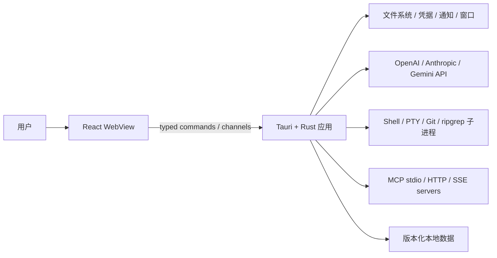
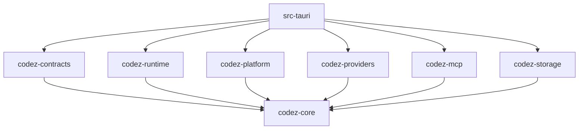
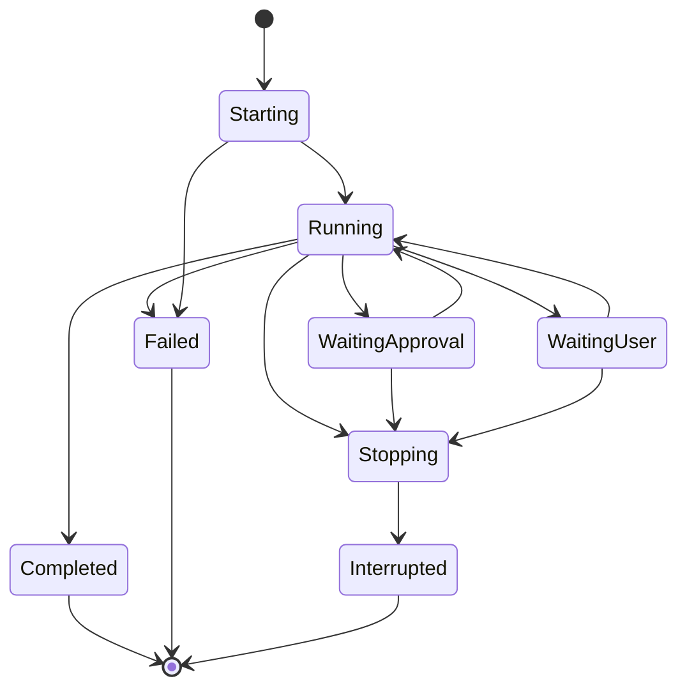

# CodeZ Tauri + Rust 工程架构设计

> 状态：Draft，作为迁移目标架构
>
> 日期：2026-07-15
>
> 需求：`docs/superpowers/specs/2026-07-15-tauri-rust-refactor-requirements.md`
>
> 实施计划：`docs/superpowers/plans/2026-07-15-tauri-rust-refactor.md`

## 1. 文档目的

本文定义 CodeZ 从 Electron/Node 主进程迁移到 Tauri/Rust 后的工程结构和长期边界。迁移不仅替换桌面壳，还要解决当前架构中的几个累积问题：

- Electron IPC、业务编排和平台操作混在 `src/main`，模块所有权不够明确。
- `preload` 以一个大型 `window.api` 暴露大量 `any/unknown` 与动态事件，契约难以校验。
- Agent、Tool、Permission、Context、MCP、Session 通过单例和直接 import 形成隐式依赖。
- 文件、进程、网络和时钟等环境能力缺少统一 port，部分核心测试依赖 Electron/Node mock。
- 长任务的所有权、取消传播、事件顺序和退出收尾分散在不同实现中。

目标是构建一个可测试的 Rust 模块化单体：Tauri 是最外层桌面 adapter，React 是表现层，Agent/工具/权限等核心不依赖 Tauri，也不依赖具体操作系统实现。目标架构按领域逐步落地，但 Electron 基线必须保留到完整迁移验收通过，不允许用“目标架构已确定”作为提前删除旧实现的理由。

## 2. 架构决策

### 2.1 采用模块化单体

首版不拆多个常驻服务，不引入本地 HTTP daemon，也不保留 Node sidecar。所有 Rust 模块随一个 Tauri 进程部署；只有用户 Shell、PTY、Git/ripgrep 和 MCP stdio server 作为受控子进程存在。

原因：

- 当前能力需要大量低延迟状态协作，拆进程会放大状态同步和取消难度。
- Tauri command/channel 已提供清晰的 UI/后端边界，不需要再叠加本地网络协议。
- Cargo workspace 和 trait port 足以提供代码所有权、测试隔离和未来拆分能力。

### 2.2 保留 React 表现层

React + TypeScript + Zustand + xterm.js 继续负责 UI、临时交互状态和视图组合。Rust 是会话、Agent、工具、权限、任务、计划、MCP 连接和持久化状态的权威来源。

前端不得复制一套独立的后端状态机。乐观 UI 仅用于明确支持回滚的轻量设置；运行状态必须由 Rust 事件确认。

### 2.3 使用 ports and adapters

- 领域层表达规则和状态，不知道 Tauri、WebView、文件系统和网络。
- 应用层编排 use case，依赖 trait port。
- adapter 实现文件、进程、Provider、MCP、凭据和 Tauri 通信。
- 组合根位于 `src-tauri`，只有这里创建具体实现并注入应用服务。

本文使用 ports and adapters 的约束，但不要求为每个小函数创建 trait。只有跨平台、外部 I/O、时间/随机数或需要替换测试实现的边界才定义 port。

## 3. 系统上下文



### 3.1 信任边界

1. WebView 是低权限表现层，不能直接访问任意文件、进程或密钥。
2. 模型输出、工具参数、MCP 内容、项目配置、文件路径和远程响应均是不可信输入。
3. Rust command adapter 负责 wire 校验，应用层负责业务前置条件，平台层再次执行资源边界校验。
4. 系统凭据库中的 secret 只在需要发起请求或启动受控连接时解析，不通过普通查询 API 回传。

## 4. 仓库目标结构

```text
CodeZ/
  crates/
    codez-contracts/
      src/
        command.rs
        event.rs
        error.rs
        dto/
    codez-core/
      src/
        agent/
        chat/
        context/
        permission/
        task/
        tool/
        workspace/
        ports/
    codez-runtime/
      src/
        agent/
        chat/
        context/
        execution/
        tool/
    codez-platform/
      src/
        fs/
        process/
        pty/
        git/
        search/
        notification/
        resources/
    codez-providers/
      src/
        openai/
        anthropic/
        gemini/
        streaming/
    codez-mcp/
      src/
        config/
        transport/
        oauth/
        policy/
        content/
    codez-storage/
      src/
        repositories/
        migration/
        atomic_file/
        credentials/
  src-tauri/
    capabilities/
    src/
      commands/
      channels/
      lifecycle/
      composition.rs
      state.rs
      lib.rs
      main.rs
    Cargo.toml
    tauri.conf.json
  src/renderer/src/
    app/
    features/
      chat/
      workspace/
      terminal/
      settings/
      tasks/
    entities/
      session/
      provider/
      project/
    shared/
      desktop/
      ui/
      lib/
    main.tsx
  tests/
    fixtures/
      contracts/
      providers/
      permission/
      migration/
    e2e/
  docs/
    architecture/
    decisions/
```

这是目标布局，不要求在第一个提交一次性移动全部 React 文件。后端随领域迁移进入目标 crate；前端只在接入相应 `desktopApi` 时按 feature 归位，避免独立的大规模文件搬迁。

## 5. Crate 职责与依赖规则

### 5.1 `codez-contracts`

负责跨 WebView 边界的 DTO、command request/response、事件 envelope、稳定错误码和 TypeScript 生成。不包含领域流程，不直接执行 I/O。

规则：

- wire 字段使用稳定、显式命名和 `serde` 策略。
- breaking change 必须提升 contract version 或提供向后解析。
- `any` 对应的无约束 JSON 只允许用于协议本身确实开放的字段，并必须有大小/深度限制。
- domain type 与 wire DTO 通过 `From/TryFrom` 显式转换，避免把内部字段无意暴露给 UI。

### 5.2 `codez-core`

负责纯领域模型、值对象、状态机、规则和 port trait：

- Agent/Task/Plan/Tool/Permission 的状态与转换。
- `WorkspaceRoot`、`SafeWorkspacePath`、`SessionId`、`StreamId`、`ToolCallId` 等 newtype。
- 权限决策、风险等级、工具效果计划、上下文预算等无 I/O 算法。
- Repository、Clock、IdGenerator、CredentialResolver、EventSink、ProviderClient、ProcessRunner 等 port。

规则：

- 不依赖 Tauri、具体数据库、HTTP client、PTY 或 OS API。
- 不读取全局环境或当前时间；通过 port 获取。
- 可用普通 Rust unit/property tests 完整运行。

### 5.3 `codez-runtime`

负责应用用例和长生命周期运行时：

- Chat/Agent loop、Context/Compaction、Tool pipeline、调度、并行执行和恢复。
- 会话级 registries、取消树、pending approval/ask broker。
- 调用 core port，但不创建具体平台实现。

规则：

- 每个运行任务有明确 owner、ID、状态机和 `CancellationToken`。
- 不直接持有 Tauri Window；向抽象 `EventSink` 发布领域事件。
- 不在跨 `await` 区间持有粗粒度 `MutexGuard`。

### 5.4 Adapter crates

- `codez-platform`：本机文件、进程、PTY、Git、搜索、通知、资源和平台差异。
- `codez-providers`：模型协议、HTTP、SSE/字节流、消息映射和 Usage。
- `codez-mcp`：MCP config/transport/OAuth/policy/content，实现 core 定义的 MCP port。
- `codez-storage`：Repository、原子文件、schema migration、credentials 和旧数据导入。

Adapter 之间默认不互相依赖。需要协同时通过 core port 或由 `codez-runtime`/composition root 编排。例如 MCP 的反向 sampling 通过回调 port 调用应用层，不直接 import Provider 的具体 client。

### 5.5 `src-tauri`

负责 Tauri 入口、窗口、capabilities、command/channel adapter、AppState 和依赖组合。

规则：

- command 函数目标控制在“校验 DTO -> 调用 use case -> 映射结果”。
- command 不读写业务文件、不启动任意子进程、不实现 Agent loop。
- Tauri 类型不得穿透到 core/runtime。
- 所有具体 adapter 只在 `composition.rs` 创建并注入。

### 5.6 允许的依赖方向



禁止以下依赖：

- `codez-core -> tauri` 或 `codez-runtime -> tauri`。
- `codez-core -> codez-platform/storage/providers/mcp`。
- React component/store -> 原始 Tauri `invoke` 字符串。
- 领域模块 -> 全局 singleton 或隐式静态可变状态。
- adapter crate 之间为复用内部实现而形成环形依赖。

## 6. 现有模块迁移归属

| 现有区域 | 目标归属 | 说明 |
| --- | --- | --- |
| `src/main/index.ts` | `src-tauri/lifecycle` + `composition.rs` | 只保留宿主生命周期和依赖装配 |
| `src/main/ipc/*` | `src-tauri/commands`、`channels` | handler 变薄，业务下沉 use case |
| `src/preload/index.ts` | `codez-contracts` + 前端 `shared/desktop` | 不再存在 preload |
| `src/main/agent/*` | `codez-core::agent` + `codez-runtime::agent` | 状态与编排分开 |
| `src/main/tools/runtime/*` | `codez-core::tool` + `codez-runtime::tool` | Schema/效果/状态与执行编排分开 |
| `src/main/tools/builtin/*` | core descriptor + platform/runtime handler | 按副作用类型落入 adapter |
| `src/main/services/permission/*` | `codez-core::permission` + parser adapter | 决策纯化，解析平台化 |
| `src/main/services/context/*` | `codez-core::context` + `codez-runtime::context` + storage | ledger/recovery 分层 |
| `src/main/services/mcp/*` | `codez-mcp` | 对 runtime 暴露 port |
| Provider/Chat services | `codez-providers` + `codez-runtime::chat` | 协议与会话编排分离 |
| Session/Settings stores | `codez-storage::repositories` | 版本化 repository |
| Workspace/Edit/Terminal | `codez-platform` + runtime use case | 所有路径先转安全值对象 |
| React components/stores | `features`/`entities`/`shared` | 按迁移触点渐进整理 |

## 7. 应用状态与所有权

`AppState` 只保存线程安全的服务入口：

```rust
pub struct AppState {
    pub sessions: Arc<SessionService>,
    pub runtimes: Arc<RuntimeRegistry>,
    pub terminals: Arc<TerminalRegistry>,
    pub mcp: Arc<McpManager>,
    pub shutdown: Arc<ShutdownCoordinator>,
}
```

实际类型可调整，但所有权必须满足：

- Repository 是数据的唯一持久化入口，同一文件不能存在多个独立写入者。
- `RuntimeRegistry` 是 session/chat 运行状态的唯一权威索引。
- Tool execution 归属于 Agent/Chat run；Agent 归属于 session；所有任务最终归属于 app shutdown scope。
- UI 订阅不是任务 owner。窗口关闭后后端按产品策略继续或取消，但不能因 listener 丢失而悬挂。
- ID 使用 newtype，禁止在 session/tool/stream/agent ID 之间传裸 `String`。

## 8. Command 与事件架构

### 8.1 短命令

短操作使用 request/response command：

```rust
#[derive(Serialize)]
#[serde(rename_all = "camelCase")]
pub struct CommandError {
    pub code: ErrorCode,
    pub message: String,
    pub retryable: bool,
    pub details: Option<serde_json::Value>,
}
```

要求：

- command 名按领域分组，如 `workspace_open_directory`、`session_list`、`permission_set_mode`。
- 输入 DTO 在边界拒绝未知危险字段、过大字符串/数组和非法枚举。
- 业务失败不使用 panic；panic 视为 bug 并转为无敏感信息的 internal error。
- 写命令需要显式幂等策略；可能重复提交的操作携带 request/operation ID。

### 8.2 长流

Chat、Agent、Tool、Terminal 使用 typed channel。建议模型：

```text
chat_start(request, event_channel) -> { streamId }
chat_stop(streamId)                -> acknowledged state
chat_steer(streamId, input)        -> queued/consumed result
chat_respond_approval(requestId)    -> accepted/rejected
```

事件统一包含：

- `version`：wire schema 版本。
- `streamId/sessionId`：作用域。
- `sequence`：单流单调递增序号。
- `kind`：稳定 tagged union discriminator。
- `timestamp`：观测时间，不用于排序权威。
- `payload`：具体事件 DTO。

每个流必须恰好一个终态事件：`completed | failed | interrupted`。终态提交后禁止发送业务增量；迟到的子任务结果只记录诊断日志。

低频全局状态如主题和 MCP server status 可以使用 Tauri event，但也必须有版本化 payload 和 unsubscribe。

### 8.3 前端 adapter

```text
components / hooks
        |
feature services + Zustand slices
        |
shared/desktop typed API
        |
Tauri invoke / Channel / listen
```

- 只有 `shared/desktop` 可 import Tauri JavaScript API。
- Zustand slice 不拼 command/event 字符串。
- 订阅返回 `dispose()`，feature scope 统一管理生命周期。
- 事件先通过 runtime reducer，再更新 view state；组件不自行解释后端状态机。
- desktop DTO 禁止 `any`；开放 JSON 使用 `unknown` + runtime validator。

## 9. 运行时状态机

### 9.1 Chat/Agent run



状态转换集中定义并测试，不能由多个 UI callback 隐式推断。恢复逻辑只能从持久化的非终态映射到明确的 `recovering/waiting/lost` 策略，不能直接假定仍在运行。

### 9.2 Tool call

```text
received -> validated -> planned -> authorized -> scheduled -> running
                                      |              |            |
                                      v              v            v
                                    denied        cancelled   succeeded/failed/interrupted
```

规则：

- validation/planning/authorization 顺序固定。
- 授权针对不可变输入摘要；执行前重验关键资源。
- 只有 `running` 可产生副作用。
- journal 状态与 UI event 均来自同一转换，不分别手写。

### 9.3 数据迁移

```text
not_started -> discovered -> backed_up -> transforming -> verified -> committed
                                           |              |
                                           +---- failed <--+
```

只有 `committed` 可让新 repository 把迁移结果作为权威数据；失败状态可重试且不修改旧数据。Electron `userData` 与升级前已有的 `~/.codez` 内容都是迁移源，新运行时的目标根固定为 `~/.codez`。由于目标根可能预先包含用户内容，backup/staging 必须使用 catalog 明确排除的受控路径，并按实际读写文件验证不相交；禁止用整个目录覆盖、重命名或清空来完成提交。

## 10. 并发、取消与背压

### 10.1 任务树

```text
Application shutdown token
  +-- MCP manager token
  +-- Terminal registry token
  +-- Session token
        +-- Chat/Agent run token
              +-- Provider stream token
              +-- Tool call token
              |     +-- child process token
              +-- SubAgent token
```

- 父 token 取消向下传播；子任务结束不反向取消父任务。
- 独立运行的 sibling 不共享可被任一 sibling 随意取消的 token。
- 每个 spawned task 都由 `JoinSet`、registry 或等价 owner 回收，禁止 fire-and-forget。
- 退出按“停止接收新任务 -> 取消 -> 等待宽限期 -> 强制回收子进程 -> 刷新持久化/日志”执行。

### 10.2 锁与队列

- Registry 使用短临界区；取出 `Arc` 后释放 map 锁再执行异步操作。
- 文件 repository 采用每资源单写者/队列，不以一个全局锁串行整个应用。
- Chat/terminal 高频事件进入有界 channel；文本 delta 可批处理，但终态、审批和工具边界事件不可丢。
- 队列满时必须有显式策略：等待、合并可合并增量或终止过载流；禁止静默丢关键事件。
- CPU 密集解析/搜索与阻塞系统调用使用专用阻塞池，不阻塞 Tokio async worker。

## 11. 数据架构

### 11.1 Repository 边界

建议 repository：

- `SessionRepository`
- `ProviderRepository`
- `SettingsRepository`
- `WorkspaceRepository`
- `PermissionRuleRepository` / `PermissionAuditRepository`
- `McpConfigRepository` / `McpContentRepository`
- `ContextLedgerRepository`
- `ExecutionJournalRepository`
- `AttachmentRepository`

Repository 接收 domain model 或专用 persistence model，不接收 Tauri DTO。每个 repository 明确 schema version、原子性、并发模型、最大数据量和清理策略。

### 11.2 初期存储策略

- 第一阶段保持 JSON/JSONL/目录格式兼容，避免框架和数据库同时迁移。
- 统一 atomic file 实现，禁止每个 service 自行拼临时文件逻辑。
- 大对象使用内容寻址或独立文件，session index 不重复嵌入无界内容。
- 新运行时的全局应用数据根固定为 `~/.codez`；cache、logs、temp 与 migrations 分别位于该根的同名子目录，见 ADR 0007。
- 所有路径由 `AppPaths` 提供，模块不能自行推测 `%APPDATA%`、XDG、home、Tauri app-data 或临时目录。
- 工作区 `.codez`/`.codez-cache` 是从受验证 workspace root 派生的项目状态，不构成第二个全局应用数据根。
- 将来切换 SQLite 必须通过 repository adapter 和独立 ADR，不改变应用层接口。

### 11.3 Secret

- 持久化模型只存 secret reference/status，不存明文。
- `CredentialStore` 提供 set/get/delete，错误区分 unavailable/locked/not-found/corrupt。
- secret 进入 Provider/MCP adapter 后尽量缩短生命周期，不实现 `Debug/Serialize`。
- command response 默认只返回 `configured: true` 或 masked 状态。
- Electron 旧密钥兼容由 migration adapter 处理，不能侵入日常 CredentialStore API。

## 12. 权限与安全架构

权限判断形成单一链路：

```text
untrusted input
  -> wire/schema validation
  -> effect plan + resource keys
  -> permission analysis
  -> user/model/runtime decision
  -> immutable authorization receipt
  -> resource revalidation
  -> platform execution
  -> audit/journal
```

关键约束：

- `PermissionManager` 不执行副作用，Platform adapter 不自行跳过授权。
- `AuthorizationReceipt` 绑定 tool、input digest、workspace、scope、rule 和过期条件。
- Shell 解析失败、动态执行和路径无法证明安全时进入保守能力分类。
- `SafeWorkspacePath` 不是字符串 alias，而是成功校验后才能构造的值对象。
- Tauri capability 仅允许应用需要的宿主功能；UI 不拥有通用 filesystem/shell plugin scope。
- OAuth callback、外链、MCP URL 和远程下载限制 scheme、host、redirect 与大小。

## 13. 错误模型

错误分层：

| 层 | 示例 | 是否可重试 |
| --- | --- | --- |
| Validation | 非法 DTO、Schema 不匹配 | 否，需修正输入 |
| Permission | 拒绝、需要审批、授权过期 | 视操作而定 |
| NotFound/Conflict | 会话不存在、编辑指纹冲突 | 通常需刷新 |
| External | Provider 429、MCP 断开、Git 失败 | 按错误码 |
| Cancelled/Timeout | 用户停止、握手超时 | 可由用户重试 |
| Storage | 磁盘满、数据损坏、凭据锁定 | 依具体原因 |
| Internal | 不变量破坏、未知 bug | 否，记录 correlation ID |

- crate 内使用具体 `thiserror` 类型，不以字符串比较控制流程。
- `anyhow` 可用于最外层诊断聚合，但不能成为跨 command 的公开协议。
- 外部错误在 adapter 处归一化并保留 source chain 到日志，UI 只收到脱敏信息。
- 所有日志关联 `session_id/stream_id/agent_id/tool_call_id`，敏感值不作为 span field。

## 14. 可观测性

- 结构化 `tracing` span 覆盖 command、session、agent、provider request、tool、process、MCP connection 和 migration。
- 日志分为用户可查看的操作记录与开发诊断日志，不能混用工具输出作为系统日志。
- 长任务记录开始、状态转换、取消原因、耗时和终态；不记录完整 prompt、密钥或文件内容。
- 指标初期可以写入本地诊断摘要，不引入远程遥测；远程遥测另行征得产品与隐私决策。
- 崩溃恢复依赖持久化 journal，而不是从日志反推业务状态。

## 15. 前端工程架构

### 15.1 分层

- `app`：应用装配、路由/页面壳、全局 provider 和启动恢复。
- `features`：用户可执行的完整工作流，如 chat、workspace、terminal、settings、tasks。
- `entities`：Session、Provider、Project 等跨 feature 的展示模型和小型 store。
- `shared/desktop`：唯一 Tauri adapter、生成 DTO、channel/event transport。
- `shared/ui`：无业务语义的基础控件。
- `shared/lib`：纯函数，不依赖 feature。

### 15.2 依赖规则

```text
app -> features -> entities -> shared
```

- `shared` 不依赖 entity/feature。
- feature 默认不 import 另一个 feature 的内部文件；跨 feature 行为通过 app orchestration 或公开入口。
- 后端 durable state 不在多个 Zustand store 重复保存；按 ID 引用或由统一 runtime slice 管理。
- 大型 store slice 按领域事件 reducer 拆分，避免 command response 与 stream event 竞争写同一状态。
- CSS/UI 文件整理随 feature 迁移进行，不把视觉重构混入后端迁移验收。

## 16. 测试架构

### 16.1 Rust

- `codez-core`：快速 unit/property/state-machine 测试，无网络和真实文件系统。
- runtime：使用 fake Clock/Id/Provider/Tool/EventSink 的确定性异步测试。
- adapters：临时目录、本地 HTTP server、真实子进程和平台条件测试。
- migration：脱敏旧数据 golden fixtures、重复运行、故障注入、权限和损坏场景。
- security：路径逃逸、命令 corpus、授权 receipt、secret redaction 和 MCP trust。

### 16.2 前端与契约

- React/Vitest mock `shared/desktop` 的 typed interface，不 mock Electron。
- 生成的 TypeScript DTO 在 CI 检查无未提交差异。
- Rust 序列化与 TypeScript validator 对同一 fixtures 做双向兼容测试。
- reducer 以完整事件序列测试，包括乱序、重复、取消和迟到事件。

### 16.3 E2E

桌面 E2E 只覆盖跨层关键流程，不替代 core 单元测试。每个目标平台至少有安装后 smoke；Windows 额外覆盖中文路径、PowerShell、ConPTY 和进程树。

## 17. 构建与发布架构

- Cargo/npm 版本和工具链通过文件锁定；CI 从干净缓存验证可复现构建。
- builtin skills、`rg` 或 parser assets 在 Tauri resource manifest 中显式声明并有安装后定位测试。
- debug/release 使用相同契约和资源布局，不写依赖当前工作目录的路径逻辑。
- 每个平台独立签名与 bundle 配置，未验证平台不发布空壳包。
- 生成 SBOM、第三方许可证和 Rust/npm dependency audit 报告。
- 旧 Electron 数据迁移和 Tauri 自身 schema upgrade 使用同一 migration runner，但属于不同 migration source。

## 18. 工程规则

### 18.1 Rust

- `cargo fmt`、`clippy -D warnings`、workspace tests 为合并门槛。
- 生产路径禁止无说明 `unwrap/expect`；只有不变量已由类型证明时允许，并在同处说明。
- 默认 `#![forbid(unsafe_code)]`；确需 `unsafe` 的平台模块必须独立隔离、测试并有 ADR。
- 领域 ID、路径、摘要、secret reference 使用 newtype，不传魔法字符串。
- 公共 API 返回具体类型；避免公开 `serde_json::Value`、`Box<dyn Error>` 或宽泛字符串错误。
- 不创建没有所有者的 Tokio task；spawn 必须登记、等待或显式 transfer ownership。
- 不在 command handler 中出现领域事务，不在 core 中读取环境变量。

### 18.2 TypeScript/React

- desktop contract 禁止 `any`，`unknown` 必须在 adapter 边界验证。
- 组件不直接 `invoke/listen`，不拼接 command/event 名。
- feature store 不持久化后端 secret 或完整授权凭据。
- 订阅、Object URL、terminal 和 stream handle 必须有确定性 cleanup。
- 迁移阶段保持 strict typecheck 与现有测试基线。

### 18.3 架构治理

- 重要例外用 `docs/decisions/NNNN-title.md` ADR 记录背景、决定、替代方案与后果。
- 下列变更必须有 ADR：新增 crate、反转依赖方向、引入数据库/sidecar、改变 secret 策略、改变 contract version、引入 `unsafe`、更换 MCP/PTY 核心实现。
- 每个 Phase 结束做一次依赖图和 public API 审核，删除迁移期间产生的临时 adapter。

## 19. 明确禁止的反模式

- 把现有 `src/main` 按文件名一比一翻译到 `src-tauri/src`。
- 创建一个数千行 `commands.rs` 或全能 `AppService`。
- 让 core/runtime 接收 `tauri::AppHandle`、`Window` 或 WebView event 名。
- 为方便 UI 暴露任意文件读取、任意 Shell 或 secret dump command。
- 以全局 `Mutex<HashMap<String, serde_json::Value>>` 代替领域状态模型。
- 使用无限 channel 承载聊天、终端或子进程输出。
- 用日志作为恢复源，或依赖事件到达 UI 才持久化权威状态。
- 为了兼容旧密钥退回 Base64/明文。
- 在没有测试去向的情况下删除 Electron 旧测试。
- 在单个模块、单个平台或开发环境验证通过后，就删除 Electron 源码、配置、依赖或构建链路。
- 迁移期间同时重做 UI、存储、协议和领域模型，导致无法定位行为差异。

## 20. 过渡架构与删除边界

迁移期允许目标 Tauri/Rust 代码与冻结的 Electron 基线同时存在于源码仓库，但两者不组成产品双运行时，也不进行状态双写。Electron 的作用仅限于：

- 提供可执行的行为基线和问题复现入口。
- 保留尚未迁移模块及其测试的权威实现。
- 支撑 fixtures、协议和数据迁移结果的对照。
- 在 Tauri 首个稳定版发布出现阻断时提供发布级回退安装包。

过渡期规则：

1. Electron 不接收新功能；Tauri/Rust 是唯一演进方向。
2. 不为了共享运行时而新增 Electron/Tauri 抽象层、双写或 feature flag。
3. Electron 文件只有在迁移追踪矩阵证明其职责和有效测试均有去向后，才进入删除候选清单。
4. 删除候选清单不得直接执行；必须等待功能、数据、密钥、安全、性能、安装升级、回退和目标平台验证全部通过。
5. 删除使用独立提交/PR，便于审计和回退；不得夹带新的 Rust 功能或架构重构。
6. 删除后重新生成依赖图、执行全量测试、构建安装包并在干净环境运行 smoke test。
7. 旧用户数据和上一稳定 Electron 安装包不随源码清理自动删除。

## 21. 架构验收

架构整理完成需要满足：

1. Cargo workspace 依赖方向符合第 5 节，core/runtime 不依赖 Tauri 或具体 adapter。
2. Tauri command 均为薄 adapter，业务状态机和 I/O port 可在无 WebView 环境测试。
3. React 只有 `shared/desktop` 直接接触 Tauri API，前后端 wire 类型可生成/校验。
4. Chat、Agent、Tool、Migration 有显式状态机、终态和取消所有权。
5. 高频流使用有界、有序通道，关键事件不静默丢失，退出无遗留任务/子进程。
6. Repository、AppPaths、atomic file 和 CredentialStore 成为唯一数据/密钥入口。
7. 权限链路从输入验证到执行审计闭合，Platform adapter 无授权旁路。
8. 现有有效测试行为均有 Rust、前端、契约或 E2E 去向。
9. 架构例外有 ADR，临时迁移 adapter 只有在迁移完成门禁通过后才随 Electron 清理阶段删除。
10. Electron 删除前有完整追踪矩阵、恢复 tag/分支、稳定安装包和人工批准记录，删除后全量验证通过。
11. 文档、依赖图和实际代码结构一致，不把本文当成只在开工时有效的静态说明。
